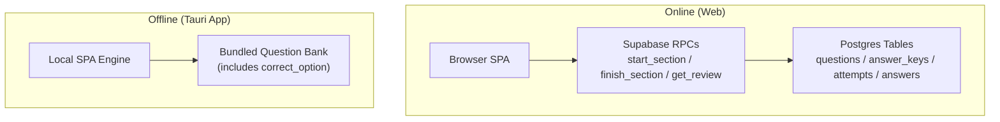
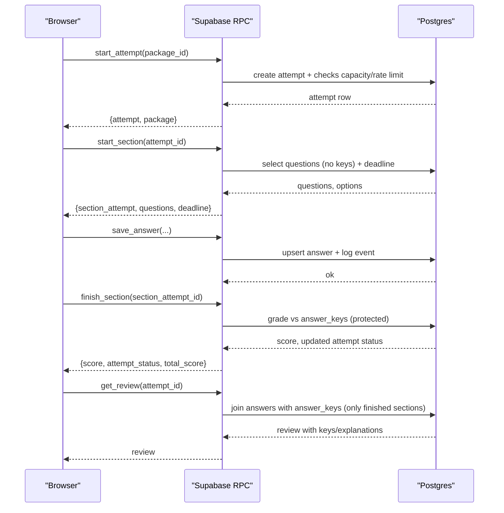
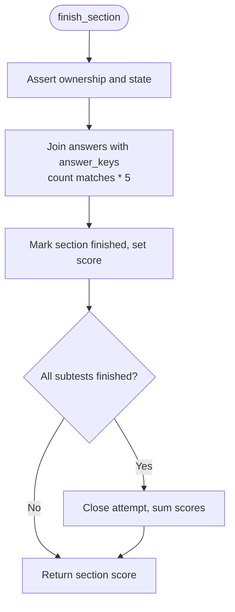
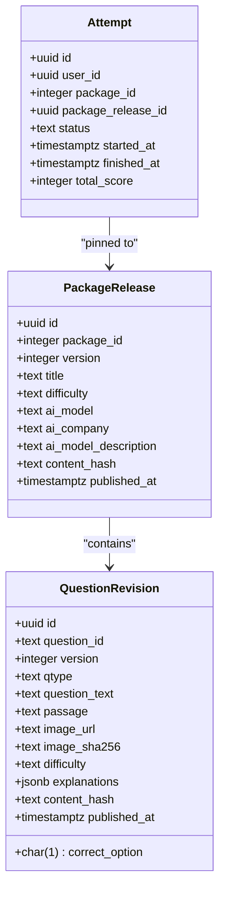
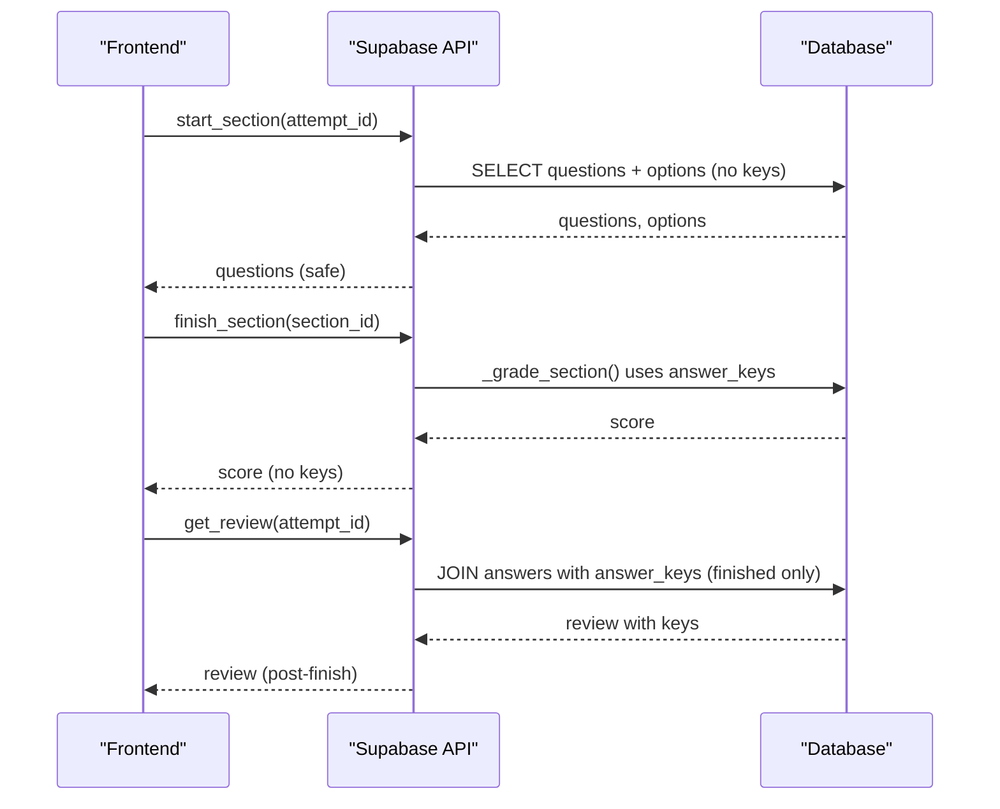
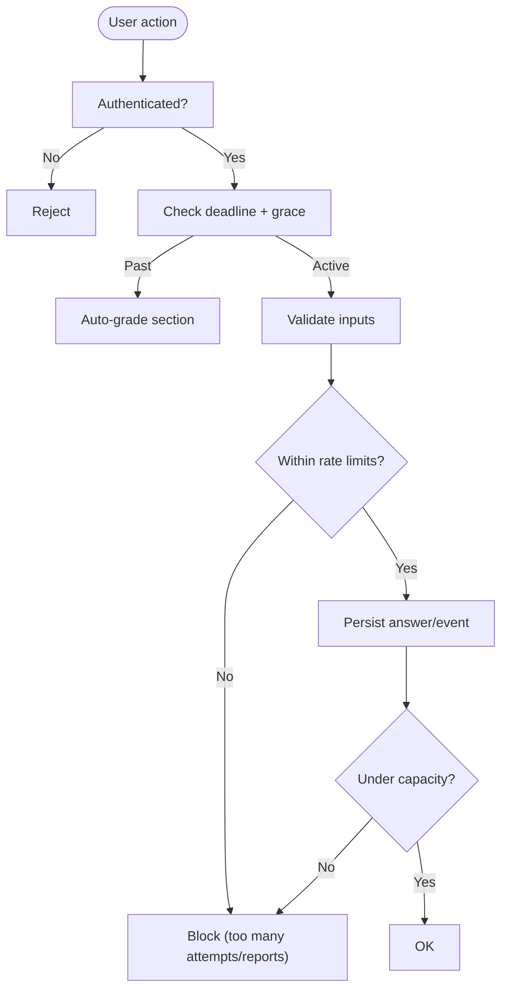
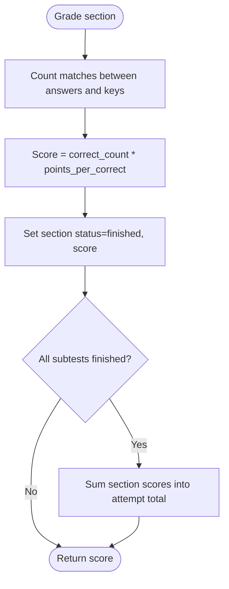
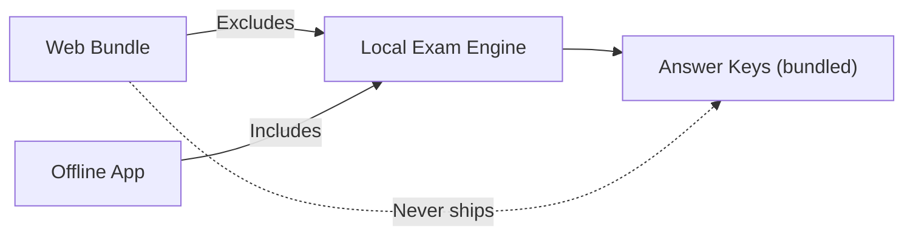
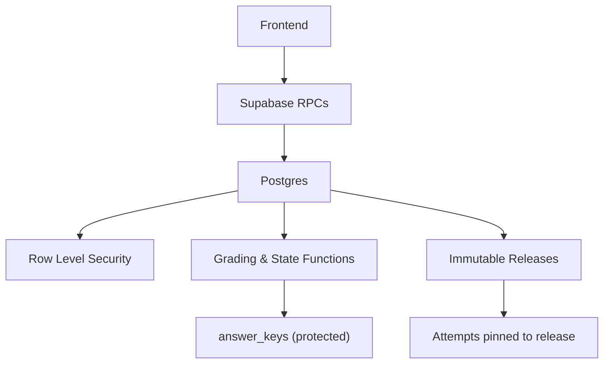

# Answer Key Security and Integrity

<cite>
**Referenced Files in This Document**
- [schema.sql](file://supabase/schema.sql)
- [schema_v3.sql](file://supabase/schema_v3.sql)
- [TECHNICAL_REQUIREMENTS.md](file://docs/TECHNICAL_REQUIREMENTS.md)
- [AGENTS.md](file://AGENTS.md)
- [README.md](file://README.md)
- [localApi.ts](file://web/src/lib/localApi.ts)
- [supabaseApi.ts](file://web/src/lib/supabaseApi.ts)
- [push_to_supabase.py](file://questions/generator/push_to_supabase.py)
- [validate_bank.py](file://questions/generator/validate_bank.py)
- [schema.json](file://questions/schema.json)
</cite>

## Table of Contents
1. [Introduction](#introduction)
2. [Project Structure](#project-structure)
3. [Core Components](#core-components)
4. [Architecture Overview](#architecture-overview)
5. [Detailed Component Analysis](#detailed-component-analysis)
6. [Dependency Analysis](#dependency-analysis)
7. [Performance Considerations](#performance-considerations)
8. [Troubleshooting Guide](#troubleshooting-guide)
9. [Conclusion](#conclusion)

## Introduction
This document explains how the TBS LPDP Try Out system secures answer keys and ensures grading integrity across both online and offline modes. It covers server-authoritative grading, strict separation between question content and answer validation, anti-cheating controls, integrity verification through immutable releases and hashes, and how offline functionality maintains security boundaries where applicable.

## Project Structure
The system has two execution environments:
- Online (web): The browser communicates with Supabase RPCs for all trusted operations. Answer keys are stored in a protected database table and never exposed to clients during an active section.
- Offline (Tauri app): A local engine grades against a bundled question bank that includes answers by design, because the exam must work without network access.

**Diagram sources**
- [schema.sql:37-60](file://supabase/schema.sql#L37-L60)
- [schema.sql:186-238](file://supabase/schema.sql#L186-L238)
- [schema_v3.sql:610-705](file://supabase/schema_v3.sql#L610-L705)
- [localApi.ts:209-260](file://web/src/lib/localApi.ts#L209-L260)

**Section sources**
- [README.md:40-63](file://README.md#L40-L63)
- [AGENTS.md:1-6](file://AGENTS.md#L1-L6)

## Core Components
- Server-side grading functions compute scores using protected answer keys and return only results or review data after sections finish.
- Row Level Security (RLS) prevents direct client reads from sensitive tables, including answer keys.
- Immutable releases pin attempts to a snapshot of questions and answers, preventing later edits from altering past attempts.
- Content hashing validates question integrity between publisher and consumer.
- Rate limits, capacity guards, and event logging protect against abuse and storage exhaustion.

Key responsibilities:
- Protect answer keys at rest and in transit via RLS and RPC-only access.
- Enforce deadlines and idempotent finishing on the server.
- Provide review with keys only for finished sections.
- Maintain integrity through hashes and immutable release snapshots.

**Section sources**
- [schema.sql:131-181](file://supabase/schema.sql#L131-L181)
- [schema.sql:186-238](file://supabase/schema.sql#L186-L238)
- [schema_v3.sql:58-102](file://supabase/schema_v3.sql#L58-L102)
- [schema_v3.sql:610-705](file://supabase/schema_v3.sql#L610-L705)
- [TECHNICAL_REQUIREMENTS.md:42-50](file://docs/TECHNICAL_REQUIREMENTS.md#L42-L50)

## Architecture Overview
The online flow keeps answer keys inside the database and exposes them only post-completion. The offline flow embeds keys locally so grading can occur without a network.

**Diagram sources**
- [schema.sql:341-389](file://supabase/schema.sql#L341-L389)
- [schema.sql:417-493](file://supabase/schema.sql#L417-L493)
- [schema.sql:495-522](file://supabase/schema.sql#L495-L522)
- [schema.sql:551-580](file://supabase/schema.sql#L551-L580)
- [schema.sql:612-657](file://supabase/schema.sql#L612-L657)
- [schema_v3.sql:709-758](file://supabase/schema_v3.sql#L709-L758)
- [schema_v3.sql:760-800](file://supabase/schema_v3.sql#L760-L800)

## Detailed Component Analysis

### Server-Authoritative Grading and Answer-Key Protection
- The `answer_keys` table stores correct options and explanations but has no client-readable policy, enforcing constraint C-4.
- Grading occurs in server functions that compare saved answers to the protected key and store scores.
- Review endpoints expose keys only for finished sections owned by the caller.

**Diagram sources**
- [schema.sql:186-238](file://supabase/schema.sql#L186-L238)
- [schema.sql:551-580](file://supabase/schema.sql#L551-L580)
- [schema_v3.sql:610-705](file://supabase/schema_v3.sql#L610-L705)

**Section sources**
- [schema.sql:56-60](file://supabase/schema.sql#L56-L60)
- [schema.sql:131-181](file://supabase/schema.sql#L131-L181)
- [schema.sql:186-238](file://supabase/schema.sql#L186-L238)
- [schema.sql:612-657](file://supabase/schema.sql#L612-L657)
- [schema_v3.sql:610-705](file://supabase/schema_v3.sql#L610-L705)
- [TECHNICAL_REQUIREMENTS.md:112-123](file://docs/TECHNICAL_REQUIREMENTS.md#L112-L123)

### Immutable Releases and Integrity Verification
- Attempts are pinned to a specific package release; questions and answers are versioned and hashed.
- Hashing functions compute content digests for questions and releases, enabling integrity checks.
- The push pipeline attaches a client-facing content hash alongside question payloads for diagnostics.

**Diagram sources**
- [schema_v3.sql:58-102](file://supabase/schema_v3.sql#L58-L102)
- [schema_v3.sql:151-166](file://supabase/schema_v3.sql#L151-L166)
- [schema_v3.sql:168-175](file://supabase/schema_v3.sql#L168-L175)
- [schema_v3.sql:18-54](file://supabase/schema_v3.sql#L18-L54)

**Section sources**
- [schema_v3.sql:18-54](file://supabase/schema_v3.sql#L18-L54)
- [schema_v3.sql:58-102](file://supabase/schema_v3.sql#L58-L102)
- [schema_v3.sql:151-175](file://supabase/schema_v3.sql#L151-L175)
- [push_to_supabase.py:168-219](file://questions/generator/push_to_supabase.py#L168-L219)

### Separation of Question Content and Answer Validation
- Question content (text, options, images) is served through RPCs without answer keys during active sections.
- Answer validation logic runs exclusively in server functions or the offline engine; it never leaks keys into the web bundle.
- The schema enforces option structure and required fields, ensuring consistent processing.

**Diagram sources**
- [schema.sql:417-493](file://supabase/schema.sql#L417-L493)
- [schema.sql:551-580](file://supabase/schema.sql#L551-L580)
- [schema.sql:612-657](file://supabase/schema.sql#L612-L657)
- [schema.json:66-80](file://questions/schema.json#L66-L80)

**Section sources**
- [schema.sql:417-493](file://supabase/schema.sql#L417-L493)
- [schema.sql:551-580](file://supabase/schema.sql#L551-L580)
- [schema.sql:612-657](file://supabase/schema.sql#L612-L657)
- [schema.json:66-80](file://questions/schema.json#L66-L80)

### Anti-Cheating Measures and Abuse Controls
- No client-readable policy on answer keys; keys are only accessible via server functions.
- Time enforcement: deadlines computed server-side; grace period enforced in SQL.
- Rate limiting: per-user attempt creation capped within rolling windows.
- Event logging cap: bounded append-only logs prevent storage abuse.
- Capacity guard: global storage ceiling blocks new attempts when nearing limits.

**Diagram sources**
- [schema.sql:311-337](file://supabase/schema.sql#L311-L337)
- [schema.sql:341-389](file://supabase/schema.sql#L341-L389)
- [schema.sql:241-260](file://supabase/schema.sql#L241-L260)
- [schema.sql:395-415](file://supabase/schema.sql#L395-L415)

**Section sources**
- [schema.sql:131-181](file://supabase/schema.sql#L131-L181)
- [schema.sql:241-260](file://supabase/schema.sql#L241-L260)
- [schema.sql:311-337](file://supabase/schema.sql#L311-L337)
- [schema.sql:341-389](file://supabase/schema.sql#L341-L389)
- [schema.sql:395-415](file://supabase/schema.sql#L395-L415)
- [TECHNICAL_REQUIREMENTS.md:112-123](file://docs/TECHNICAL_REQUIREMENTS.md#L112-L123)

### Secure Scoring Algorithms
- Scoring rule: each correct answer adds a fixed point value; wrong or blank yields zero.
- Section score equals the number of correct answers multiplied by the per-question weight.
- Total attempt score is the sum of finished section scores.
- Statistics eligibility thresholds ensure representative samples before contributing to aggregate metrics.

**Diagram sources**
- [schema.sql:186-238](file://supabase/schema.sql#L186-L238)
- [schema_v3.sql:610-705](file://supabase/schema_v3.sql#L610-L705)
- [TECHNICAL_REQUIREMENTS.md:65](file://docs/TECHNICAL_REQUIREMENTS.md#L65)

**Section sources**
- [schema.sql:186-238](file://supabase/schema.sql#L186-L238)
- [schema_v3.sql:610-705](file://supabase/schema_v3.sql#L610-L705)
- [TECHNICAL_REQUIREMENTS.md:65](file://docs/TECHNICAL_REQUIREMENTS.md#L65)

### Offline Mode Security Model
- The offline app includes answer keys and grading logic by necessity to function without a network.
- This does not weaken the online deployment’s security posture; the web bundle excludes the local engine and keys.
- The offline mode’s exposure is equivalent to the public question bank, which already contains keys.

**Diagram sources**
- [AGENTS.md:83-85](file://AGENTS.md#L83-L85)
- [README.md:65-70](file://README.md#L65-L70)
- [localApi.ts:27-36](file://web/src/lib/localApi.ts#L27-L36)

**Section sources**
- [AGENTS.md:83-85](file://AGENTS.md#L83-L85)
- [README.md:65-70](file://README.md#L65-L70)
- [localApi.ts:27-36](file://web/src/lib/localApi.ts#L27-L36)

## Dependency Analysis
- Frontend calls Supabase RPCs for all exam operations; no direct table writes.
- Database functions enforce RLS, deadlines, and grading using protected answer keys.
- Immutable releases link attempts to specific versions of questions and answers, ensuring historical integrity.
- Content hashing supports integrity verification between publisher and consumers.

**Diagram sources**
- [schema.sql:131-181](file://supabase/schema.sql#L131-L181)
- [schema.sql:186-238](file://supabase/schema.sql#L186-L238)
- [schema_v3.sql:58-102](file://supabase/schema_v3.sql#L58-L102)
- [schema_v3.sql:610-705](file://supabase/schema_v3.sql#L610-L705)

**Section sources**
- [schema.sql:131-181](file://supabase/schema.sql#L131-L181)
- [schema.sql:186-238](file://supabase/schema.sql#L186-L238)
- [schema_v3.sql:58-102](file://supabase/schema_v3.sql#L58-L102)
- [schema_v3.sql:610-705](file://supabase/schema_v3.sql#L610-L705)

## Performance Considerations
- Grading joins are scoped to a single section attempt, keeping operations efficient.
- Event logging is capped to bound storage growth per attempt.
- Capacity measurement uses lightweight metadata queries and caches results briefly.
- Immutable releases avoid re-scanning mutable content for historical attempts.

[No sources needed since this section provides general guidance]

## Troubleshooting Guide
Common issues and mitigations:
- “Section already finished”: Finishing is idempotent; repeated calls return the stored score.
- “Section deadline passed”: Deadlines are enforced server-side; late saves are rejected.
- “Too many attempts” or “Too many reports”: Rate limits prevent abuse; wait for the window to reset.
- “Storage capacity reached”: New attempts are blocked near capacity; existing attempts continue unaffected.
- “Question not in this section”: Validates question belongs to the current section’s subtest.

Operational tips:
- Use review endpoints only for finished sections to access keys and explanations.
- Monitor service status to understand acceptance of new attempts.
- Ensure schema migrations are applied in order; v3 must be last to own final RPC definitions.

**Section sources**
- [schema.sql:311-337](file://supabase/schema.sql#L311-L337)
- [schema.sql:341-389](file://supabase/schema.sql#L341-L389)
- [schema.sql:395-415](file://supabase/schema.sql#L395-L415)
- [schema.sql:495-522](file://supabase/schema.sql#L495-L522)
- [schema.sql:551-580](file://supabase/schema.sql#L551-L580)
- [schema.sql:612-657](file://supabase/schema.sql#L612-L657)

## Conclusion
The TBS LPDP Try Out system secures answer keys through server-enforced policies and RPC-only access, ensuring that keys are never exposed during active exams. Grading is performed server-side with strict time enforcement and immutable release pinning to preserve historical integrity. Anti-cheating measures include rate limits, capacity guards, and bounded event logs. Offline mode accepts localized key exposure as a necessary trade-off while preserving online security guarantees. Together, these mechanisms provide robust integrity and fairness for try-out assessments.