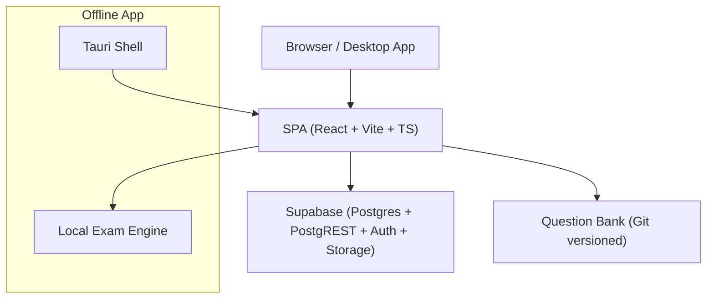
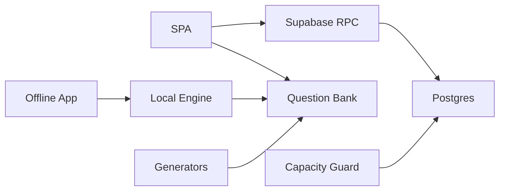

# Compliance and Standards

<cite>
**Referenced Files in This Document**
- [README.md](file://README.md)
- [docs/TECHNICAL_REQUIREMENTS.md](file://docs/TECHNICAL_REQUIREMENTS.md)
- [docs/TECHNICAL_REQUIREMENTS_V6.md](file://docs/TECHNICAL_REQUIREMENTS_V6.md)
- [docs/CAPACITY_GUARD.md](file://docs/CAPACITY_GUARD.md)
- [supabase/schema.sql](file://supabase/schema.sql)
- [web/src/styles.css](file://web/src/styles.css)
- [questions/generator/common.py](file://questions/generator/common.py)
- [CONTRIBUTING.md](file://CONTRIBUTING.md)
</cite>

## Table of Contents
1. Introduction
2. Project Structure
3. Core Components
4. Architecture Overview
5. Detailed Component Analysis
6. Dependency Analysis
7. Performance Considerations
8. Troubleshooting Guide
9. Conclusion
10. Appendices

## Introduction
This document consolidates compliance requirements and standards adherence for the TBS LPDP Try Out system, focusing on:
- Accessibility compliance aligned with WCAG principles (keyboard navigation, screen reader support, visual accessibility)
- Performance requirements and SLA commitments (response time targets, uptime considerations, scalability)
- Educational technology standards, test security, and examination integrity measures
- Internationalization support and cultural adaptation
- Examples of accessibility testing procedures, performance monitoring tools, and compliance validation processes
- Regulatory considerations for educational assessment platforms and data protection best practices

The system is a free, browser-based practice platform that mirrors the official PUSMENDIK CBT experience, with server-authoritative grading and answer-key protection. It also ships an offline desktop/mobile app built with Tauri 2 that reuses the same SPA but runs locally.

**Section sources**
- [README.md:1-128](file://README.md#L1-L128)
- [docs/TECHNICAL_REQUIREMENTS.md:10-40](file://docs/TECHNICAL_REQUIREMENTS.md#L10-L40)

## Project Structure
At a high level:
- Frontend SPA (React + Vite + TypeScript) deployed to GitHub Pages
- Backend via Supabase (Postgres, PostgREST, Auth, Storage)
- Question bank authored in git and validated by scripts
- Offline app shell (Tauri 2) bundling the SPA and local exam engine



**Diagram sources**
- [README.md:40-70](file://README.md#L40-L70)
- [docs/TECHNICAL_REQUIREMENTS.md:21-40](file://docs/TECHNICAL_REQUIREMENTS.md#L21-L40)
- [docs/TECHNICAL_REQUIREMENTS_V6.md:35-65](file://docs/TECHNICAL_REQUIREMENTS_V6.md#L35-L65)

**Section sources**
- [README.md:87-101](file://README.md#L87-L101)
- [docs/TECHNICAL_REQUIREMENTS.md:21-40](file://docs/TECHNICAL_REQUIREMENTS.md#L21-L40)

## Core Components
Key components relevant to compliance:
- Server-authoritative exam logic and grading enforced via database functions and Row Level Security (RLS)
- Capacity guard preventing new attempts when storage nears limits while allowing ongoing attempts to finish
- Offline app flavor with local grading and bundled question bank
- UI mimicking official CBT interface with Bahasa Indonesia copy

Compliance touchpoints:
- Test security and integrity through server-side timing, grading, and answer-key secrecy
- Data protection via RLS and minimal client exposure
- Scalability and capacity management via soft ceilings and retention policies
- Internationalization through Bahasa Indonesia content and localized UI

**Section sources**
- [docs/TECHNICAL_REQUIREMENTS.md:110-123](file://docs/TECHNICAL_REQUIREMENTS.md#L110-L123)
- [docs/CAPACITY_GUARD.md:1-28](file://docs/CAPACITY_GUARD.md#L1-L28)
- [docs/TECHNICAL_REQUIREMENTS_V6.md:68-90](file://docs/TECHNICAL_REQUIREMENTS_V6.md#L68-L90)

## Architecture Overview
The architecture enforces compliance through separation of concerns:
- The SPA handles user interaction and displays results; it never grades or accesses answer keys during active sections
- Supabase enforces timing, grading, and access control via RPCs and RLS
- Capacity guard protects service availability under free-tier constraints
- Offline app uses local engine and bundled bank, with update mechanisms for both bank and binary

```mermaid
sequenceDiagram
participant User as "User"
participant SPA as "SPA"
participant Supabase as "Supabase RPC"
participant DB as "Postgres"
User->>SPA : Start attempt
SPA->>Supabase : start_attempt(package_id)
Supabase->>DB : Check capacity & create attempt
DB-->>Supabase : Attempt created
Supabase-->>SPA : Attempt info
User->>SPA : Start section
SPA->>Supabase : start_section(attempt_id)
Supabase->>DB : Return questions without keys + deadline
DB-->>Supabase : Questions + deadline
Supabase-->>SPA : Section state
Note over SPA,DB : Timer enforced server-side; answers saved via RPC
```

**Diagram sources**
- [docs/TECHNICAL_REQUIREMENTS.md:150-163](file://docs/TECHNICAL_REQUIREMENTS.md#L150-L163)
- [supabase/schema.sql:16-104](file://supabase/schema.sql#L16-L104)

**Section sources**
- [docs/TECHNICAL_REQUIREMENTS.md:150-163](file://docs/TECHNICAL_REQUIREMENTS.md#L150-L163)
- [supabase/schema.sql:16-104](file://supabase/schema.sql#L16-L104)

## Detailed Component Analysis

### Accessibility Compliance (WCAG-aligned)
While explicit WCAG conformance statements are not present in the repository, several design choices align with common accessibility principles:
- Keyboard focus indicators are defined for interactive elements (e.g., navigation buttons, close controls), supporting keyboard navigation
- High-contrast color palette and consistent visual hierarchy improve readability
- Responsive layout ensures usability across devices, aiding users with assistive technologies
- Font size controls are provided in the exam flow, supporting visual accessibility needs

Recommendations for further WCAG alignment:
- Add ARIA labels and roles where semantic HTML is insufficient
- Ensure all interactive elements are reachable via keyboard and announce state changes to screen readers
- Validate color contrast ratios against WCAG AA thresholds
- Provide skip links and logical heading structure for improved navigation

**Section sources**
- [web/src/styles.css:264-268](file://web/src/styles.css#L264-L268)
- [web/src/styles.css:129-132](file://web/src/styles.css#L129-L132)
- [docs/TECHNICAL_REQUIREMENTS.md:98-107](file://docs/TECHNICAL_REQUIREMENTS.md#L98-L107)

### Performance Requirements and SLA Commitments
The system targets free-tier-friendly performance:
- Optimistic UI with background RPC calls for instant-feeling interactions
- Server-enforced timer accuracy within ±1 second using server time correction
- Capacity guard prevents new attempts at a soft limit to avoid write failures mid-exam
- Retention policies automatically clean up old attempts and anonymous users

SLA considerations:
- Uptime depends on GitHub Pages and Supabase free tier; no self-hosted servers
- Response times aim for immediate feel on question interactions
- Scalability is bounded by free-tier limits; capacity guard and retention manage growth

Monitoring and validation:
- Capacity metrics measured via database size and row estimates
- Service status exposed to frontend for user-facing messaging
- Daily maintenance jobs handle retention and capacity refresh

**Section sources**
- [docs/TECHNICAL_REQUIREMENTS.md:171-181](file://docs/TECHNICAL_REQUIREMENTS.md#L171-L181)
- [docs/CAPACITY_GUARD.md:29-80](file://docs/CAPACITY_GUARD.md#L29-L80)
- [docs/CAPACITY_GUARD.md:98-135](file://docs/CAPACITY_GUARD.md#L98-L135)

### Educational Technology Standards and Test Security
The platform adheres to key educational assessment standards:
- Mirrors official PUSMENDIK CBT interface and exam format
- Server-authoritative timing and grading ensure integrity
- Answer keys are never accessible to clients during active sections
- Event logging captures user actions for auditability

Integrity measures:
- RLS restricts data access to user’s own attempts
- No client-side grading in web deployment
- Offline app includes local grading by design, with documentation clarifying this limitation

**Section sources**
- [docs/TECHNICAL_REQUIREMENTS.md:42-50](file://docs/TECHNICAL_REQUIREMENTS.md#L42-L50)
- [docs/TECHNICAL_REQUIREMENTS.md:164-169](file://docs/TECHNICAL_REQUIREMENTS.md#L164-L169)
- [docs/TECHNICAL_REQUIREMENTS_V6.md:22-33](file://docs/TECHNICAL_REQUIREMENTS_V6.md#L22-L33)

### Internationalization and Cultural Adaptation
The system supports Indonesian language throughout:
- All user-facing content and questions are in Bahasa Indonesia
- Number formatting follows Indonesian conventions (comma decimal separator, dot thousands separator)
- UI copy matches official CBT terminology and layout

Cultural adaptation:
- Content reflects Indonesian educational context and terminology
- Figures and examples use culturally appropriate contexts

**Section sources**
- [docs/TECHNICAL_REQUIREMENTS.md:89-90](file://docs/TECHNICAL_REQUIREMENTS.md#L89-L90)
- [questions/generator/common.py:99-117](file://questions/generator/common.py#L99-L117)
- [CONTRIBUTING.md:7-8](file://CONTRIBUTING.md#L7-L8)

### Compliance Validation Processes
Validation mechanisms include:
- Question bank validation via schema checks and generator constraints
- CI pipelines enforce build-time assertions (e.g., flavor isolation, secret absence)
- Capacity guard provides runtime protection against storage limits
- Manual acceptance criteria for offline app features

Examples:
- Schema validation ensures question structure compliance
- Build flavor constants prevent accidental inclusion of sensitive code
- Capacity measurements run periodically to maintain service health

**Section sources**
- [docs/TECHNICAL_REQUIREMENTS.md:79-90](file://docs/TECHNICAL_REQUIREMENTS.md#L79-L90)
- [docs/TECHNICAL_REQUIREMENTS_V6.md:240-253](file://docs/TECHNICAL_REQUIREMENTS_V6.md#L240-L253)
- [docs/CAPACITY_GUARD.md:60-80](file://docs/CAPACITY_GUARD.md#L60-L80)

## Dependency Analysis
Component relationships impact compliance:
- SPA depends on Supabase RPCs for secure exam operations
- Offline app depends on local engine and bundled bank
- Question generators depend on deterministic algorithms for answer correctness
- Capacity guard depends on database metadata for service health



**Diagram sources**
- [docs/TECHNICAL_REQUIREMENTS.md:21-40](file://docs/TECHNICAL_REQUIREMENTS.md#L21-L40)
- [docs/TECHNICAL_REQUIREMENTS_V6.md:35-65](file://docs/TECHNICAL_REQUIREMENTS_V6.md#L35-L65)
- [docs/CAPACITY_GUARD.md:29-80](file://docs/CAPACITY_GUARD.md#L29-L80)

**Section sources**
- [docs/TECHNICAL_REQUIREMENTS.md:21-40](file://docs/TECHNICAL_REQUIREMENTS.md#L21-L40)
- [docs/TECHNICAL_REQUIREMENTS_V6.md:35-65](file://docs/TECHNICAL_REQUIREMENTS_V6.md#L35-L65)

## Performance Considerations
Key performance aspects:
- Optimistic UI updates provide immediate feedback
- Server-side timer enforcement ensures accurate timing
- Capacity guard prevents service degradation from storage limits
- Retention policies manage database growth

Recommendations:
- Monitor RPC response times and error rates
- Track capacity usage trends to proactively adjust limits
- Validate timer accuracy across different network conditions
- Test offline app performance with large question banks

[No sources needed since this section provides general guidance]

## Troubleshooting Guide
Common issues and resolutions:
- Capacity reached: New attempts blocked with specific error code; existing attempts continue normally
- Network errors: Retry logic with visible warnings for failed writes
- Offline app updates: Version checks and manual update prompts available
- Question validation failures: Use generator validation tools before publishing

Debugging steps:
- Check service status endpoint for capacity information
- Review event logs for user action history
- Validate question bank with provided scripts
- Inspect build artifacts for compliance violations

**Section sources**
- [docs/CAPACITY_GUARD.md:98-135](file://docs/CAPACITY_GUARD.md#L98-L135)
- [docs/TECHNICAL_REQUIREMENTS.md:175-181](file://docs/TECHNICAL_REQUIREMENTS.md#L175-L181)
- [docs/TECHNICAL_REQUIREMENTS_V6.md:210-227](file://docs/TECHNICAL_REQUIREMENTS_V6.md#L210-L227)

## Conclusion
The TBS LPDP Try Out system demonstrates strong compliance foundations through:
- Server-authoritative exam logic ensuring test integrity
- Capacity management protecting service availability
- Indonesian localization providing cultural relevance
- Structured validation processes maintaining quality

Areas for enhancement include formal WCAG conformance testing and comprehensive accessibility audits. The system's architecture supports scalability within free-tier constraints while maintaining educational assessment standards.

[No sources needed since this section summarizes without analyzing specific files]

## Appendices

### Accessibility Testing Procedures
Recommended procedures:
- Keyboard navigation testing using Tab, Shift+Tab, and Enter keys
- Screen reader compatibility testing with NVDA, JAWS, and VoiceOver
- Color contrast validation using automated tools
- Focus management verification across all interactive states
- Semantic HTML structure review for assistive technology support

### Performance Monitoring Tools
Suggested tools:
- Database monitoring for capacity and query performance
- Network request monitoring for RPC latency
- Browser performance APIs for frontend metrics
- Error tracking services for exception monitoring

### Compliance Validation Processes
Established processes:
- Question bank validation through schema checks
- Build-time assertions for security and compliance
- Runtime capacity monitoring and alerts
- Manual acceptance criteria for feature releases

[No sources needed since this section provides general guidance]