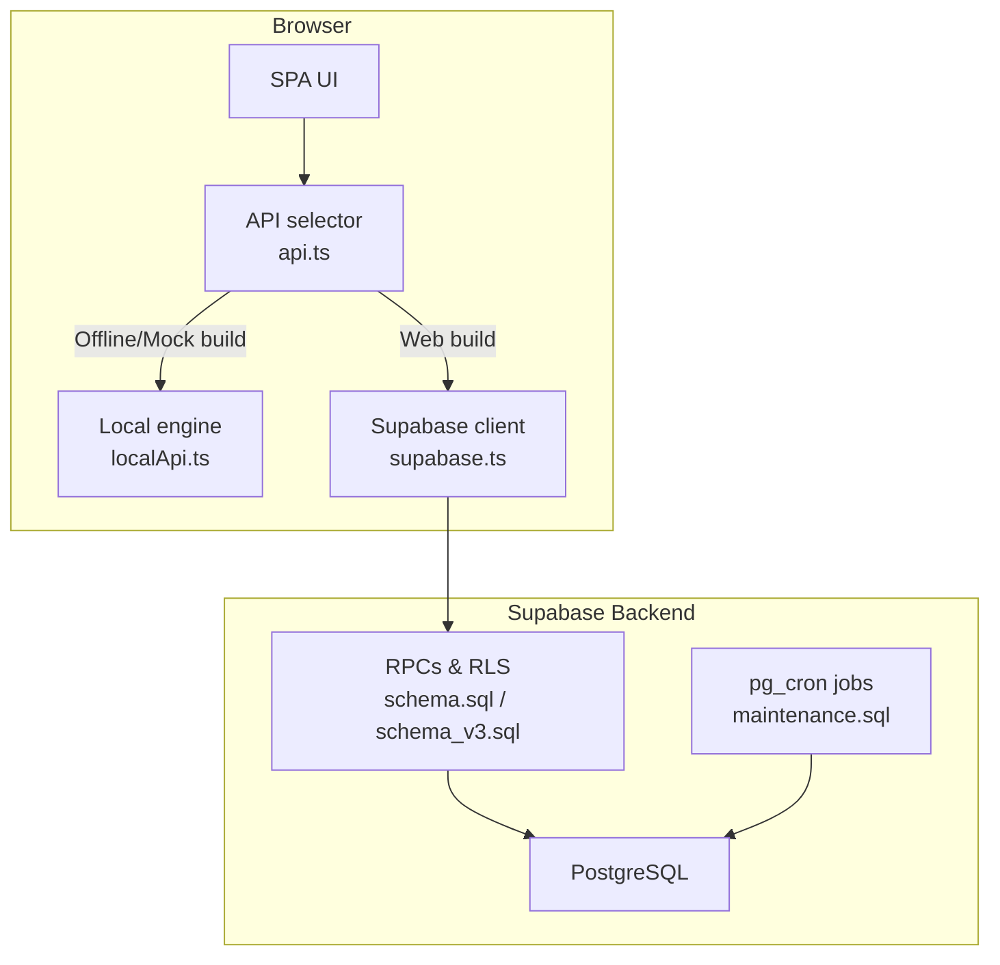
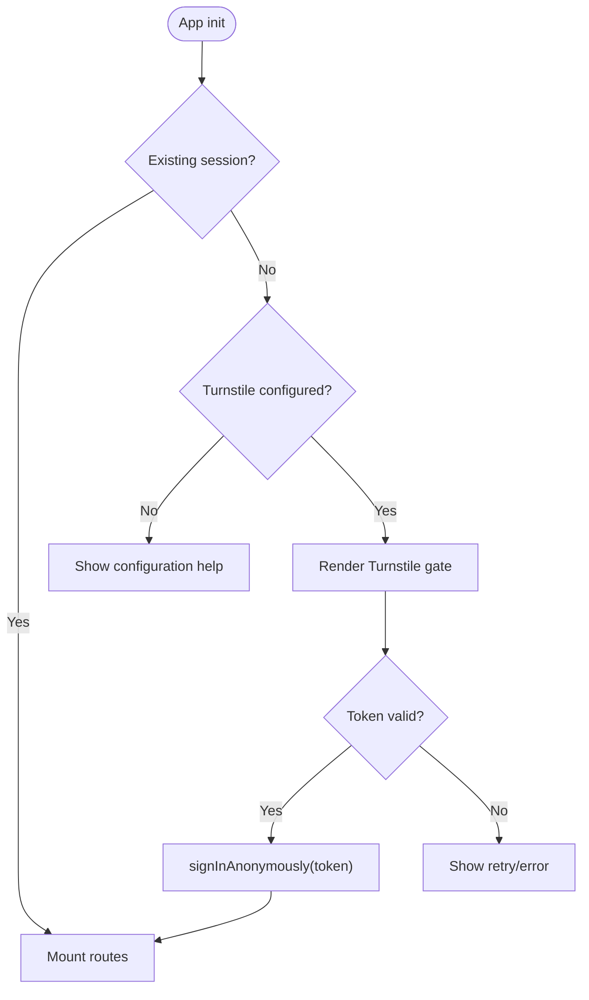
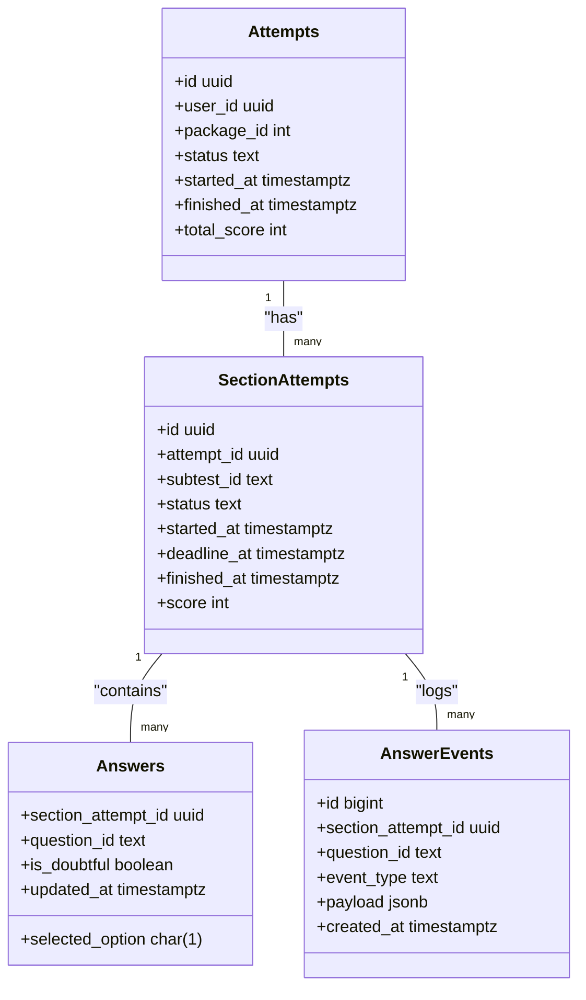
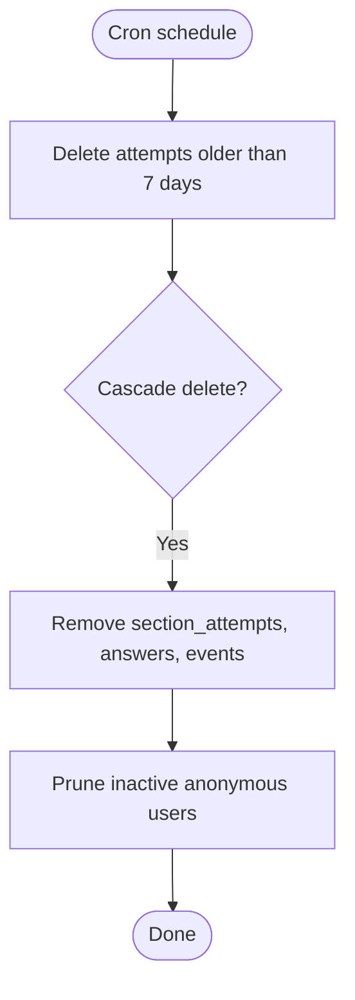
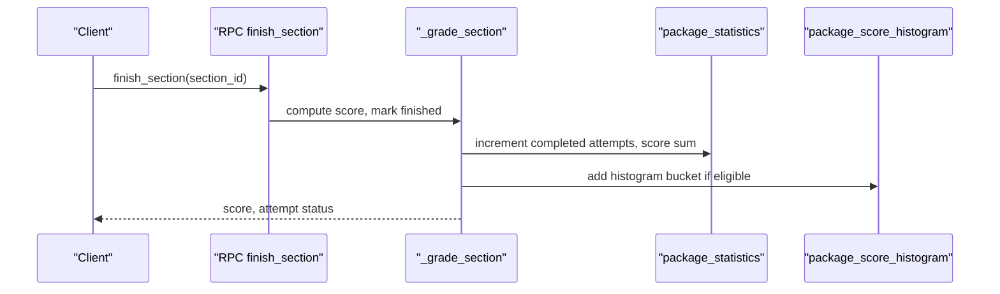
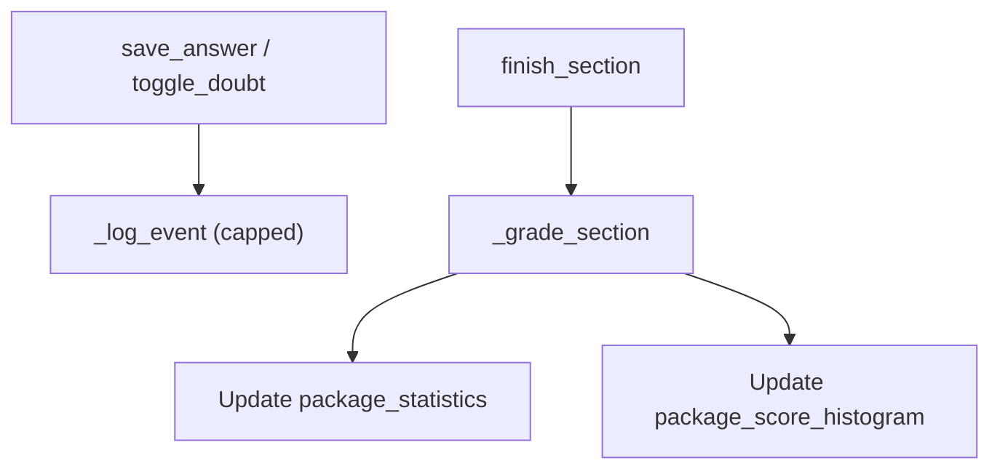
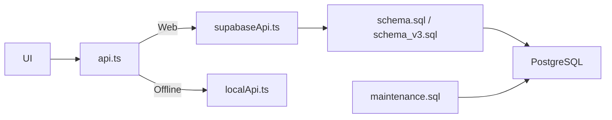

# Data Protection and Privacy

<cite>
**Referenced Files in This Document**
- [schema.sql](file://supabase/schema.sql)
- [schema_v3.sql](file://supabase/schema_v3.sql)
- [maintenance.sql](file://supabase/maintenance.sql)
- [api.ts](file://web/src/lib/api.ts)
- [supabaseApi.ts](file://web/src/lib/supabaseApi.ts)
- [config.ts](file://web/src/lib/config.ts)
- [localApi.ts](file://web/src/lib/localApi.ts)
- [push_to_supabase.py](file://questions/generator/push_to_supabase.py)
- [TECHNICAL_REQUIREMENTS_V5.md](file://docs/TECHNICAL_REQUIREMENTS_V5.md)
- [CAPACITY_GUARD.md](file://docs/CAPACITY_GUARD.md)
</cite>

## Table of Contents
1. Introduction
2. Project Structure
3. Core Components
4. Architecture Overview
5. Detailed Component Analysis
6. Dependency Analysis
7. Performance Considerations
8. Troubleshooting Guide
9. Conclusion

## Introduction
This document explains how the TBS LPDP Try Out system protects personal data across its lifecycle. It covers what data is collected, how it is stored and accessed, encryption practices for data at rest and in transit, retention and cleanup policies, archival strategies for attempt history and statistics, compliance controls such as CAPTCHA-gated anonymous sign-in, user consent considerations, and mechanisms to support deletion requests. It also documents privacy-preserving analytics and audit logging patterns used by the system.

## Project Structure
The system has two runtime modes:
- Web mode: a browser SPA that calls Supabase RPCs over HTTPS with Row-Level Security (RLS) enforced server-side.
- Offline mode: a Tauri-based app that runs a local exam engine against an embedded question bank and stores state in localStorage.

**Diagram sources**
- [api.ts:1-128](file://web/src/lib/api.ts#L1-L128)
- [supabaseApi.ts:1-170](file://web/src/lib/supabaseApi.ts#L1-L170)
- [localApi.ts:1-560](file://web/src/lib/localApi.ts#L1-L560)
- [schema.sql:131-188](file://supabase/schema.sql#L131-L188)
- [schema_v3.sql:185-289](file://supabase/schema_v3.sql#L185-L289)
- [maintenance.sql:18-73](file://supabase/maintenance.sql#L18-L73)

**Section sources**
- [api.ts:1-128](file://web/src/lib/api.ts#L1-L128)
- [supabaseApi.ts:1-170](file://web/src/lib/supabaseApi.ts#L1-L170)
- [localApi.ts:1-560](file://web/src/lib/localApi.ts#L1-L560)
- [schema.sql:131-188](file://supabase/schema.sql#L131-L188)
- [schema_v3.sql:185-289](file://supabase/schema_v3.sql#L185-L289)
- [maintenance.sql:18-73](file://supabase/maintenance.sql#L18-L73)

## Core Components
- Authentication and access control: Anonymous sign-in protected by Cloudflare Turnstile; all data access goes through authenticated RPCs with RLS policies scoped to the current user.
- Attempt lifecycle: Attempts, sections, answers, and events are created and updated exclusively via server-side RPCs.
- Retention and capacity: Scheduled jobs prune old attempts and anonymous users; capacity guards prevent new attempts when storage limits approach.
- Analytics and audit: Per-attempt event logs and aggregate package statistics provide auditability while minimizing raw personal data exposure.
- Offline mode: A local engine mirrors server semantics using localStorage; answer keys exist only in offline builds, not in production web bundles.

**Section sources**
- [supabaseApi.ts:45-64](file://web/src/lib/supabaseApi.ts#L45-L64)
- [schema.sql:131-188](file://supabase/schema.sql#L131-L188)
- [schema_v3.sql:608-757](file://supabase/schema_v3.sql#L608-L757)
- [maintenance.sql:22-73](file://supabase/maintenance.sql#L22-L73)
- [localApi.ts:27-36](file://web/src/lib/localApi.ts#L27-L36)

## Architecture Overview
Data flows from the UI through a backend-agnostic API layer into either a local engine or Supabase RPCs. All mutations are validated and authorized on the server. Sensitive content (answer keys) never reaches clients during normal operation.

```mermaid
sequenceDiagram
participant U as "User"
participant B as "Browser"
participant A as "API selector<br/>api.ts"
participant S as "Supabase client<br/>supabaseApi.ts"
participant R as "RPCs & RLS<br/>schema.sql / schema_v3.sql"
participant D as "Database"
U->>B : Open page
B->>A : Call API method
A->>S : Choose backend (offline vs web)
alt Offline
A->>A : localApi.ts (localStorage)
else Web
S->>R : start_attempt / save_answer / finish_section
R->>D : Enforce RLS, grade, log events
D-->>R : Results
R-->>S : JSON with server_time
S-->>A : Response
A-->>U : UI update
end
```

**Diagram sources**
- [api.ts:38-75](file://web/src/lib/api.ts#L38-L75)
- [supabaseApi.ts:32-64](file://web/src/lib/supabaseApi.ts#L32-L64)
- [schema.sql:341-580](file://supabase/schema.sql#L341-L580)
- [schema_v3.sql:608-757](file://supabase/schema_v3.sql#L608-L757)

## Detailed Component Analysis

### Authentication, Consent, and Bot Protection
- New anonymous identities require a verified CAPTCHA token before Supabase Auth creates an account. Existing sessions continue without re-challenge.
- The public site key is configured at build time; the secret remains in Supabase.
- The frontend enforces a gate so routes do not mount until verification succeeds when configured.

**Diagram sources**
- [TECHNICAL_REQUIREMENTS_V5.md:10-53](file://docs/TECHNICAL_REQUIREMENTS_V5.md#L10-L53)
- [supabaseApi.ts:45-64](file://web/src/lib/supabaseApi.ts#L45-L64)
- [config.ts:33-43](file://web/src/lib/config.ts#L33-L43)

**Section sources**
- [TECHNICAL_REQUIREMENTS_V5.md:10-53](file://docs/TECHNICAL_REQUIREMENTS_V5.md#L10-L53)
- [supabaseApi.ts:45-64](file://web/src/lib/supabaseApi.ts#L45-L64)
- [config.ts:33-43](file://web/src/lib/config.ts#L33-L43)

### Data Minimization and Access Control
- Clients never write tables directly; all mutations go through RPCs that enforce ownership checks.
- RLS policies restrict reads/writes to the current user’s attempts and related data.
- Answer keys are never exposed to clients except in review of finished sections owned by the caller.

**Diagram sources**
- [schema.sql:64-106](file://supabase/schema.sql#L64-L106)
- [schema.sql:131-188](file://supabase/schema.sql#L131-L188)

**Section sources**
- [schema.sql:64-106](file://supabase/schema.sql#L64-L106)
- [schema.sql:131-188](file://supabase/schema.sql#L131-L188)

### Encryption and Secure Communication
- In transit: All client-to-server communication uses HTTPS via Supabase endpoints.
- At rest: PostgreSQL data resides in Supabase-managed infrastructure; application code does not implement custom encryption.
- Secrets management: Service role keys and Turnstile secrets are never included in the frontend bundle; only publishable keys reach the client.

**Section sources**
- [config.ts:18-43](file://web/src/lib/config.ts#L18-L43)
- [CLAUDE.md:83-95](file://CLAUDE.md#L83-L95)

### Storage, Retention, and Cleanup
- Attempt data retention: A scheduled job deletes attempts older than seven days, cascading to sections, answers, and events.
- Anonymous user cleanup: Periodically removes inactive anonymous users who have no question reports.
- Capacity guard: Prevents starting new attempts when database usage approaches plan limits; existing attempts remain usable.

**Diagram sources**
- [maintenance.sql:22-73](file://supabase/maintenance.sql#L22-L73)

**Section sources**
- [maintenance.sql:22-73](file://supabase/maintenance.sql#L22-L73)
- [CAPACITY_GUARD.md:1-161](file://docs/CAPACITY_GUARD.md#L1-L161)

### Archival Strategy for Statistics and History
- Immutable releases and revisions: Question and package versions are captured immutably; attempts pin to a release snapshot.
- Aggregate statistics: Package-level counters and score histograms are maintained per completion, enabling privacy-preserving analytics without exposing individual responses.
- Backfill capability: An optional one-time backfill reconstructs qualified historical aggregates from retained pre-boundary attempts, ensuring consistency.

**Diagram sources**
- [schema_v3.sql:608-757](file://supabase/schema_v3.sql#L608-L757)
- [schema_v3.sql:185-237](file://supabase/schema_v3.sql#L185-L237)

**Section sources**
- [schema_v3.sql:185-237](file://supabase/schema_v3.sql#L185-L237)
- [schema_v3.sql:608-757](file://supabase/schema_v3.sql#L608-L757)

### Audit Logging and Privacy-Preserving Analytics
- Event log: Each section maintains an append-only event log capped per section to bound storage growth.
- Aggregates: Package statistics and histograms summarize performance without linking to individuals.
- Hashing: Content hashes ensure integrity of published questions and releases.

**Diagram sources**
- [schema.sql:241-260](file://supabase/schema.sql#L241-L260)
- [schema_v3.sql:608-757](file://supabase/schema_v3.sql#L608-L757)

**Section sources**
- [schema.sql:241-260](file://supabase/schema.sql#L241-L260)
- [schema_v3.sql:608-757](file://supabase/schema_v3.sql#L608-L757)

### Offline Mode Data Handling
- Local engine: Mirrors server semantics using localStorage; answer keys are present only in offline builds.
- No network: Offline mode does not call Supabase; therefore no remote data leaves the device.
- Build-time isolation: Production web builds exclude the local engine and Supabase client to avoid bundling sensitive logic.

**Section sources**
- [localApi.ts:27-36](file://web/src/lib/localApi.ts#L27-L36)
- [api.ts:1-128](file://web/src/lib/api.ts#L1-L128)
- [config.ts:11-31](file://web/src/lib/config.ts#L11-L31)

## Dependency Analysis
- Frontend API selection determines whether data stays local or travels to Supabase.
- Server-side RPCs encapsulate business rules, RLS enforcement, and auditing.
- Maintenance jobs depend on pg_cron and operate independently of application deployments.

**Diagram sources**
- [api.ts:1-128](file://web/src/lib/api.ts#L1-L128)
- [supabaseApi.ts:1-170](file://web/src/lib/supabaseApi.ts#L1-L170)
- [localApi.ts:1-560](file://web/src/lib/localApi.ts#L1-L560)
- [schema.sql:131-188](file://supabase/schema.sql#L131-L188)
- [schema_v3.sql:185-289](file://supabase/schema_v3.sql#L185-L289)
- [maintenance.sql:18-73](file://supabase/maintenance.sql#L18-L73)

**Section sources**
- [api.ts:1-128](file://web/src/lib/api.ts#L1-L128)
- [supabaseApi.ts:1-170](file://web/src/lib/supabaseApi.ts#L1-L170)
- [localApi.ts:1-560](file://web/src/lib/localApi.ts#L1-L560)
- [schema.sql:131-188](file://supabase/schema.sql#L131-L188)
- [schema_v3.sql:185-289](file://supabase/schema_v3.sql#L185-L289)
- [maintenance.sql:18-73](file://supabase/maintenance.sql#L18-L73)

## Performance Considerations
- Event logging is capped per section to prevent unbounded growth.
- Capacity measurements use catalog estimates to stay O(1) even as tables grow.
- Retention jobs run off-hours to minimize impact.

[No sources needed since this section provides general guidance]

## Troubleshooting Guide
- Human verification required: Indicates missing or invalid CAPTCHA token; ensure Turnstile is configured and the gate completes successfully.
- Too many attempts: Rate limit exceeded; wait before retrying.
- Storage capacity reached: Database near plan limit; new attempts are blocked until retention reduces usage or limits are adjusted.
- Chunk load errors: The app may reload automatically to fetch fresh modules.

**Section sources**
- [supabaseApi.ts:45-64](file://web/src/lib/supabaseApi.ts#L45-L64)
- [api.ts:97-122](file://web/src/lib/api.ts#L97-L122)
- [CAPACITY_GUARD.md:81-135](file://docs/CAPACITY_GUARD.md#L81-L135)

## Conclusion
The TBS LPDP Try Out system applies data protection principles throughout its lifecycle: minimal collection, strict access controls via RLS, secure communication, bounded audit logs, and automated retention. Analytics are aggregated to preserve privacy, while immutable releases ensure reproducibility. CAPTCHA-gated anonymous sign-in mitigates abuse without compromising privacy. Together, these measures align with responsible data handling practices suitable for a high-stakes testing environment.