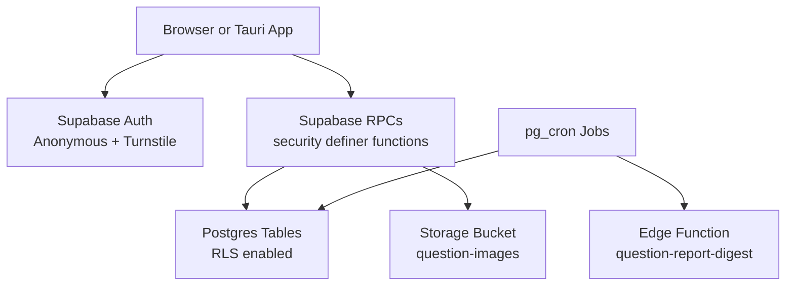
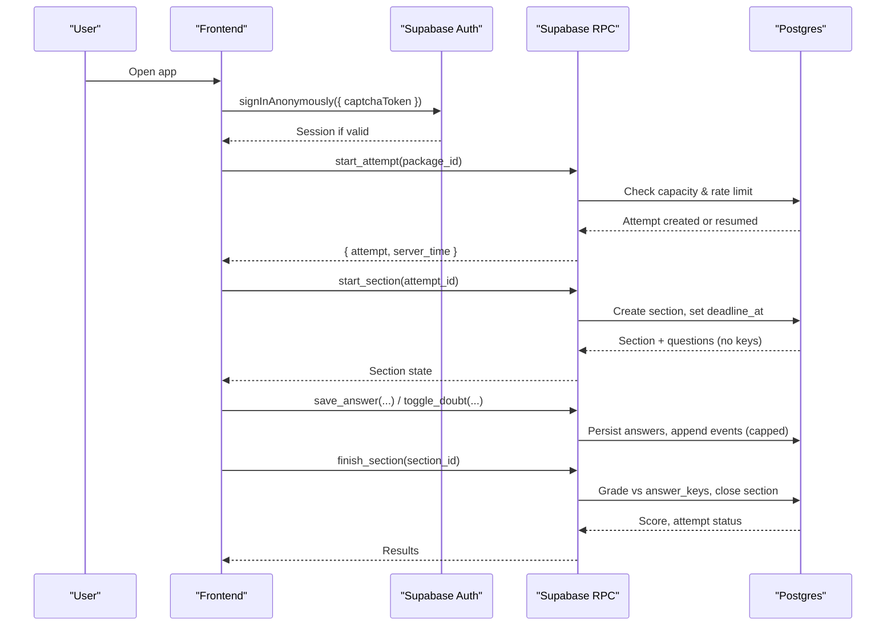
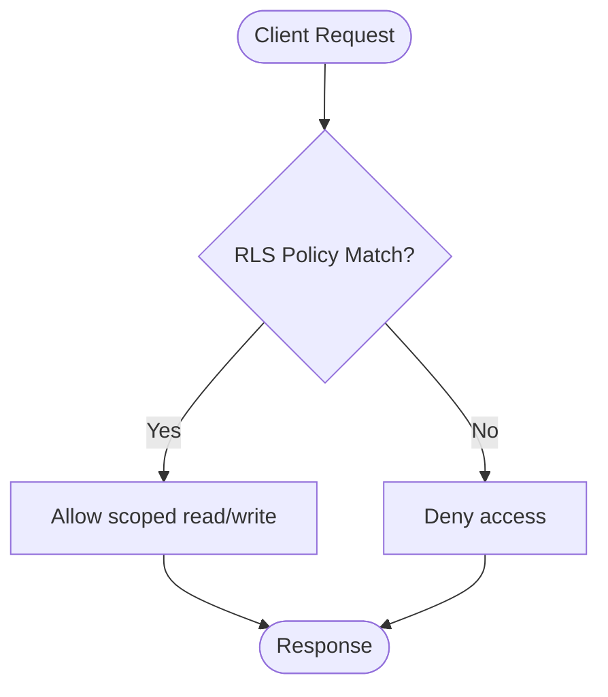
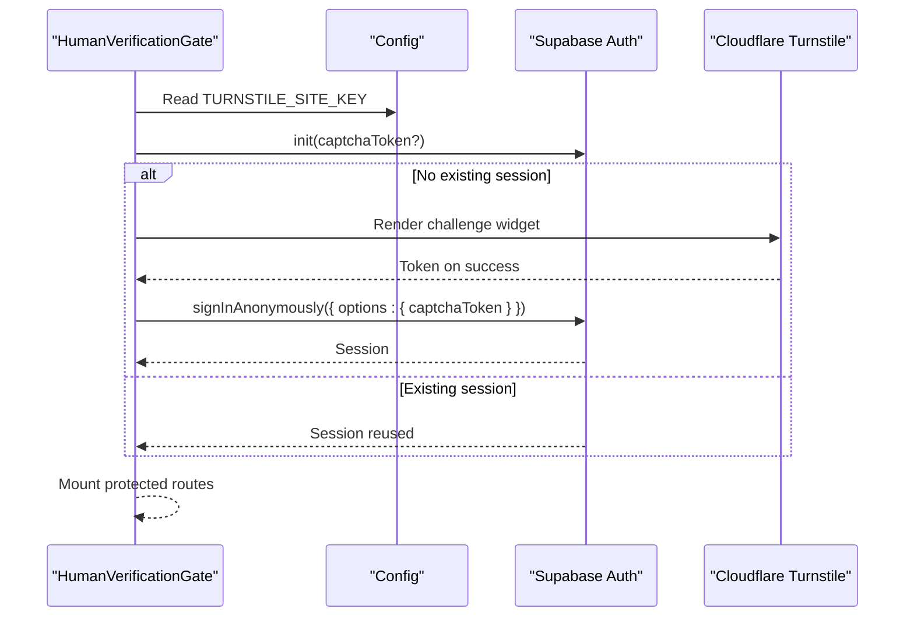
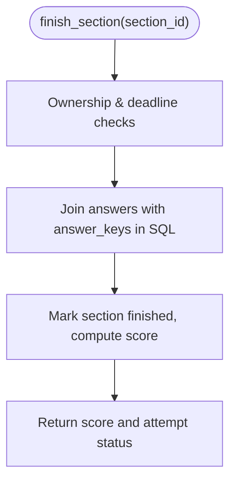
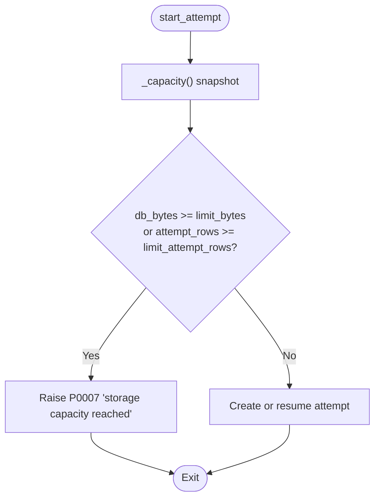
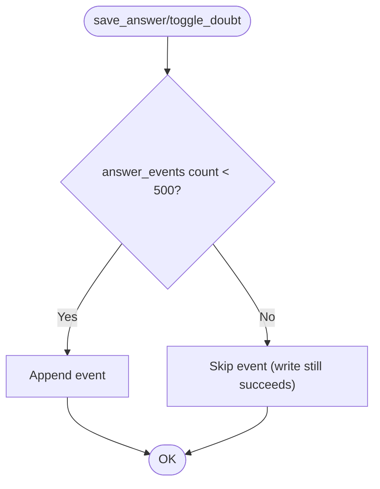
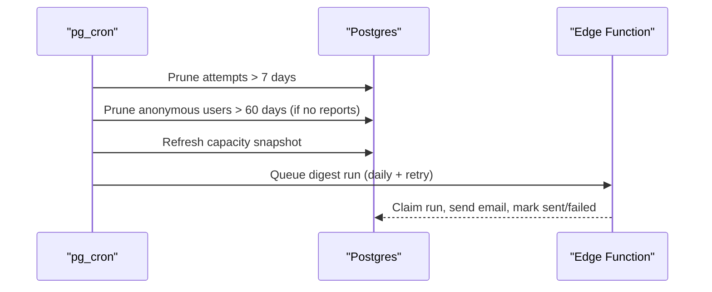
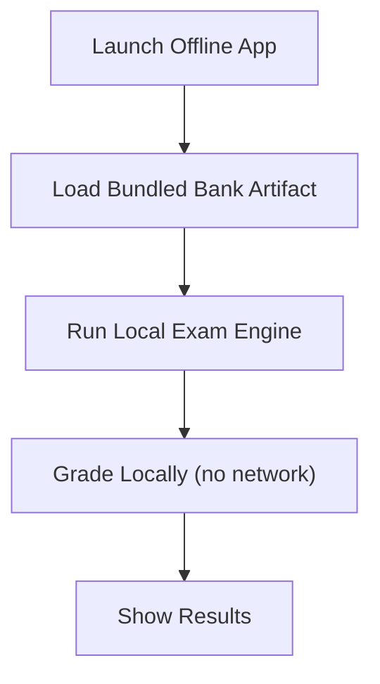
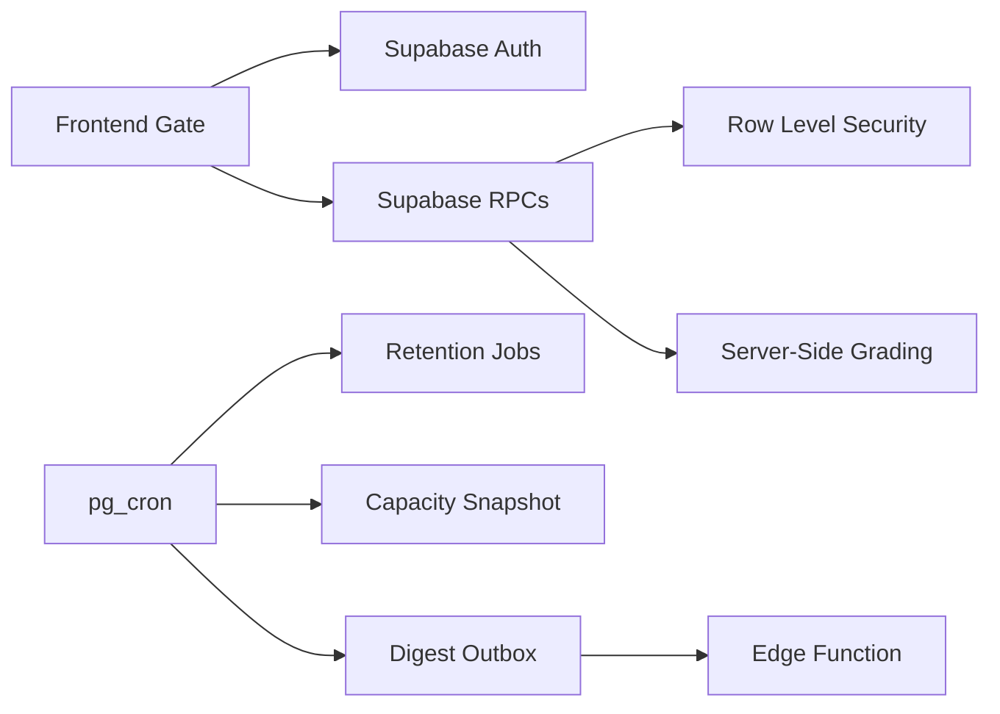

# Security and Compliance

<cite>
**Referenced Files in This Document**
- [README.md](file://README.md)
- [CONTRIBUTING.md](file://CONTRIBUTING.md)
- [docs/TECHNICAL_REQUIREMENTS.md](file://docs/TECHNICAL_REQUIREMENTS.md)
- [docs/TECHNICAL_REQUIREMENTS_V5.md](file://docs/TECHNICAL_REQUIREMENTS_V5.md)
- [docs/CAPACITY_GUARD.md](file://docs/CAPACITY_GUARD.md)
- [supabase/schema.sql](file://supabase/schema.sql)
- [supabase/maintenance.sql](file://supabase/maintenance.sql)
- [supabase/functions/question-report-digest/index.ts](file://supabase/functions/question-report-digest/index.ts)
- [web/src/components/HumanVerificationGate.tsx](file://web/src/components/HumanVerificationGate.tsx)
- [web/src/lib/api.ts](file://web/src/lib/api.ts)
- [web/src/lib/config.ts](file://web/src/lib/config.ts)
</cite>

## Table of Contents
1. Introduction
2. Project Structure
3. Core Components
4. Architecture Overview
5. Detailed Component Analysis
6. Dependency Analysis
7. Performance Considerations
8. Troubleshooting Guide
9. Conclusion

## Introduction
This document provides comprehensive security and compliance coverage for the TBS LPDP Try Out system. It explains how Row Level Security (RLS), anonymous authentication, Turnstile CAPTCHA integration, answer-key protection, capacity controls, rate limiting, retention jobs, and operational safeguards work together to protect a free-tier infrastructure while preserving user trust. It also outlines threat models across web and offline versions, compliance considerations, audit logging, and incident response procedures.

## Project Structure
The system is composed of:
- A static SPA frontend deployed to GitHub Pages that communicates with Supabase via RPCs.
- A Postgres-backed backend using RLS policies, server-side grading, and scheduled maintenance jobs.
- An offline desktop/mobile app built with Tauri that bundles the question bank and runs locally without network access.

**Diagram sources**
- [supabase/schema.sql:131-181](file://supabase/schema.sql#L131-L181)
- [supabase/maintenance.sql:18-73](file://supabase/maintenance.sql#L18-L73)
- [supabase/functions/question-report-digest/index.ts:27-58](file://supabase/functions/question-report-digest/index.ts#L27-L58)

**Section sources**
- [README.md:28-63](file://README.md#L28-L63)
- [docs/TECHNICAL_REQUIREMENTS.md:21-40](file://docs/TECHNICAL_REQUIREMENTS.md#L21-L40)

## Core Components
- Anonymous authentication with Turnstile verification for new sessions.
- Server-authoritative exam logic: deadlines, grading, and answer-key secrecy enforced by database functions and RLS.
- Capacity guard preventing new attempts when storage nears limits while allowing ongoing exams to finish.
- Rate limiting per user and per-attempt event log caps to deter abuse.
- Retention jobs to prune old attempts and inactive anonymous users.
- Audit logging through append-only events.
- Offline mode that excludes sensitive backends from the bundle.

**Section sources**
- [docs/TECHNICAL_REQUIREMENTS.md:110-123](file://docs/TECHNICAL_REQUIREMENTS.md#L110-L123)
- [docs/CAPACITY_GUARD.md:1-28](file://docs/CAPACITY_GUARD.md#L1-L28)
- [supabase/schema.sql:185-337](file://supabase/schema.sql#L185-L337)
- [supabase/maintenance.sql:22-73](file://supabase/maintenance.sql#L22-L73)
- [web/src/lib/api.ts:97-122](file://web/src/lib/api.ts#L97-L122)

## Architecture Overview
The security architecture centers on least privilege and server authority:
- All mutations go through RPCs; no direct table writes from clients.
- RLS scopes all user data to the current anonymous user.
- Answer keys are never client-readable; grading occurs server-side.
- New anonymous identities require a Turnstile token verified by Supabase Auth.
- Capacity guard and retention jobs keep the free tier safe.

**Diagram sources**
- [supabase/schema.sql:341-389](file://supabase/schema.sql#L341-L389)
- [supabase/schema.sql:417-493](file://supabase/schema.sql#L417-L493)
- [supabase/schema.sql:495-580](file://supabase/schema.sql#L495-L580)
- [docs/TECHNICAL_REQUIREMENTS_V5.md:28-53](file://docs/TECHNICAL_REQUIREMENTS_V5.md#L28-L53)

## Detailed Component Analysis

### Row Level Security and Data Access Control
- RLS is enabled on all tables; content tables expose only published metadata.
- User-scoped policies restrict reads/writes to the current `auth.uid()`.
- `answer_keys` has no client policy; it is accessed only inside server functions.
- Public images bucket allows read access for both anonymous and authenticated users.

**Diagram sources**
- [supabase/schema.sql:131-181](file://supabase/schema.sql#L131-L181)
- [supabase/schema.sql:663-672](file://supabase/schema.sql#L663-L672)

**Section sources**
- [supabase/schema.sql:131-181](file://supabase/schema.sql#L131-L181)
- [supabase/schema.sql:663-672](file://supabase/schema.sql#L663-L672)

### Anonymous Authentication and Turnstile CAPTCHA
- New anonymous identities must pass a Turnstile challenge before Supabase Auth creates a session.
- Existing sessions bypass the challenge.
- The frontend gate loads the Turnstile script only when needed and handles errors/retries gracefully.
- Token is single-use and not persisted in application storage.

**Diagram sources**
- [web/src/components/HumanVerificationGate.tsx:73-158](file://web/src/components/HumanVerificationGate.tsx#L73-L158)
- [web/src/lib/config.ts:33-40](file://web/src/lib/config.ts#L33-L40)
- [docs/TECHNICAL_REQUIREMENTS_V5.md:28-53](file://docs/TECHNICAL_REQUIREMENTS_V5.md#L28-L53)

**Section sources**
- [web/src/components/HumanVerificationGate.tsx:73-158](file://web/src/components/HumanVerificationGate.tsx#L73-L158)
- [web/src/lib/config.ts:33-40](file://web/src/lib/config.ts#L33-L40)
- [docs/TECHNICAL_REQUIREMENTS_V5.md:28-53](file://docs/TECHNICAL_REQUIREMENTS_V5.md#L28-L53)

### Answer Key Protection and Grading Integrity
- Grading happens exclusively in server functions; clients never see correct answers during active sections.
- Review endpoints return keys only for finished sections owned by the caller.
- Event logs capture actions without exposing secrets.

**Diagram sources**
- [supabase/schema.sql:185-238](file://supabase/schema.sql#L185-L238)
- [supabase/schema.sql:551-580](file://supabase/schema.sql#L551-L580)
- [supabase/schema.sql:612-657](file://supabase/schema.sql#L612-L657)

**Section sources**
- [supabase/schema.sql:185-238](file://supabase/schema.sql#L185-L238)
- [supabase/schema.sql:551-580](file://supabase/schema.sql#L551-L580)
- [supabase/schema.sql:612-657](file://supabase/schema.sql#L612-L657)

### Capacity Controls and Free-Tier Protection
- Capacity guard measures database size and estimated attempt rows, refusing new attempts at a soft ceiling while allowing ongoing work to complete.
- UI reflects acceptance status and usage percentage; raw bytes remain server-side.
- Limits are configurable via a single row in the database.

**Diagram sources**
- [supabase/schema.sql:262-315](file://supabase/schema.sql#L262-L315)
- [supabase/schema.sql:341-389](file://supabase/schema.sql#L341-L389)
- [docs/CAPACITY_GUARD.md:29-111](file://docs/CAPACITY_GUARD.md#L29-L111)

**Section sources**
- [docs/CAPACITY_GUARD.md:1-28](file://docs/CAPACITY_GUARD.md#L1-L28)
- [docs/CAPACITY_GUARD.md:29-111](file://docs/CAPACITY_GUARD.md#L29-L111)
- [supabase/schema.sql:262-315](file://supabase/schema.sql#L262-L315)
- [supabase/schema.sql:341-389](file://supabase/schema.sql#L341-L389)

### Rate Limiting and Abuse Prevention
- Per-user hourly attempt creation limit prevents rapid-fire attempts.
- Append-only event log is capped per section to bound storage growth.
- Combined with Turnstile and IP-based auth limits, these mitigate scrapers and bots.

**Diagram sources**
- [supabase/schema.sql:241-260](file://supabase/schema.sql#L241-L260)
- [supabase/schema.sql:341-389](file://supabase/schema.sql#L341-L389)

**Section sources**
- [supabase/schema.sql:241-260](file://supabase/schema.sql#L241-L260)
- [supabase/schema.sql:341-389](file://supabase/schema.sql#L341-L389)

### Retention Jobs and Operational Safeguards
- Daily pruning removes attempts older than 7 days and cleans up inactive anonymous users who did not file reports.
- Capacity snapshot job warms the capacity guard; self-healing ensures correctness even without cron.
- Digest outbox schedules daily report emails with retry and idempotency.

**Diagram sources**
- [supabase/maintenance.sql:22-73](file://supabase/maintenance.sql#L22-L73)
- [supabase/maintenance.sql:87-152](file://supabase/maintenance.sql#L87-L152)
- [supabase/functions/question-report-digest/index.ts:27-118](file://supabase/functions/question-report-digest/index.ts#L27-L118)

**Section sources**
- [supabase/maintenance.sql:22-73](file://supabase/maintenance.sql#L22-L73)
- [supabase/maintenance.sql:87-152](file://supabase/maintenance.sql#L87-L152)
- [supabase/functions/question-report-digest/index.ts:27-118](file://supabase/functions/question-report-digest/index.ts#L27-L118)

### Offline Version Security Model
- The offline app uses a local exam engine and bundled question bank; it does not call Supabase or load third-party scripts.
- Build-time flags ensure the offline bundle excludes any backend dependencies or secrets.

**Diagram sources**
- [web/src/lib/config.ts:11-22](file://web/src/lib/config.ts#L11-L22)
- [web/src/lib/api.ts:3-12](file://web/src/lib/api.ts#L3-L12)
- [CONTRIBUTING.md:87-100](file://CONTRIBUTING.md#L87-L100)

**Section sources**
- [web/src/lib/config.ts:11-22](file://web/src/lib/config.ts#L11-L22)
- [web/src/lib/api.ts:3-12](file://web/src/lib/api.ts#L3-L12)
- [CONTRIBUTING.md:87-100](file://CONTRIBUTING.md#L87-L100)

## Dependency Analysis
Key security dependencies and their roles:
- Supabase Auth enforces CAPTCHA for anonymous sign-in.
- Postgres RLS and security definer functions enforce data isolation and trusted grading.
- pg_cron drives retention and operational tasks.
- Frontend gate orchestrates Turnstile only when required.
- Edge function sends operator digests securely using vaulted secrets.

**Diagram sources**
- [supabase/schema.sql:131-181](file://supabase/schema.sql#L131-L181)
- [supabase/maintenance.sql:18-73](file://supabase/maintenance.sql#L18-L73)
- [supabase/functions/question-report-digest/index.ts:27-58](file://supabase/functions/question-report-digest/index.ts#L27-L58)
- [web/src/components/HumanVerificationGate.tsx:73-158](file://web/src/components/HumanVerificationGate.tsx#L73-L158)

**Section sources**
- [supabase/schema.sql:131-181](file://supabase/schema.sql#L131-L181)
- [supabase/maintenance.sql:18-73](file://supabase/maintenance.sql#L18-L73)
- [supabase/functions/question-report-digest/index.ts:27-58](file://supabase/functions/question-report-digest/index.ts#L27-L58)
- [web/src/components/HumanVerificationGate.tsx:73-158](file://web/src/components/HumanVerificationGate.tsx#L73-L158)

## Performance Considerations
- Capacity measurements use O(1) catalog stats and directory sizes; cached for 5 minutes to avoid request overhead.
- Event log cap bounds per-section storage growth without blocking saves.
- Retry logic avoids retransmitting on terminal errors (rate limits, capacity full).
- Offline mode eliminates network latency and preserves privacy by keeping everything local.

[No sources needed since this section provides general guidance]

## Troubleshooting Guide
Common issues and mitigations:
- Human verification failures: Ensure Turnstile site key is configured; handle script load errors and retries; mock mode bypasses challenges for development.
- Capacity full: Expect disabled start buttons and banner; ongoing attempts continue unaffected; wait for retention to reclaim space or adjust limits.
- Rate limited: Excessive attempt creation within an hour triggers P0005; reduce frequency.
- Retention gaps: Verify pg_cron jobs are active; check last run details and error messages.

**Section sources**
- [web/src/components/HumanVerificationGate.tsx:156-199](file://web/src/components/HumanVerificationGate.tsx#L156-L199)
- [docs/CAPACITY_GUARD.md:98-135](file://docs/CAPACITY_GUARD.md#L98-L135)
- [web/src/lib/api.ts:97-122](file://web/src/lib/api.ts#L97-L122)
- [supabase/maintenance.sql:154-166](file://supabase/maintenance.sql#L154-L166)

## Conclusion
The TBS LPDP Try Out system combines strong server-side controls with careful frontend behavior to deliver a secure, compliant, and resilient experience on free-tier infrastructure. RLS and server-authoritative grading protect sensitive content, Turnstile deters automated abuse, capacity guards and retention jobs preserve service stability, and offline mode offers a private alternative. Together, these mechanisms uphold data privacy, accessibility, and performance requirements while maintaining user trust.

[No sources needed since this section summarizes without analyzing specific files]