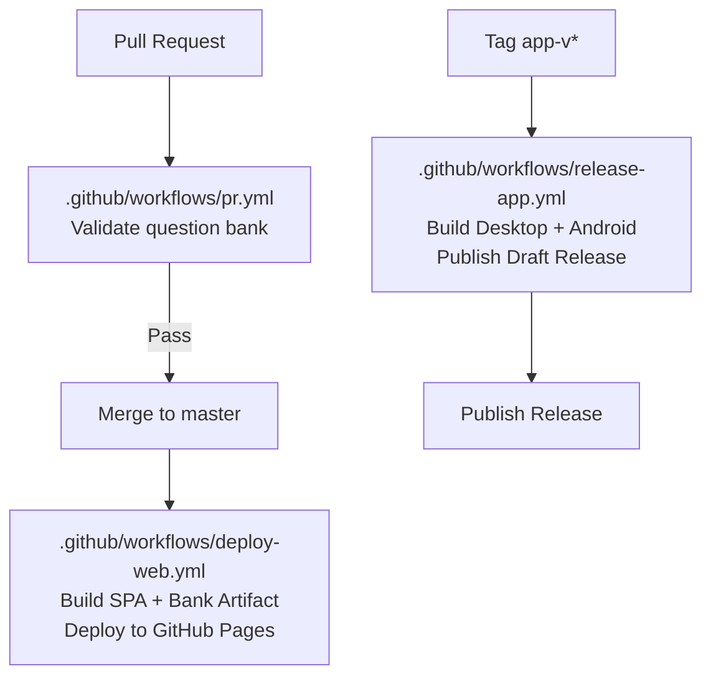
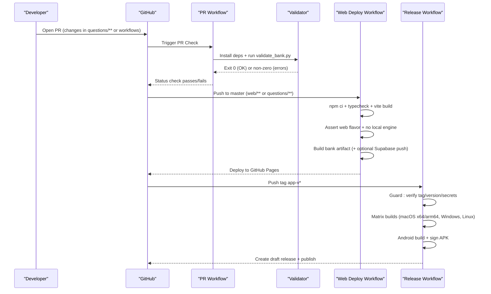
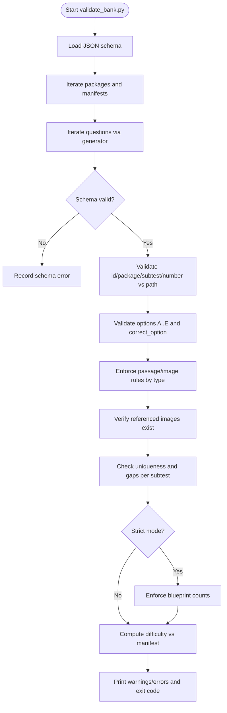
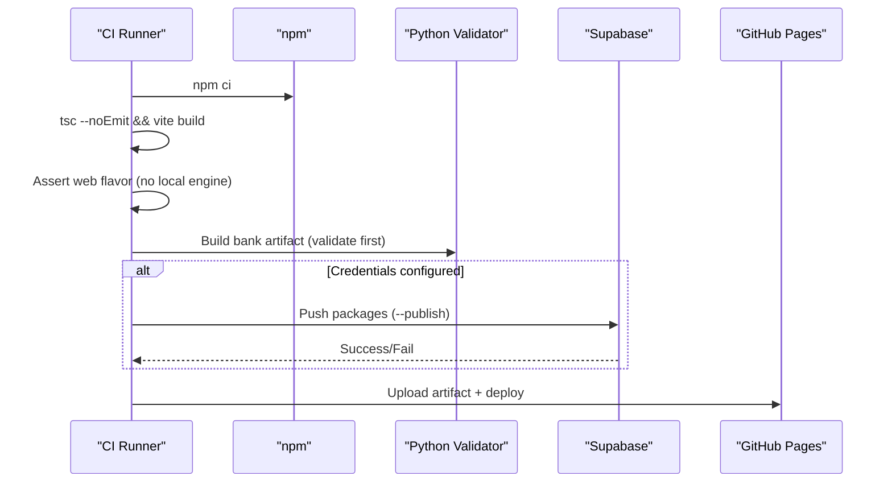
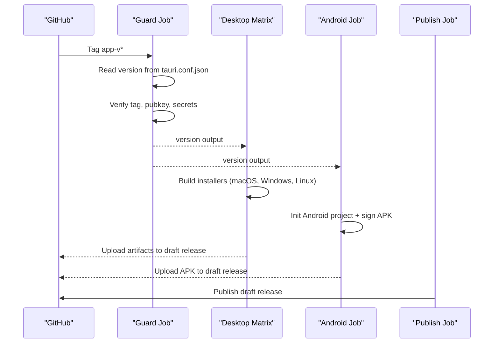
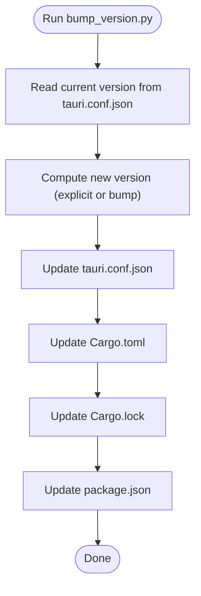
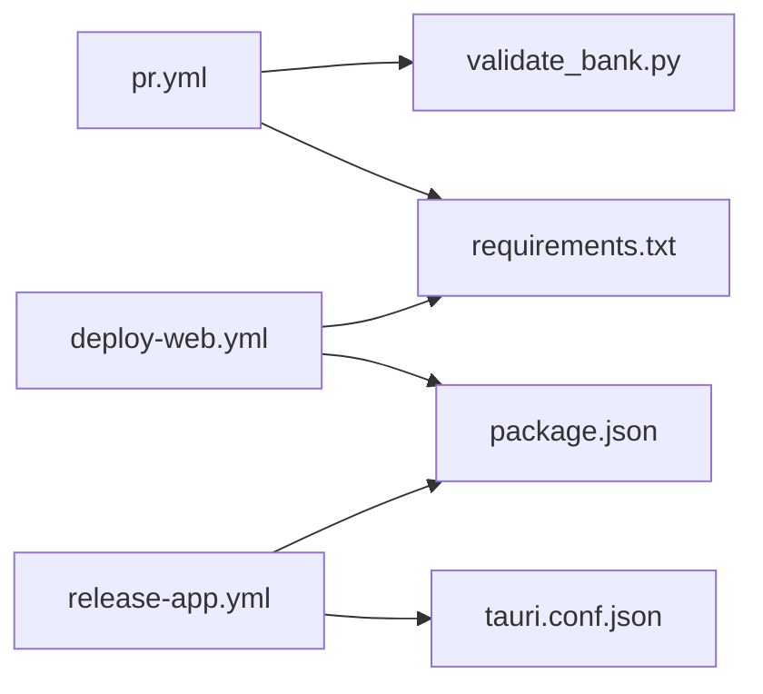

# Automated Quality Checks

<cite>
**Referenced Files in This Document**
- [pr.yml](file://.github/workflows/pr.yml)
- [deploy-web.yml](file://.github/workflows/deploy-web.yml)
- [release-app.yml](file://.github/workflows/release-app.yml)
- [validate_bank.py](file://questions/generator/validate_bank.py)
- [requirements.txt](file://questions/generator/requirements.txt)
- [bump_version.py](file://scripts/bump_version.py)
- [package.json](file://web/package.json)
- [tauri.conf.json](file://web/src-tauri/tauri.conf.json)
- [CONTRIBUTING.md](file://CONTRIBUTING.md)
</cite>

## Table of Contents
1. [Introduction](#introduction)
2. [Project Structure](#project-structure)
3. [Core Components](#core-components)
4. [Architecture Overview](#architecture-overview)
5. [Detailed Component Analysis](#detailed-component-analysis)
6. [Dependency Analysis](#dependency-analysis)
7. [Performance Considerations](#performance-considerations)
8. [Troubleshooting Guide](#troubleshooting-guide)
9. [Conclusion](#conclusion)

## Introduction
This document explains the automated quality assurance pipeline and continuous integration processes for the TBS LPDP Try Out project. It covers GitHub Actions workflows that enforce code quality, validate the question bank on pull requests, build and deploy the web application to GitHub Pages, and produce signed desktop and Android releases. It also documents version bumping automation, release preparation, and how to configure local development tools to match CI requirements. Finally, it provides troubleshooting guidance for failing quality checks.

## Project Structure
The CI/CD surface is defined by GitHub Actions workflows under .github/workflows and supporting scripts:
- Pull Request validation runs a Python-based question bank validator.
- Web deployment builds the SPA with TypeScript type checking and Vite, publishes a question-bank artifact, and deploys to GitHub Pages.
- App release workflow builds cross-platform installers and a signed Android APK, then publishes a draft GitHub Release.
- A version bump script synchronizes versions across configuration files used by both the web app and the offline Tauri app.

**Diagram sources**
- [pr.yml:1-28](file://.github/workflows/pr.yml#L1-L28)
- [deploy-web.yml:1-133](file://.github/workflows/deploy-web.yml#L1-L133)
- [release-app.yml:1-310](file://.github/workflows/release-app.yml#L1-L310)

**Section sources**
- [pr.yml:1-28](file://.github/workflows/pr.yml#L1-L28)
- [deploy-web.yml:1-133](file://.github/workflows/deploy-web.yml#L1-L133)
- [release-app.yml:1-310](file://.github/workflows/release-app.yml#L1-L310)

## Core Components
- Question bank validation: Ensures every question file conforms to the schema, path conventions, subtest rules, image references, numbering integrity, and blueprint counts. Runs on pull requests touching questions or workflows.
- Web build and deployment: Type-checks TypeScript, builds the SPA, asserts correct build flavor (no local engine), publishes a question-bank artifact, optionally pushes packages to Supabase, and deploys to GitHub Pages.
- Offline app release: Builds macOS (Apple Silicon and Intel), Windows, Linux, and Android artifacts; signs them; creates a draft GitHub Release with updater manifest; publishes automatically when all artifacts are ready.
- Version management: Synchronizes version strings across Tauri config, Cargo metadata, lockfile, and package.json.

**Section sources**
- [validate_bank.py:1-208](file://questions/generator/validate_bank.py#L1-L208)
- [deploy-web.yml:24-133](file://.github/workflows/deploy-web.yml#L24-L133)
- [release-app.yml:24-310](file://.github/workflows/release-app.yml#L24-L310)
- [bump_version.py:1-124](file://scripts/bump_version.py#L1-L124)

## Architecture Overview
The CI system enforces quality at multiple stages:
- On pull requests: Python environment installs dependencies and validates the entire question bank against schema and blueprint constraints.
- On push to master (web changes): Node.js environment performs type checking and builds the SPA; environment variables ensure production-safe configuration; a question-bank artifact is published; optional Supabase upload occurs if credentials are configured; GitHub Pages deployment follows.
- On tags (app releases): Guard job verifies tag matches the committed app version and required secrets; matrix jobs build installers per platform; Android signing is applied; a draft release is created and later published.

**Diagram sources**
- [pr.yml:1-28](file://.github/workflows/pr.yml#L1-L28)
- [deploy-web.yml:24-133](file://.github/workflows/deploy-web.yml#L24-L133)
- [release-app.yml:24-310](file://.github/workflows/release-app.yml#L24-L310)

## Detailed Component Analysis

### Pull Request Validation: Question Bank Integrity
The PR workflow triggers only when questions or workflows change. It sets up Python 3.12, installs JSON Schema and HTTP client libraries, and runs the validator. The validator:
- Parses each question file and validates against the JSON schema.
- Enforces id/package/subtest/number consistency with file paths.
- Validates option keys (A..E), correct_option presence, and allowed types per subtest.
- Requires passages or images for stimulus-based types and forbids passages for self-contained types.
- Verifies referenced images exist.
- Checks unique numbering per subtest and gap-free sequences.
- In strict mode, enforces exact counts per subtest from the blueprint and completeness per package.
- Computes difficulty index and compares with manifest metadata.

**Diagram sources**
- [validate_bank.py:44-194](file://questions/generator/validate_bank.py#L44-L194)

**Section sources**
- [pr.yml:10-28](file://.github/workflows/pr.yml#L10-L28)
- [validate_bank.py:1-208](file://questions/generator/validate_bank.py#L1-L208)
- [requirements.txt:1-3](file://questions/generator/requirements.txt#L1-L3)

### Web Deployment: Build, Validate Flavor, Publish Bank, Deploy Pages
The web deployment workflow:
- Uses Node.js 22 and caches npm dependencies.
- Installs Python dependencies for bank building/validation.
- Runs type checking and builds the SPA; failures fail CI.
- Asserts that repository variables do not enable local-engine flavors and that env files do not leak flags into production.
- Scans the built assets to ensure no local exam engine reached the bundle.
- Builds the question-bank artifact and optionally pushes immutable packages to Supabase using service role credentials.
- Configures and uploads GitHub Pages artifact, then deploys.

**Diagram sources**
- [deploy-web.yml:24-133](file://.github/workflows/deploy-web.yml#L24-L133)

**Section sources**
- [deploy-web.yml:24-133](file://.github/workflows/deploy-web.yml#L24-L133)
- [package.json:9-23](file://web/package.json#L9-L23)

### Offline App Release: Guard, Matrix Builds, Signing, Publish
The release workflow:
- Guard step reads the version from Tauri config and ensures the tag matches app-v<version>. It also checks that the updater public key is configured and signing secrets are present.
- Desktop matrix builds installers for macOS (arm64 and x64), Windows, and Linux (AppImage).
- Android job initializes Gradle project, applies branding icons, configures keystore, patches signing, builds and verifies the APK signature, and uploads it to the draft release.
- Publish step converts the draft release to a published release after all artifacts are uploaded.

**Diagram sources**
- [release-app.yml:24-310](file://.github/workflows/release-app.yml#L24-L310)
- [tauri.conf.json:1-98](file://web/src-tauri/tauri.conf.json#L1-L98)

**Section sources**
- [release-app.yml:24-310](file://.github/workflows/release-app.yml#L24-L310)
- [tauri.conf.json:1-98](file://web/src-tauri/tauri.conf.json#L1-L98)

### Version Bumping Automation
The version bump script updates version strings consistently across:
- Tauri configuration
- Cargo metadata and lockfile
- Web package.json

It supports setting an explicit version or bumping patch/minor/major based on current semver.

**Diagram sources**
- [bump_version.py:29-120](file://scripts/bump_version.py#L29-L120)

**Section sources**
- [bump_version.py:1-124](file://scripts/bump_version.py#L1-L124)

## Dependency Analysis
- Python validation depends on jsonschema and requests, installed from requirements.txt.
- Web build depends on Node.js 22+, TypeScript, Vite, and React ecosystem as declared in package.json.
- Tauri app build depends on Rust toolchain and platform-specific dependencies (e.g., GTK on Linux).
- Secrets and repository variables are consumed by workflows for secure configuration and publishing.

**Diagram sources**
- [pr.yml:18-27](file://.github/workflows/pr.yml#L18-L27)
- [deploy-web.yml:37-80](file://.github/workflows/deploy-web.yml#L37-L80)
- [release-app.yml:100-123](file://.github/workflows/release-app.yml#L100-L123)
- [requirements.txt:1-3](file://questions/generator/requirements.txt#L1-L3)
- [package.json:1-46](file://web/package.json#L1-L46)
- [tauri.conf.json:1-98](file://web/src-tauri/tauri.conf.json#L1-L98)

**Section sources**
- [requirements.txt:1-3](file://questions/generator/requirements.txt#L1-L3)
- [package.json:1-46](file://web/package.json#L1-L46)
- [tauri.conf.json:1-98](file://web/src-tauri/tauri.conf.json#L1-L98)

## Performance Considerations
- Caching: Workflows cache pip and npm dependencies to speed up repeated runs.
- Concurrency: Pages deployment uses concurrency control to avoid overlapping deployments and keep the newest artifact.
- Full history: Workflows fetch full commit history where needed to derive question versions and bank digests deterministically.
- Matrix builds: Desktop releases build multiple targets in parallel to reduce total time while ensuring broad compatibility.

[No sources needed since this section provides general guidance]

## Troubleshooting Guide
Common failure points and resolutions:

- Question bank validation fails on PR:
  - Ensure every question file parses and matches the JSON schema.
  - Confirm id/package/subtest/number align with file paths.
  - Verify option keys are exactly A..E in order and correct_option is among them.
  - For stimulus-based types, include required passage or chart; self-contained types must not include passages.
  - Check referenced images exist under the package’s images directory.
  - Ensure numbering is unique and gap-free per subtest; in strict mode, counts must match the blueprint.
  - Validate manifest difficulty matches computed difficulty.

- Web build/typecheck fails:
  - Run typecheck locally before pushing: npm run typecheck.
  - Ensure Node.js version meets engines requirement.
  - Fix TypeScript errors reported by the build step.

- Web flavor assertion fails:
  - Do not set VITE_OFFLINE or VITE_USE_MOCK in repository variables or env files for production builds.
  - Ensure no local engine artifacts reach the dist bundle.

- Release workflow guard fails:
  - Ensure the tag matches app-v<version> from tauri.conf.json.
  - Configure updater public key and provide required secrets (Tauri signing private key and password).

- Android signing fails:
  - Provide ANDROID_KEYSTORE_B64 and related secrets.
  - Ensure keystore properties and signing patch are applied correctly.
  - Verify APK signature post-build.

Local development alignment with CI:
- Use Node.js >= 22.18 and Python 3.12.
- Install Python dependencies from requirements.txt.
- Run pre-pull-request checks: validate bank, figures check, typecheck, and builds for both web and app flavors.

**Section sources**
- [validate_bank.py:44-194](file://questions/generator/validate_bank.py#L44-L194)
- [deploy-web.yml:52-95](file://.github/workflows/deploy-web.yml#L52-L95)
- [release-app.yml:26-57](file://.github/workflows/release-app.yml#L26-L57)
- [release-app.yml:250-296](file://.github/workflows/release-app.yml#L250-L296)
- [CONTRIBUTING.md:21-34](file://CONTRIBUTING.md#L21-L34)
- [CONTRIBUTING.md:145-155](file://CONTRIBUTING.md#L145-L155)

## Conclusion
The TBS LPDP Try Out project employs a robust CI/CD pipeline that enforces data integrity through rigorous question bank validation, ensures code quality via TypeScript type checking and controlled build flavors, and automates multi-platform releases with cryptographic signing. Version synchronization is centralized in a dedicated script to prevent drift across configurations. By aligning local development environments with CI requirements and following the troubleshooting steps, contributors can maintain high-quality standards and streamline releases.

[No sources needed since this section summarizes without analyzing specific files]