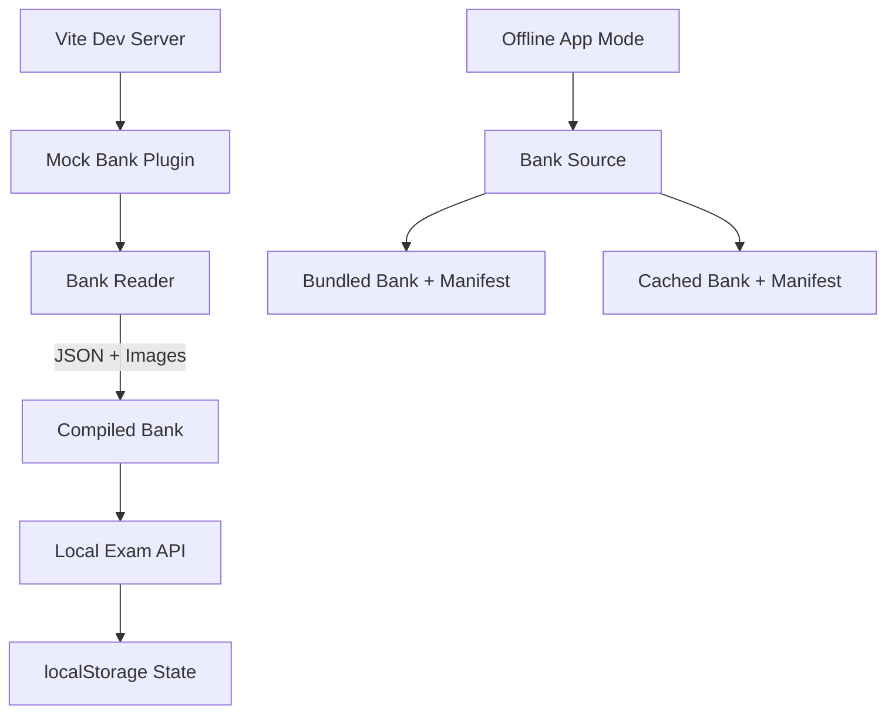
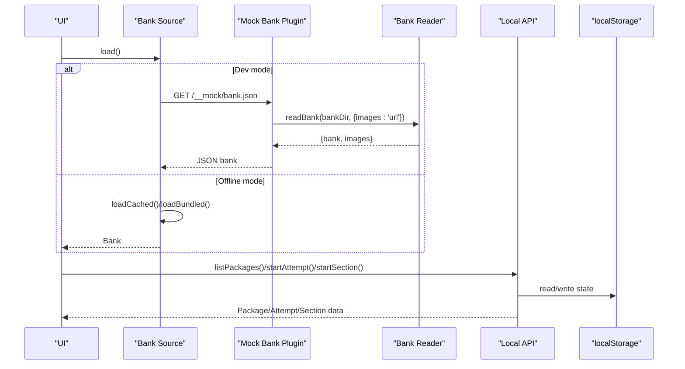
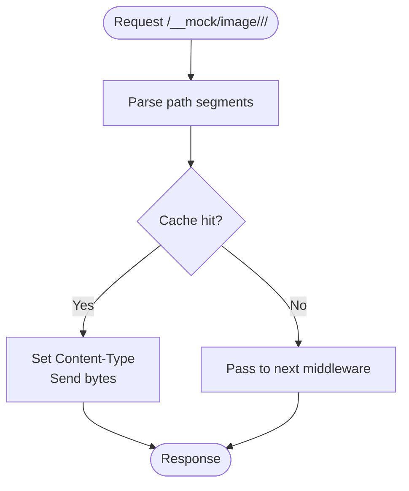
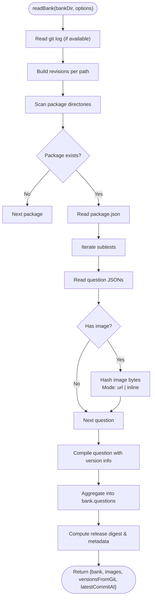
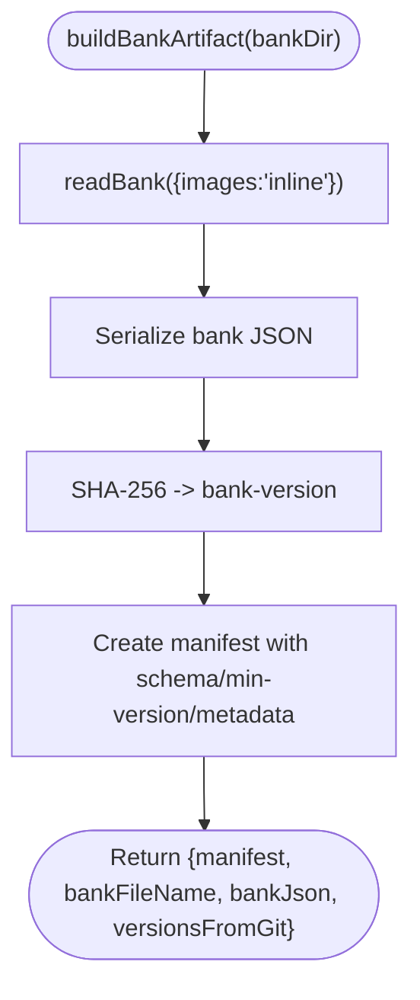
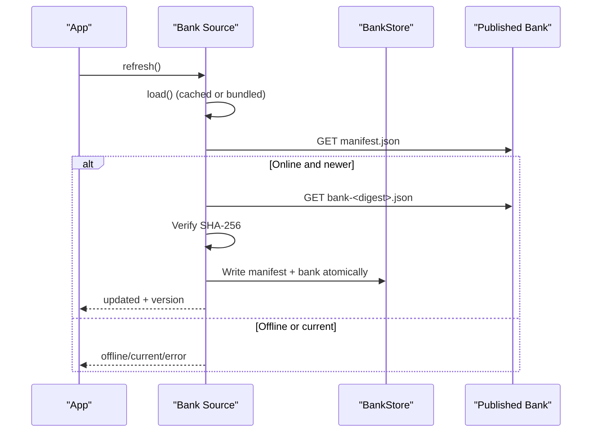
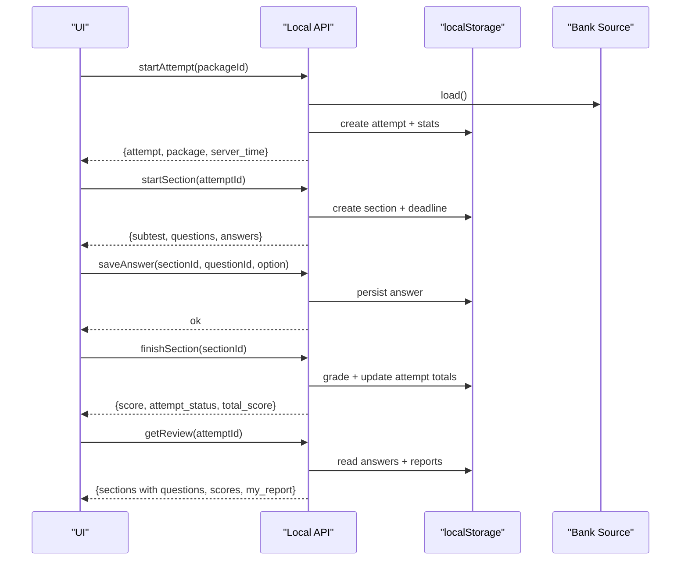
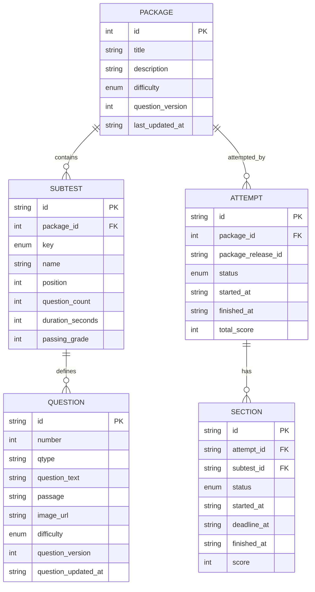
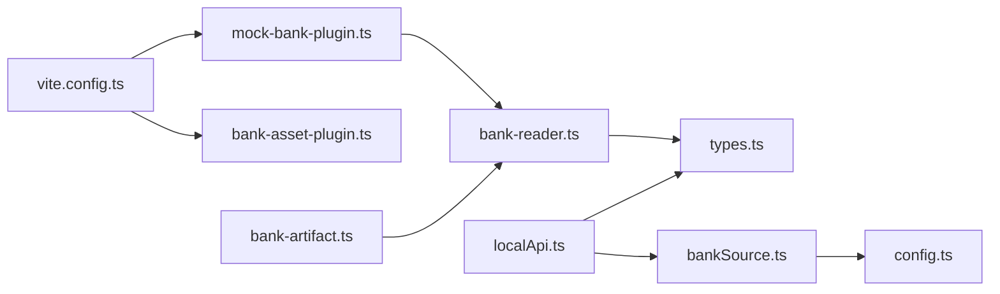

# Integration Testing

<cite>
**Referenced Files in This Document**
- [mock-bank-plugin.ts](file://web/vite/mock-bank-plugin.ts)
- [bank-reader.ts](file://web/vite/bank-reader.ts)
- [bank-artifact.ts](file://web/vite/bank-artifact.ts)
- [bankSource.ts](file://web/src/lib/bankSource.ts)
- [localApi.ts](file://web/src/lib/localApi.ts)
- [vite.config.ts](file://web/vite.config.ts)
- [config.ts](file://web/src/lib/config.ts)
- [types.ts](file://web/src/lib/types.ts)
- [package.json](file://questions/bank/1/package.json)
- [001.json](file://questions/bank/1/verbal/001.json)
- [schema.json](file://questions/schema.json)
- [render.test.ts](file://supabase/functions/question-report-digest/render.test.ts)
</cite>

## Table of Contents
1. Introduction
2. Project Structure
3. Core Components
4. Architecture Overview
5. Detailed Component Analysis
6. Dependency Analysis
7. Performance Considerations
8. Troubleshooting Guide
9. Conclusion

## Introduction
This document explains how to run end-to-end integration tests for the TBS LPDP Try Out application using the mock-bank-plugin system and the bank artifact pipeline. It covers simulating complete user workflows from package selection through exam completion and results review, managing test datasets via the bank artifact system, loading data with the bank reader, and testing API integrations, database interactions (localStorage-based), and cross-component communication. It also documents strategies for offline mode, error scenarios, and performance testing approaches.

## Project Structure
The integration testing surface is built around:
- A Vite dev plugin that serves a compiled question bank and images during development.
- A bank reader that compiles JSON questions into an in-memory structure used by both dev and offline modes.
- A bank artifact builder that produces immutable, content-addressed bank files plus a manifest for distribution and caching.
- A bank source abstraction that selects between a dev mock backend and an offline bundled/cached backend.
- A local API implementation that re-implements server semantics against localStorage, pinning attempts to immutable releases.
- Build configuration that selects the correct backend per build flavor and excludes sensitive code from production bundles.

**Diagram sources**
- [mock-bank-plugin.ts:21-49](file://web/vite/mock-bank-plugin.ts#L21-L49)
- [bank-reader.ts:159-297](file://web/vite/bank-reader.ts#L159-L297)
- [bankSource.ts:100-322](file://web/src/lib/bankSource.ts#L100-L322)
- [localApi.ts:309-559](file://web/src/lib/localApi.ts#L309-L559)

**Section sources**
- [vite.config.ts:17-41](file://web/vite.config.ts#L17-L41)
- [config.ts:16-43](file://web/src/lib/config.ts#L16-L43)

## Core Components
- Mock bank plugin: Serves a compiled bank at a dedicated endpoint during development and proxies image assets behind a stable URL scheme keyed by content hash.
- Bank reader: Compiles the git-backed question bank into a single structure, computes versions from git history when available, and supports inline or URL image modes.
- Bank artifact builder: Produces a content-addressed bank file and a small manifest describing it; outputs are deterministic over the same tree.
- Bank source: Chooses between dev and offline backends based on build flags; handles fetching, integrity verification, caching, and hot-swapping.
- Local API: Implements the full exam flow (list packages, start attempt/section, save answers, finish sections, review, reporting) against localStorage, pinning attempts to immutable releases.
- Types and config: Define shared shapes, error codes, and environment-driven behavior such as offline mode and Supabase configuration.

**Section sources**
- [mock-bank-plugin.ts:1-52](file://web/vite/mock-bank-plugin.ts#L1-L52)
- [bank-reader.ts:1-298](file://web/vite/bank-reader.ts#L1-L298)
- [bank-artifact.ts:1-56](file://web/vite/bank-artifact.ts#L1-L56)
- [bankSource.ts:1-323](file://web/src/lib/bankSource.ts#L1-L323)
- [localApi.ts:1-560](file://web/src/lib/localApi.ts#L1-L560)
- [types.ts:1-200](file://web/src/lib/types.ts#L1-L200)
- [config.ts:1-68](file://web/src/lib/config.ts#L1-L68)

## Architecture Overview
The system supports two primary runtime modes selected at build time:
- Development mode: The app fetches the bank from a Vite middleware endpoint; images are served via a separate middleware path. All grading happens locally.
- Offline mode: The app loads a bundled snapshot and optionally refreshes to a verified cached version from a published location. Integrity is enforced via SHA-256.

**Diagram sources**
- [bankSource.ts:100-322](file://web/src/lib/bankSource.ts#L100-L322)
- [mock-bank-plugin.ts:21-49](file://web/vite/mock-bank-plugin.ts#L21-L49)
- [bank-reader.ts:159-297](file://web/vite/bank-reader.ts#L159-L297)
- [localApi.ts:386-465](file://web/src/lib/localApi.ts#L386-L465)

## Detailed Component Analysis

### Mock Bank Plugin
- Purpose: Provide a realistic backend for development without requiring a live server.
- Behavior:
  - Serves a compiled bank at a fixed endpoint during development only.
  - Serves images via a content-addressed path to keep old attempts stable after edits.
  - Caches image bytes in memory keyed by package, image hash, and filename.
- Error handling: Returns a 500 JSON error if reading fails.

**Diagram sources**
- [mock-bank-plugin.ts:39-48](file://web/vite/mock-bank-plugin.ts#L39-L48)

**Section sources**
- [mock-bank-plugin.ts:1-52](file://web/vite/mock-bank-plugin.ts#L1-L52)

### Bank Reader
- Purpose: Compile the git-backed question bank into a single structure consumed by both dev and offline flows.
- Key features:
  - Derives versions from git commit history when available; falls back to filesystem mtimes otherwise.
  - Supports two image modes: URL (for dev) and inline base64 (for published artifacts).
  - Computes release digests per package to ensure immutability across runs.
- Output: A bank object containing packages and questions, plus optional image map and metadata.

**Diagram sources**
- [bank-reader.ts:78-135](file://web/vite/bank-reader.ts#L78-L135)
- [bank-reader.ts:159-297](file://web/vite/bank-reader.ts#L159-L297)

**Section sources**
- [bank-reader.ts:1-298](file://web/vite/bank-reader.ts#L1-L298)

### Bank Artifact Builder
- Purpose: Produce immutable, content-addressed bank files and a small manifest for distribution and caching.
- Behavior:
  - Uses the bank reader in inline image mode.
  - Generates a bank filename from the SHA-256 of the serialized bank.
  - Writes a manifest with schema versions, minimum app version, generated timestamp, and bank size/digest.
- Determinism: Outputs are byte-identical over the same git tree.

**Diagram sources**
- [bank-artifact.ts:25-55](file://web/vite/bank-artifact.ts#L25-L55)

**Section sources**
- [bank-artifact.ts:1-56](file://web/vite/bank-artifact.ts#L1-L56)

### Bank Source (Dev vs Offline)
- Purpose: Abstract where the exam engine gets its questions and how updates are handled.
- Dev mode:
  - Fetches from the Vite middleware endpoint.
  - Provides status indicating dev origin.
  - Refresh returns unsupported because there is no remote to pull from.
- Offline mode:
  - Loads from cache first, then bundled snapshot.
  - Verifies integrity via SHA-256 before accepting cached content.
  - Refresh checks a published manifest, validates schema compatibility, downloads and verifies new bank, persists atomically, and hot-swaps.

**Diagram sources**
- [bankSource.ts:267-311](file://web/src/lib/bankSource.ts#L267-L311)

**Section sources**
- [bankSource.ts:1-323](file://web/src/lib/bankSource.ts#L1-L323)

### Local API (Exam Flow)
- Purpose: Implement the full exam lifecycle against localStorage, mirroring server-side semantics.
- Highlights:
  - Pinning: Each attempt is pinned to an immutable release snapshot derived from the bank’s release_id.
  - Grading: Section scoring uses answer keys only within the local engine; never shipped to production web bundles.
  - Statistics: Aggregates attempts, scores, histograms, and eligibility rules for statistics inclusion.
  - Reporting: Validates reasons, enforces rate limits, and stores per-attempt reports keyed by release and question.
  - Maintenance: Supports forced phases via environment variables for testing maintenance banners.

**Diagram sources**
- [localApi.ts:405-529](file://web/src/lib/localApi.ts#L405-L529)

**Section sources**
- [localApi.ts:1-560](file://web/src/lib/localApi.ts#L1-L560)

### Data Models and Schemas
- Question bank items conform to a strict JSON schema ensuring consistent structure, required fields, and valid enums.
- Types define the public contract for packages, questions, attempts, sections, reviews, and reporting.

**Diagram sources**
- [types.ts:9-177](file://web/src/lib/types.ts#L9-L177)
- [schema.json:1-98](file://questions/schema.json#L1-L98)

**Section sources**
- [types.ts:1-200](file://web/src/lib/types.ts#L1-L200)
- [schema.json:1-98](file://questions/schema.json#L1-L98)

## Dependency Analysis
- Build-time selection:
  - vite.config.ts defines environment flags to include only the appropriate backend in each bundle.
  - config.ts exposes IS_OFFLINE_APP and other flags used throughout the app.
- Runtime dependencies:
  - localApi depends on bankSource to obtain the active bank.
  - bankSource chooses between dev and offline implementations based on environment.
  - mock-bank-plugin depends on bank-reader to compile the bank and serve images.
  - bank-artifact depends on bank-reader and bankSchema types for publishing.

**Diagram sources**
- [vite.config.ts:17-41](file://web/vite.config.ts#L17-L41)
- [config.ts:16-43](file://web/src/lib/config.ts#L16-L43)
- [bankSource.ts:100-322](file://web/src/lib/bankSource.ts#L100-L322)
- [mock-bank-plugin.ts:21-49](file://web/vite/mock-bank-plugin.ts#L21-L49)
- [bank-reader.ts:159-297](file://web/vite/bank-reader.ts#L159-L297)
- [bank-artifact.ts:25-55](file://web/vite/bank-artifact.ts#L25-L55)

**Section sources**
- [vite.config.ts:17-41](file://web/vite.config.ts#L17-L41)
- [config.ts:16-43](file://web/src/lib/config.ts#L16-L43)
- [bankSource.ts:100-322](file://web/src/lib/bankSource.ts#L100-L322)

## Performance Considerations
- Image handling:
  - In dev mode, images are served via a fast in-memory cache keyed by content hash to avoid repeated disk reads and to keep older attempts stable.
  - In offline mode, images are inlined into the bank artifact to minimize network requests and enable fully offline operation.
- Versioning:
  - Versions are derived from git history when available, ensuring deterministic builds and stable references across runs.
- Network timeouts:
  - Bank refresh operations use short timeouts for manifest checks and longer timeouts for downloads to balance responsiveness and reliability.
- Storage:
  - The local API persists state in localStorage; operations are lightweight and designed for frequent reads/writes during an attempt.

[No sources needed since this section provides general guidance]

## Troubleshooting Guide
Common issues and resolutions:
- Mock bank not available:
  - Ensure the Vite dev server is running so the middleware endpoint is reachable. Errors will be surfaced as API errors with a clear message.
- Offline bank mismatch:
  - If the cached bank fails integrity verification, it is discarded and the app falls back to the bundled snapshot. Check network connectivity and published manifest availability.
- Excessive attempts or storage capacity:
  - The local API enforces rate limits and capacity checks; adjust test scenarios to simulate realistic usage or reset localStorage state when necessary.
- Maintenance mode simulation:
  - Use environment variables to force maintenance phases for testing banners and gating logic.

**Section sources**
- [bankSource.ts:100-127](file://web/src/lib/bankSource.ts#L100-L127)
- [bankSource.ts:218-235](file://web/src/lib/bankSource.ts#L218-L235)
- [localApi.ts:405-426](file://web/src/lib/localApi.ts#L405-L426)
- [localApi.ts:310-375](file://web/src/lib/localApi.ts#L310-L375)

## Conclusion
The TBS LPDP Try Out application provides a robust integration testing foundation through its mock-bank-plugin, bank artifact system, and local API. These components enable realistic end-to-end testing of the full exam workflow, including package selection, attempt management, section execution, grading, and results review. The design ensures deterministic builds, secure offline operation, and safe hot-swapping of banks while keeping sensitive logic out of production bundles. By leveraging these tools, teams can confidently validate API integrations, database interactions via localStorage, and cross-component communication across development and offline modes.