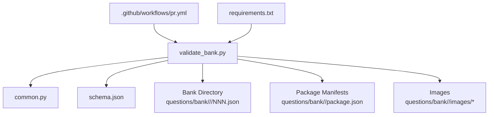
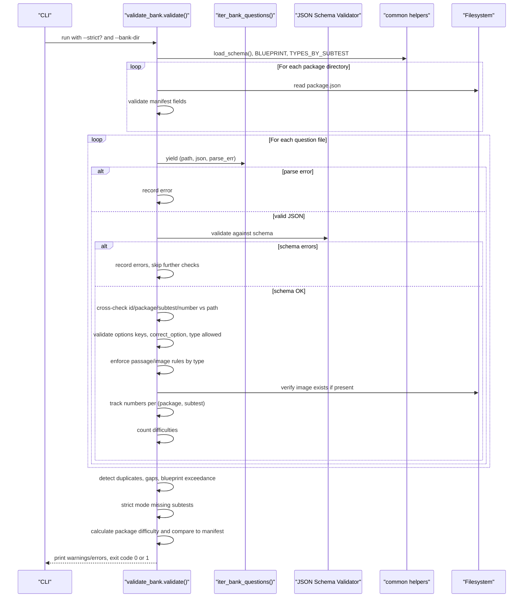
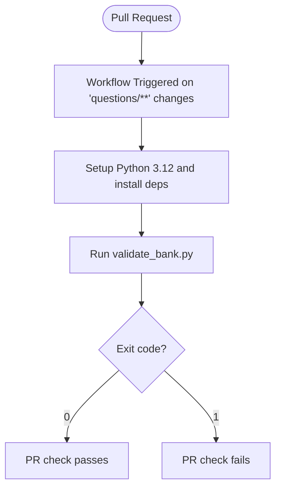
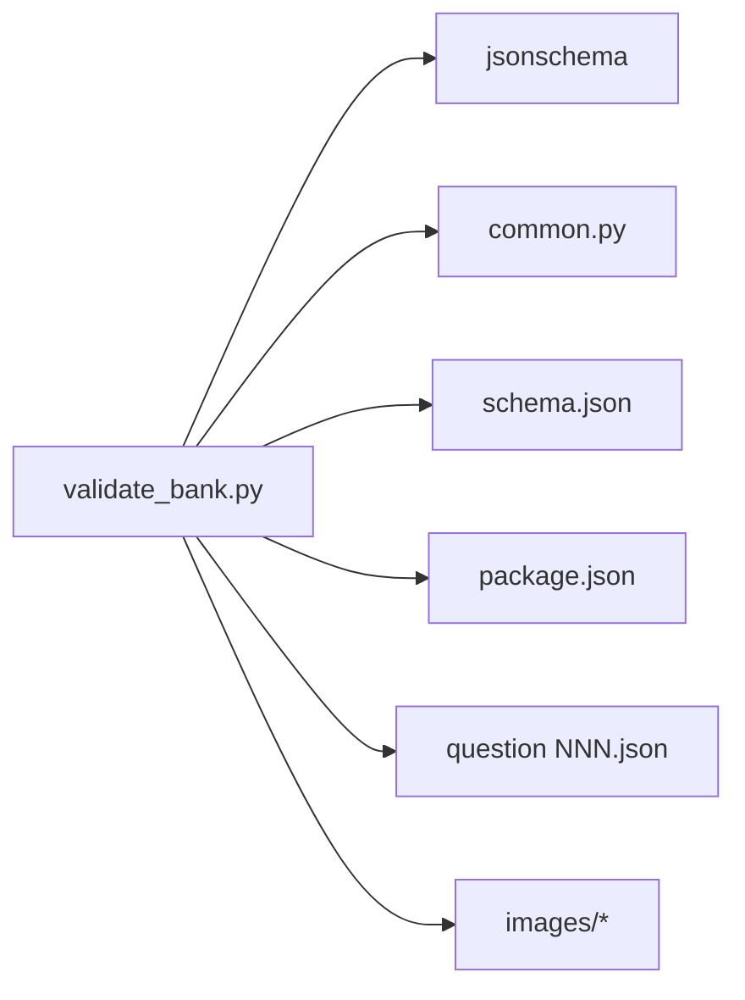

# Bank Validation

<cite>
**Referenced Files in This Document**
- [validate_bank.py](file://questions/generator/validate_bank.py)
- [common.py](file://questions/generator/common.py)
- [schema.json](file://questions/schema.json)
- [package.json](file://questions/bank/1/package.json)
- [001.json](file://questions/bank/1/verbal/001.json)
- [pr.yml](file://.github/workflows/pr.yml)
- [requirements.txt](file://questions/generator/requirements.txt)
</cite>

## Table of Contents
1. [Introduction](#introduction)
2. [Project Structure](#project-structure)
3. [Core Components](#core-components)
4. [Architecture Overview](#architecture-overview)
5. [Detailed Component Analysis](#detailed-component-analysis)
6. [Dependency Analysis](#dependency-analysis)
7. [Performance Considerations](#performance-considerations)
8. [Troubleshooting Guide](#troubleshooting-guide)
9. [Conclusion](#conclusion)
10. [Appendices](#appendices)

## Introduction
This document explains the bank validation tool that ensures the integrity and consistency of the question bank used by the application. It covers how the validator checks structural validity, cross-references between questions and assets, metadata consistency, package organization, subtest categorization, and version management. It also documents error reporting, severity levels, CI/CD integration, guidance for interpreting reports, fixing common issues, and maintaining data quality across multiple question packages.

## Project Structure
The validation system is centered around a Python script that walks the question bank directory, validates each question against a JSON schema and additional business rules, and enforces package-level constraints. Supporting modules define shared constants, helpers, and iteration logic over the bank.

**Diagram sources**
- [validate_bank.py:1-208](file://questions/generator/validate_bank.py#L1-L208)
- [common.py:1-218](file://questions/generator/common.py#L1-L218)
- [schema.json:1-98](file://questions/schema.json#L1-L98)
- [pr.yml:1-28](file://.github/workflows/pr.yml#L1-L28)
- [requirements.txt:1-3](file://questions/generator/requirements.txt#L1-L3)

**Section sources**
- [validate_bank.py:1-208](file://questions/generator/validate_bank.py#L1-L208)
- [common.py:1-218](file://questions/generator/common.py#L1-L218)
- [schema.json:1-98](file://questions/schema.json#L1-L98)
- [pr.yml:1-28](file://.github/workflows/pr.yml#L1-L28)
- [requirements.txt:1-3](file://questions/generator/requirements.txt#L1-L3)

## Core Components
- Validator script: orchestrates scanning, schema validation, path-based cross-checks, asset verification, numbering and blueprint enforcement, and difficulty band calculation.
- Shared helpers: defines the test blueprint (counts per subtest), allowed types per subtest, passage requirements, iteration over bank files, and difficulty calculation.
- Schema: JSON Schema defining required fields, formats, and constraints for each question file.
- Package manifests: metadata per package including id, title, description, difficulty, AI model info.
- CI pipeline: GitHub Actions workflow that runs the validator on pull requests touching question-related paths.

Key responsibilities:
- Structural validity: parse JSON, validate against schema.
- Cross-references: ensure id/package/subtest/number match file paths; verify referenced images exist.
- Metadata consistency: enforce option keys A–E, correct_option presence, explanations for all options, type allowed in subtest, passage/image rules.
- Organization and counts: unique numbers per subtest, no gaps, blueprint limits, strict mode exactness.
- Versioning: package manifest id must match directory number; difficulty band must match calculated value from question difficulties.

**Section sources**
- [validate_bank.py:44-194](file://questions/generator/validate_bank.py#L44-L194)
- [common.py:19-68](file://questions/generator/common.py#L19-L68)
- [schema.json:7-96](file://questions/schema.json#L7-L96)
- [package.json:1-10](file://questions/bank/1/package.json#L1-L10)

## Architecture Overview
The validator performs a multi-pass check over the entire bank:

**Diagram sources**
- [validate_bank.py:44-194](file://questions/generator/validate_bank.py#L44-L194)
- [common.py:130-218](file://questions/generator/common.py#L130-L218)
- [schema.json:1-98](file://questions/schema.json#L1-L98)

## Detailed Component Analysis

### Validator Entry Point and Control Flow
- Parses arguments: --strict and --bank-dir.
- Initializes schema validator and accumulators for errors, warnings, numbering, manifests, and difficulty counts.
- Iterates numeric package directories, reads and validates package.json metadata.
- Iterates all question files, applies schema and business rule checks, aggregates results, prints summary, and returns an exit code suitable for CI.

Validation highlights:
- Skips deeper checks when schema validation fails to avoid cascading noise.
- Enforces canonical id format derived from path components.
- Ensures exactly five options keyed A–E in order and correct_option among them.
- Enforces type-to-subtest compatibility using shared constants.
- Enforces stimulus requirements based on question type.
- Verifies image references resolve within the package’s images directory.
- Detects duplicate numbers and gaps per subtest.
- In strict mode, requires exact blueprint counts and presence of all subtests.
- Calculates package difficulty from question difficulties and compares to manifest.

**Section sources**
- [validate_bank.py:19-203](file://questions/generator/validate_bank.py#L19-L203)

### Shared Constants and Helpers
- Blueprint: defines subtest display names, positions, question counts, durations, and passing grades. The counts are used to enforce completeness and blueprint compliance.
- Types by subtest: restricts which question types can appear in each subtest.
- Passage rules: distinguishes types that require a passage, those that accept either passage or image, and self-contained types where a stray passage is a warning.
- Difficulty calculation: computes a deterministic band (easy/medium/hard) from weighted averages of question difficulties.
- File iteration: yields every question file under the bank directory with parsed JSON or parse errors.

These helpers centralize policy so the validator remains focused on orchestration and reporting.

**Section sources**
- [common.py:19-68](file://questions/generator/common.py#L19-L68)
- [common.py:77-96](file://questions/generator/common.py#L77-L96)
- [common.py:130-218](file://questions/generator/common.py#L130-L218)

### JSON Schema for Questions
The schema enforces:
- Required fields: id, package, subtest, number, type, question_text, image, passage, options, correct_option, explanations, difficulty, source, verified.
- Id pattern: <package>-<subtest>-<NNN>.
- Subtest enum: verbal, kuantitatif, pemecahan_masalah.
- Number range: 1–25.
- Type enum: comprehensive list of supported question types.
- Options: exactly five items with keys A–E and non-empty text.
- Correct option: one of A–E.
- Explanations: object with keys A–E and minimum length constraints.
- Difficulty: one of easy, medium, hard.
- Image and passage: optional strings with specific patterns or null.

The validator uses this schema to catch malformed or incomplete question files early.

**Section sources**
- [schema.json:1-98](file://questions/schema.json#L1-L98)

### Package Manifest Validation
For each package directory:
- Requires package.json with id matching the directory number.
- Validates title as a non-empty string.
- Validates description as a string.
- Validates difficulty as one of easy, medium, hard.
- Validates ai_model as a non-empty string.
- Validates ai_company as a non-empty string with length limit.
- Validates ai_model_description as a non-empty string with length limit.

Manifest metadata is later compared against computed difficulty to ensure consistency.

**Section sources**
- [validate_bank.py:58-94](file://questions/generator/validate_bank.py#L58-L94)
- [package.json:1-10](file://questions/bank/1/package.json#L1-L10)

### Question-Level Validation Rules
Cross-reference and content rules enforced per question:
- Path-field alignment: package, subtest, number, and id must match the file path.
- Option integrity: keys must be exactly A–E in order; correct_option must be among them.
- Type allowance: question type must be permitted for its subtest.
- Stimulus requirements:
  - reading and analisis_teks must include a passage.
  - interpretasi_data must include either a passage (table) or an image (chart).
  - Self-contained types should not carry a passage; otherwise a warning is issued.
- Asset availability: if image is set, it must exist under the package’s images directory.
- Numbering:
  - Unique numbers per subtest within a package.
  - No gaps in numbering.
  - Counts must not exceed blueprint; strict mode requires exact counts.
- Difficulty band:
  - Calculated from question difficulties.
  - Must match the manifest’s difficulty when totals align with blueprint.

**Section sources**
- [validate_bank.py:96-185](file://questions/generator/validate_bank.py#L96-L185)
- [common.py:29-68](file://questions/generator/common.py#L29-L68)

### Error Reporting and Severity Levels
- Errors: printed with prefix ERROR and cause the process to exit with code 1. Examples include schema violations, path mismatches, missing images, duplicate or out-of-range numbers, blueprint exceedances, and difficulty band mismatches.
- Warnings: printed with prefix WARN and do not fail the build. Examples include self-contained types carrying a passage.
- Summary line: indicates total files checked, error count, and warning count, followed by status OK or FAILED.

This design makes the output machine-readable for CI and human-friendly for developers.

**Section sources**
- [validate_bank.py:187-194](file://questions/generator/validate_bank.py#L187-L194)

### Automated Integration into CI/CD
A GitHub Actions workflow triggers on pull requests that modify question-related paths. It:
- Checks out the repository.
- Sets up Python 3.12.
- Installs dependencies from requirements.txt.
- Runs the validator without strict mode by default.

To enforce stricter checks in CI, add the --strict flag to the command in the workflow.

**Diagram sources**
- [pr.yml:1-28](file://.github/workflows/pr.yml#L1-L28)
- [validate_bank.py:197-203](file://questions/generator/validate_bank.py#L197-L203)
- [requirements.txt:1-3](file://questions/generator/requirements.txt#L1-L3)

**Section sources**
- [pr.yml:1-28](file://.github/workflows/pr.yml#L1-L28)
- [requirements.txt:1-3](file://questions/generator/requirements.txt#L1-L3)

## Dependency Analysis
The validator depends on:
- JSON Schema library for structural validation.
- Shared module for constants, helpers, and iteration.
- Filesystem access to read manifests, question files, and images.
- Optional strict mode to enforce blueprint exactness.

**Diagram sources**
- [validate_bank.py:23-41](file://questions/generator/validate_bank.py#L23-L41)
- [common.py:130-218](file://questions/generator/common.py#L130-L218)
- [schema.json:1-98](file://questions/schema.json#L1-L98)

**Section sources**
- [validate_bank.py:23-41](file://questions/generator/validate_bank.py#L23-L41)
- [common.py:130-218](file://questions/generator/common.py#L130-L218)

## Performance Considerations
- Single pass over all files: the iterator yields each question once, minimizing overhead.
- Early termination of deeper checks on schema failures avoids redundant processing.
- Counting and deduplication use efficient structures (defaultdict and sets).
- Strict mode adds extra checks but only after collecting per-subtest counts.

Optimization tips:
- Keep question files small and well-formed to reduce parsing time.
- Avoid unnecessary large images; ensure they are referenced only when needed.
- Use strict mode in CI to catch blueprint deviations early.

[No sources needed since this section provides general guidance]

## Troubleshooting Guide
Common issues and how to fix them:

- Invalid JSON in a question file:
  - Symptom: parse error reported.
  - Fix: correct syntax and ensure UTF-8 encoding.

- Schema violations:
  - Symptom: schema error messages with field paths.
  - Fix: ensure all required fields are present and conform to types and constraints defined in the schema.

- Path-field mismatch:
  - Symptom: id/package/subtest/number does not match file path.
  - Fix: rename files and update fields to follow the canonical id format and directory structure.

- Option keys incorrect:
  - Symptom: option keys not exactly A–E in order or correct_option missing.
  - Fix: reorder options and ensure correct_option is one of A–E.

- Disallowed type in subtest:
  - Symptom: type not allowed in subtest.
  - Fix: choose a type permitted for the subtest per shared constants.

- Missing or extra passage/image:
  - Symptom: stimulus requirement violated or warning about stray passage.
  - Fix: add passage for reading/analisis_teks; for interpretasi_data, provide either passage or image; remove passage from self-contained types.

- Referenced image not found:
  - Symptom: image path not found under package images.
  - Fix: place the image in the correct package images directory and update the reference.

- Duplicate or gapped numbers:
  - Symptom: duplicate numbers detected or numbering gaps.
  - Fix: renumber files sequentially without gaps per subtest.

- Blueprint exceedance or missing subtests:
  - Symptom: too many questions or missing subtest in strict mode.
  - Fix: adjust question counts to match blueprint; add missing subtests if required.

- Difficulty band mismatch:
  - Symptom: manifest difficulty differs from calculated band.
  - Fix: adjust question difficulties or update manifest to match the calculated band.

Interpreting reports:
- Each line prefixed with ERROR or WARN identifies the file and issue.
- The final summary shows total files checked and counts of errors/warnings.
- Exit code 0 means OK; 1 means errors were found.

CI integration:
- If PR checks fail, review the ERROR lines to identify and fix issues before merging.
- To enforce stricter validation in CI, add the --strict flag to the workflow command.

**Section sources**
- [validate_bank.py:96-194](file://questions/generator/validate_bank.py#L96-L194)
- [schema.json:7-96](file://questions/schema.json#L7-L96)
- [pr.yml:23-27](file://.github/workflows/pr.yml#L23-L27)

## Conclusion
The bank validation tool provides robust, automated assurance of question bank integrity through schema validation, path-based cross-references, asset checks, and blueprint enforcement. Its clear error and warning reporting, combined with CI integration, helps maintain high data quality across multiple packages. By following the documented rules and troubleshooting steps, contributors can reliably create, update, and merge question content while preserving consistency and correctness.

[No sources needed since this section summarizes without analyzing specific files]

## Appendices

### Example Question File Reference
- Sample question demonstrating proper structure and fields:
  - [001.json:1-29](file://questions/bank/1/verbal/001.json#L1-L29)

**Section sources**
- [001.json:1-29](file://questions/bank/1/verbal/001.json#L1-L29)