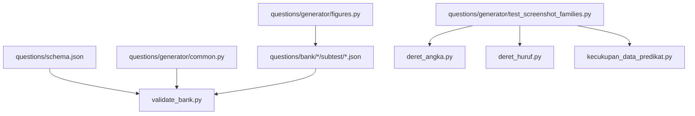
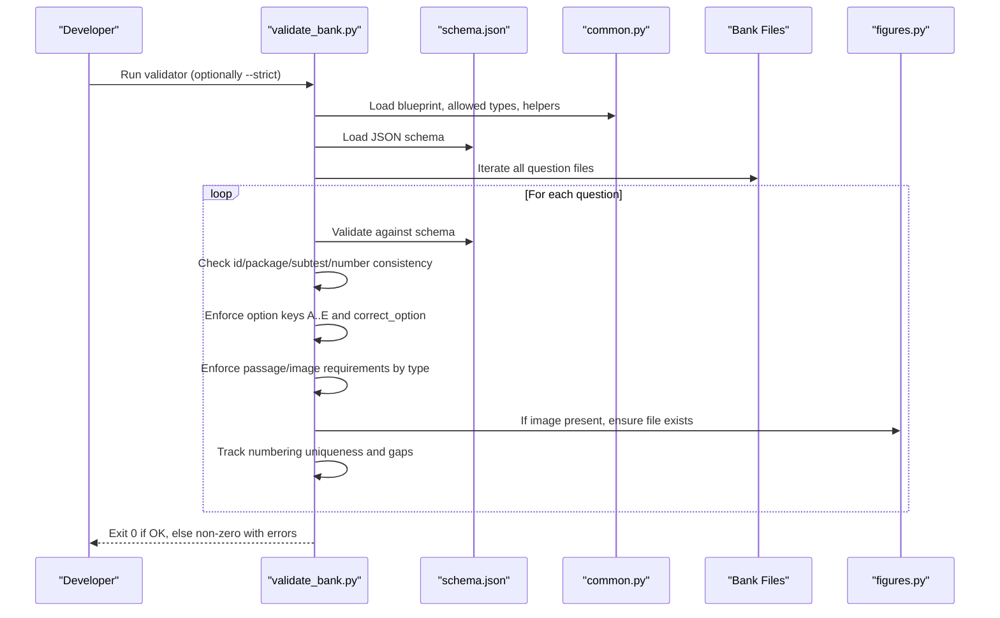
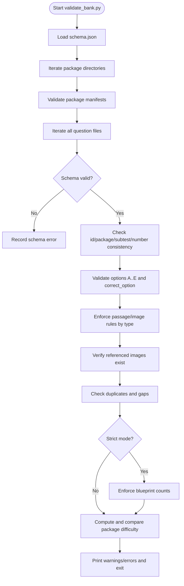
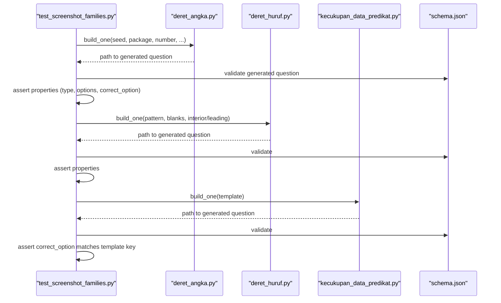
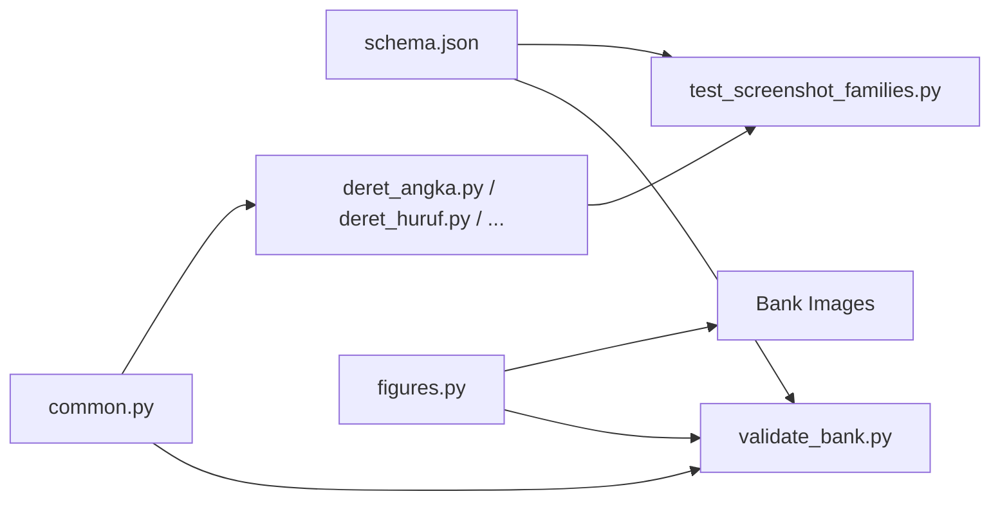

# Question Validation Testing

<cite>
**Referenced Files in This Document**
- [validate_bank.py](file://questions/generator/validate_bank.py)
- [schema.json](file://questions/schema.json)
- [test_screenshot_families.py](file://questions/generator/test_screenshot_families.py)
- [common.py](file://questions/generator/common.py)
- [deret_angka.py](file://questions/generator/deret_angka.py)
- [figures.py](file://questions/generator/figures.py)
- [package.json](file://questions/bank/1/package.json)
- [001.json (kuantitatif)](file://questions/bank/1/kuantitatif/001.json)
- [001.json (verbal)](file://questions/bank/1/verbal/001.json)
- [001.json (pemecahan_masalah)](file://questions/bank/1/pemecahan_masalah/001.json)
- [README.md (generator)](file://questions/generator/README.md)
</cite>

## Table of Contents
1. Introduction
2. Project Structure
3. Core Components
4. Architecture Overview
5. Detailed Component Analysis
6. Dependency Analysis
7. Performance Considerations
8. Troubleshooting Guide
9. Conclusion
10. Appendices

## Introduction
This document explains how the TBS LPDP Try Out project validates and tests its question bank to ensure integrity, consistency, and correctness across all generated questions. It covers:
- Automated JSON schema validation for every question file
- Structural and semantic checks performed by validate_bank.py
- Screenshot family testing to verify visual rendering across variants
- Guidelines for adding new question types, validation rules, and test data
- The relationship between generators and validators, and how to debug failures

## Project Structure
The validation and testing system is centered around three layers:
- Schema layer: a strict JSON schema defines the contract for each question file.
- Validator layer: a Python tool scans the entire bank, enforcing format, references, counts, and blueprint compliance.
- Test layer: unit tests exercise generator families to ensure outputs remain valid and visually correct over time.

**Diagram sources**
- [validate_bank.py:1-208](file://questions/generator/validate_bank.py#L1-L208)
- [schema.json:1-98](file://questions/schema.json#L1-L98)
- [common.py:1-218](file://questions/generator/common.py#L1-L218)
- [test_screenshot_families.py:1-115](file://questions/generator/test_screenshot_families.py#L1-L115)
- [deret_angka.py:1-200](file://questions/generator/deret_angka.py#L1-L200)
- [figures.py:1-200](file://questions/generator/figures.py#L1-L200)

**Section sources**
- [validate_bank.py:1-208](file://questions/generator/validate_bank.py#L1-L208)
- [schema.json:1-98](file://questions/schema.json#L1-L98)
- [common.py:1-218](file://questions/generator/common.py#L1-L218)
- [test_screenshot_families.py:1-115](file://questions/generator/test_screenshot_families.py#L1-L115)
- [deret_angka.py:1-200](file://questions/generator/deret_angka.py#L1-L200)
- [figures.py:1-200](file://questions/generator/figures.py#L1-L200)

## Core Components
- JSON Schema: Defines required fields, allowed enums, patterns, and constraints for question files.
- Bank Validator: Loads the schema, iterates all questions, enforces structural and semantic rules, and reports errors/warnings with exit codes suitable for CI.
- Screenshot Family Tests: Generate questions via deterministic generators, assert schema validity, and check specific output properties for regression coverage.
- Common Helpers: Provide shared constants (blueprint, allowed types per subtest), utilities for formatting numbers, assembling questions, and iterating the bank.
- Figures Generator: Produces deterministic SVG figures referenced by geometry questions; supports regeneration and diff checking.

**Section sources**
- [schema.json:1-98](file://questions/schema.json#L1-L98)
- [validate_bank.py:1-208](file://questions/generator/validate_bank.py#L1-L208)
- [test_screenshot_families.py:1-115](file://questions/generator/test_screenshot_families.py#L1-L115)
- [common.py:1-218](file://questions/generator/common.py#L1-L218)
- [figures.py:1-200](file://questions/generator/figures.py#L1-L200)

## Architecture Overview
The validation pipeline ensures that every question file conforms to the schema and bank policies before it is considered valid for review or publishing.

**Diagram sources**
- [validate_bank.py:44-194](file://questions/generator/validate_bank.py#L44-L194)
- [schema.json:1-98](file://questions/schema.json#L1-L98)
- [common.py:130-218](file://questions/generator/common.py#L130-L218)
- [figures.py:1-200](file://questions/generator/figures.py#L1-L200)

## Detailed Component Analysis

### JSON Schema Validation
- Purpose: Enforce a strict contract for question files, including required fields, allowed values, and patterns.
- Key constraints:
  - Required fields: id, package, subtest, number, type, question_text, image, passage, options, correct_option, explanations, difficulty, source, verified.
  - id pattern must match <package>-<subtest>-<NNN>.
  - subtest must be one of verbal, kuantitatif, pemecahan_masalah.
  - type must be from an enumerated list appropriate to the subtest (enforced further by common.py).
  - image must be null or a path under images/ with supported extensions.
  - options must be exactly five items with keys A..E and non-empty text.
  - correct_option must be one of A..E.
  - explanations must cover A..E with non-empty strings.
  - difficulty must be easy, medium, or hard.

- Usage: Loaded by both the validator and screenshot tests to validate generated questions.

**Section sources**
- [schema.json:1-98](file://questions/schema.json#L1-L98)
- [test_screenshot_families.py:21-37](file://questions/generator/test_screenshot_families.py#L21-L37)

### Bank Validator (validate_bank.py)
- Responsibilities:
  - Parse and validate every question file against the schema.
  - Verify id/package/subtest/number consistency with file paths.
  - Ensure options are exactly A..E in order and correct_option is among them.
  - Enforce passage/image requirements based on question type.
  - Validate referenced images exist within the package’s images directory.
  - Detect duplicate numbers and gaps per subtest.
  - In strict mode, enforce exact blueprint counts per subtest.
  - Compute and compare package difficulty against manifest.

- Outputs:
  - Prints warnings and errors, then prints status and summary.
  - Exits with code 0 if no errors; non-zero otherwise.

- CLI:
  - --strict: require complete packages matching blueprint counts.
  - --bank-dir: override default bank directory.

**Diagram sources**
- [validate_bank.py:44-194](file://questions/generator/validate_bank.py#L44-L194)
- [common.py:19-68](file://questions/generator/common.py#L19-L68)

**Section sources**
- [validate_bank.py:1-208](file://questions/generator/validate_bank.py#L1-L208)
- [common.py:19-68](file://questions/generator/common.py#L19-L68)

### Screenshot Family Testing
- Purpose: Regression tests for generator families that produce visual or structured content (e.g., number sequences, letter sequences, data sufficiency predicates).
- Approach:
  - Use temporary directories to avoid polluting the real bank.
  - Generate questions deterministically using seeds.
  - Assert schema validity and specific properties (e.g., unique option texts, correct_option presence, expected stems).
  - Cover multiple layouts and edge cases (blanks count, interior positions, leading blanks, predicate templates).

- Coverage examples:
  - Letter sequence families support one and two blanks.
  - Interior position answer assertions.
  - New number layouts and interleaved sequences.
  - Predicate templates compute all five keys correctly.

**Diagram sources**
- [test_screenshot_families.py:21-115](file://questions/generator/test_screenshot_families.py#L21-L115)
- [deret_angka.py:1-200](file://questions/generator/deret_angka.py#L1-L200)
- [schema.json:1-98](file://questions/schema.json#L1-L98)

**Section sources**
- [test_screenshot_families.py:1-115](file://questions/generator/test_screenshot_families.py#L1-L115)
- [deret_angka.py:1-200](file://questions/generator/deret_angka.py#L1-L200)

### Figures Generation and Visual Integrity
- Purpose: Produce deterministic SVG figures for geometry questions so that visuals are reproducible and consistent with question text.
- Capabilities:
  - Regenerate all figures.
  - Check for stale figures against current builders.
  - Link questions to their figure files.
  - Enforce rule: figures may label only what the stem provides; derived quantities are computed but not emitted as labels.

- Integration:
  - Validator checks that referenced images exist in the package’s images directory.
  - Figures are regenerated and linked to maintain alignment with question content.

**Section sources**
- [figures.py:1-200](file://questions/generator/figures.py#L1-L200)
- [validate_bank.py:141-145](file://questions/generator/validate_bank.py#L141-L145)

### Example Question Files
- Demonstrates the structure enforced by the schema and validated by the bank validator:
  - Kuantitatif example: arithmetic problem with five options, correct_option, and detailed explanations.
  - Verbal example: synonym item with full explanations for each option.
  - Pemecahan Masalah example: logic puzzle with constraints and reasoning.

These files illustrate:
- Consistent id derivation from package, subtest, and number.
- Proper use of options and explanations.
- Appropriate difficulty and source metadata.

**Section sources**
- [001.json (kuantitatif):1-44](file://questions/bank/1/kuantitatif/001.json#L1-L44)
- [001.json (verbal):1-29](file://questions/bank/1/verbal/001.json#L1-L29)
- [001.json (pemecahan_masalah):1-44](file://questions/bank/1/pemecahan_masalah/001.json#L1-L44)

## Dependency Analysis
- Schema dependency: Both validator and tests rely on schema.json for structural validation.
- Common helpers: Validators and generators share constants and utilities (blueprint, allowed types, number formatting, question assembly).
- Generators: Deterministic generation ensures answers are computed, not guessed; tests assert properties to prevent regressions.
- Figures: Visual assets are tied to question content; validator ensures referenced images exist.

**Diagram sources**
- [schema.json:1-98](file://questions/schema.json#L1-L98)
- [validate_bank.py:1-208](file://questions/generator/validate_bank.py#L1-L208)
- [test_screenshot_families.py:1-115](file://questions/generator/test_screenshot_families.py#L1-L115)
- [common.py:1-218](file://questions/generator/common.py#L1-L218)
- [deret_angka.py:1-200](file://questions/generator/deret_angka.py#L1-L200)
- [figures.py:1-200](file://questions/generator/figures.py#L1-L200)

**Section sources**
- [common.py:1-218](file://questions/generator/common.py#L1-L218)
- [validate_bank.py:1-208](file://questions/generator/validate_bank.py#L1-L208)
- [test_screenshot_families.py:1-115](file://questions/generator/test_screenshot_families.py#L1-L115)

## Performance Considerations
- Batch processing: The validator iterates all questions in a single pass, minimizing overhead.
- Schema validation: Uses a robust JSON schema library; performance scales linearly with the number of question files.
- Strict mode: Adds additional checks for blueprint counts; useful in CI to catch incomplete packages early.
- Figure regeneration: Deterministic generation avoids manual edits and ensures byte-for-byte reproducibility; --check mode detects drift quickly.

[No sources needed since this section provides general guidance]

## Troubleshooting Guide
Common validation failures and how to address them:

- Schema violations:
  - Missing required fields or invalid types: Review schema.json constraints and fix question fields accordingly.
  - Invalid id pattern: Ensure id matches <package>-<subtest>-<NNN> derived from path.

- Option and explanation issues:
  - Options must be exactly A..E in order; correct_option must be among them.
  - Explanations must cover all five options with non-empty text.

- Passage/image requirements:
  - Types requiring passages must include passage text.
  - Types allowing either passage or image must include at least one.
  - Referenced images must exist in the package’s images directory.

- Numbering and counts:
  - Duplicate numbers or gaps per subtest will cause errors.
  - In strict mode, exact blueprint counts per subtest are enforced.

- Package difficulty mismatch:
  - Calculated difficulty based on question difficulties must match package manifest.

- Figure mismatches:
  - Use figures.py --check to detect stale figures; regenerate and link as needed.

Debugging steps:
- Run validate_bank.py with --strict to enforce complete packages and blueprint counts.
- Inspect printed errors and warnings to locate problematic files.
- Re-run screenshot family tests to identify regressions in generator outputs.
- Use figures.py --link to align question image references with actual files.

**Section sources**
- [validate_bank.py:44-194](file://questions/generator/validate_bank.py#L44-L194)
- [schema.json:1-98](file://questions/schema.json#L1-L98)
- [test_screenshot_families.py:21-115](file://questions/generator/test_screenshot_families.py#L21-L115)
- [figures.py:1-200](file://questions/generator/figures.py#L1-L200)

## Conclusion
The TBS LPDP Try Out project employs a layered validation and testing strategy to maintain high-quality question banks:
- JSON schema ensures structural integrity.
- Bank validator enforces semantic rules, reference integrity, and blueprint compliance.
- Screenshot family tests provide regression coverage for generator families.
- Figures generator guarantees visual consistency and reproducibility.

By following the guidelines for adding new question types, extending validation rules, and maintaining test data, contributors can confidently evolve the question bank while preserving reliability and correctness.

[No sources needed since this section summarizes without analyzing specific files]

## Appendices

### Guidelines for Creating New Question Types
- Add the new type to the schema enum if necessary.
- Register allowed subtests in common.py TYPES_BY_SUBTEST.
- Implement a deterministic generator that computes the answer and produces believable distractors with explicit reasons.
- Screen candidates against rival rules to avoid ambiguous stems.
- Write unit tests in test_screenshot_families.py to assert schema validity and key properties.
- If the type requires figures, add builders in figures.py and run --check/--link.

**Section sources**
- [schema.json:32-55](file://questions/schema.json#L32-L55)
- [common.py:29-68](file://questions/generator/common.py#L29-L68)
- [README.md (generator):24-33](file://questions/generator/README.md#L24-L33)
- [test_screenshot_families.py:21-115](file://questions/generator/test_screenshot_families.py#L21-L115)
- [figures.py:1-200](file://questions/generator/figures.py#L1-L200)

### Maintaining Test Data
- Use deterministic seeds in generators to reproduce outputs.
- Keep test cases focused on edge layouts and critical assertions.
- Update tests when generator behavior changes to prevent regressions.
- Validate package manifests and difficulty calculations regularly.

**Section sources**
- [test_screenshot_families.py:21-115](file://questions/generator/test_screenshot_families.py#L21-L115)
- [package.json:1-10](file://questions/bank/1/package.json#L1-L10)
- [common.py:77-96](file://questions/generator/common.py#L77-L96)