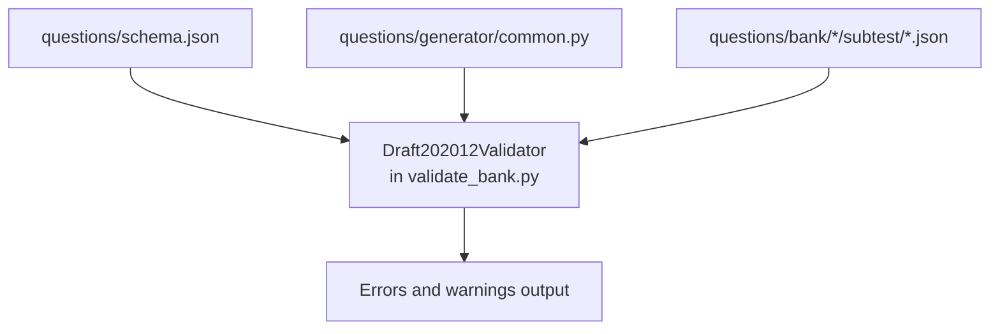
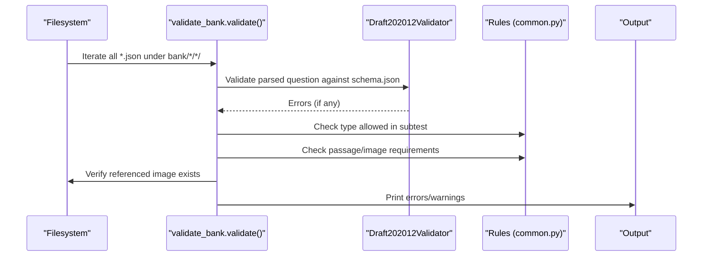
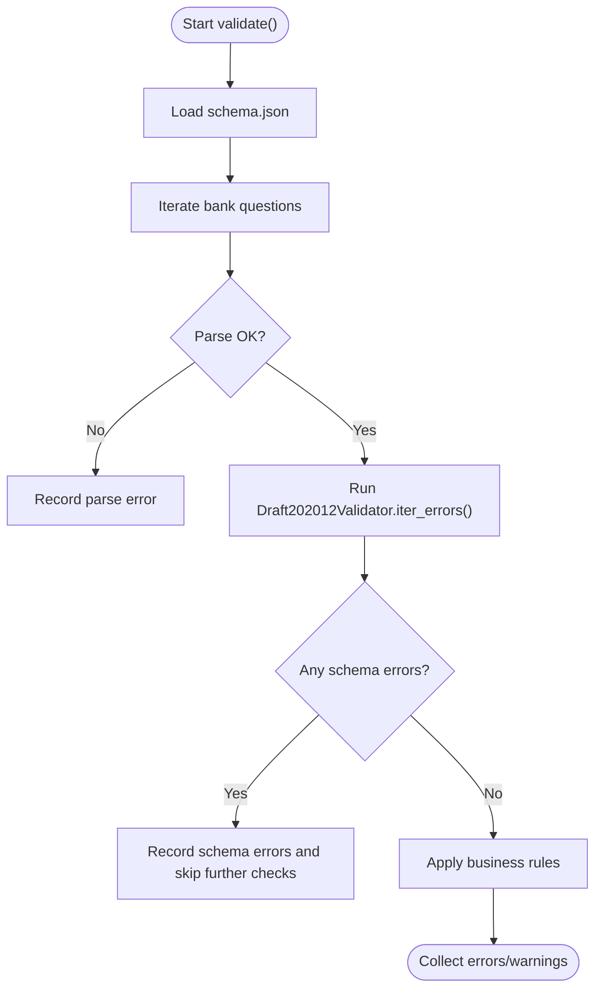
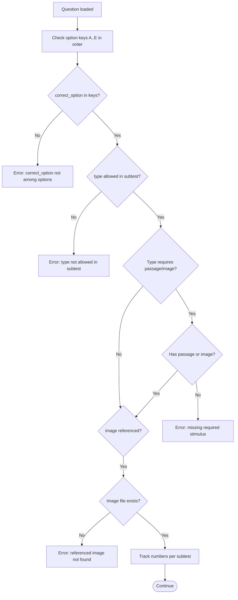
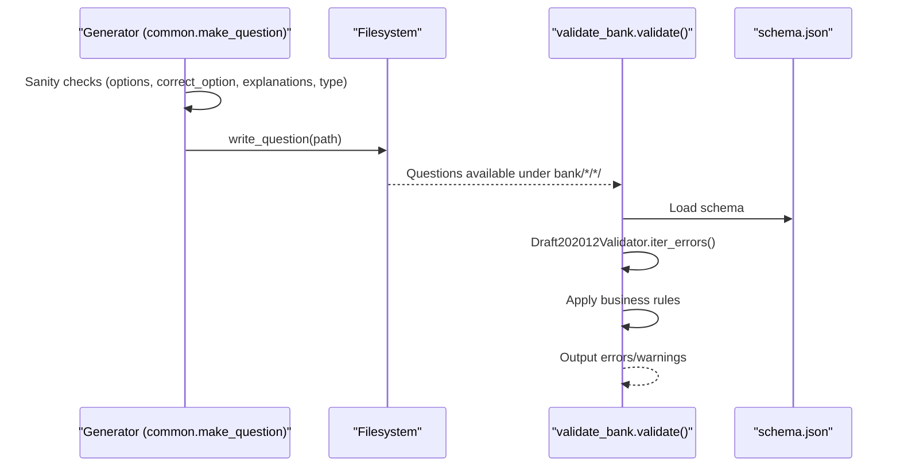
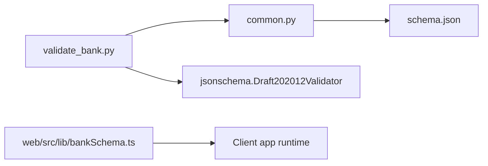

# Schema Validation

<cite>
**Referenced Files in This Document**
- [schema.json](file://questions/schema.json)
- [validate_bank.py](file://questions/generator/validate_bank.py)
- [common.py](file://questions/generator/common.py)
- [bankSchema.ts](file://web/src/lib/bankSchema.ts)
- [verbal 001.json](file://questions/bank/1/verbal/001.json)
- [kuantitatif 001.json](file://questions/bank/1/kuantitatif/001.json)
- [pemecahan_masalah 001.json](file://questions/bank/1/pemecahan_masalah/001.json)
</cite>

## Table of Contents
1. Introduction
2. Project Structure
3. Core Components
4. Architecture Overview
5. Detailed Component Analysis
6. Dependency Analysis
7. Performance Considerations
8. Troubleshooting Guide
9. Conclusion

## Introduction
This document explains how JSON schema validation is implemented for the TBS LPDP Try Out question bank system. It covers:
- How questions are structured and constrained by the JSON Schema Draft 2020-12 definition.
- How the Draft202012Validator is used to validate each question file against the schema.
- The additional business rules enforced by the validator script (option keys, correct answer presence, passage/image requirements, image existence, numbering, blueprint counts).
- Examples of valid and invalid question structures.
- Common validation errors and troubleshooting steps.
- How to add new question types and how validation integrates with the question generation pipeline.

## Project Structure
The validation system centers around three layers:
- Schema definition: a single JSON Schema file that defines the shape and constraints of every question object.
- Validator script: a Python tool that loads the schema and validates every question file in the bank directory, then enforces additional business rules.
- Shared constants and helpers: shared configuration such as allowed types per subtest, passage requirements, and utilities to load the schema and iterate over questions.

**Diagram sources**
- [schema.json:1-98](file://questions/schema.json#L1-L98)
- [validate_bank.py:29-45](file://questions/generator/validate_bank.py#L29-L45)
- [common.py:130-132](file://questions/generator/common.py#L130-L132)

**Section sources**
- [schema.json:1-98](file://questions/schema.json#L1-L98)
- [validate_bank.py:1-45](file://questions/generator/validate_bank.py#L1-L45)
- [common.py:1-70](file://questions/generator/common.py#L1-L70)

## Core Components
- JSON Schema (Draft 2020-12): Defines required fields, types, enums, patterns, and nested objects for options and explanations.
- Draft202012Validator: Loads the schema and validates each parsed question object; reports structural violations.
- Business rule checks: Validate option key ordering, correctness of correct_option, type-per-subtest allowance, passage/image requirements, referenced images, numbering uniqueness and gaps, blueprint counts, and package manifest metadata.

Key responsibilities:
- Structural validation via JSON Schema.
- Cross-field validation via the validator script.
- Consistency between file paths and question metadata.
- Integrity of stimulus-based questions (passage or image).
- Completeness and correctness of options and explanations.

**Section sources**
- [schema.json:23-96](file://questions/schema.json#L23-L96)
- [validate_bank.py:44-147](file://questions/generator/validate_bank.py#L44-L147)
- [common.py:17-68](file://questions/generator/common.py#L17-L68)

## Architecture Overview
The validation flow processes each question file through two stages:
1. Schema validation using Draft202012Validator.
2. Business rule validation performed by the script.

**Diagram sources**
- [validate_bank.py:44-147](file://questions/generator/validate_bank.py#L44-L147)
- [common.py:17-68](file://questions/generator/common.py#L17-L68)

## Detailed Component Analysis

### JSON Schema Definition (schema.json)
The schema defines a strict contract for each question object:
- Required top-level properties: id, package, subtest, number, type, question_text, image, passage, options, correct_option, explanations, difficulty, source, verified.
- Field constraints:
  - id: string matching a stable pattern derived from path.
  - package: integer minimum 1.
  - subtest: enum of verbal, kuantitatif, pemecahan_masalah.
  - number: integer between 1 and 25.
  - type: enum of supported question types; cross-type validity per subtest is enforced by the validator, not the schema.
  - question_text: non-empty string with minimum length.
  - image: optional string path with a strict pattern or null.
  - passage: optional string or null; used for reading passages or pipe-delimited tables.
  - options: array of exactly five items, each an object with key (A–E) and text (non-empty).
  - correct_option: one of A–E.
  - explanations: object with required keys A–E, each a non-empty string with minimum length.
  - difficulty: enum easy, medium, hard.
  - source: non-empty string.
  - verified: boolean.

These constraints ensure consistent structure across all question files and prevent malformed data from entering the pipeline.

**Section sources**
- [schema.json:1-98](file://questions/schema.json#L1-L98)

### Draft202012Validator Usage (validate_bank.py)
The validator:
- Loads the schema via common.load_schema().
- Iterates all question files and validates each parsed JSON against the schema.
- On schema errors, records detailed messages including the property path.
- Skips further business rule checks on schema-invalid files to avoid cascading noise.

**Diagram sources**
- [validate_bank.py:44-108](file://questions/generator/validate_bank.py#L44-L108)

**Section sources**
- [validate_bank.py:29-45](file://questions/generator/validate_bank.py#L29-L45)
- [validate_bank.py:96-108](file://questions/generator/validate_bank.py#L96-L108)

### Business Rules and Constraints (validate_bank.py + common.py)
Beyond schema validation, the script enforces:
- Option keys must be exactly A, B, C, D, E in order.
- correct_option must be among the option keys.
- type must be allowed for the given subtest (enforced via TYPES_BY_SUBTEST).
- Stimulus-based types require passage or image:
  - PASSAGE_REQUIRED_TYPES: reading, analisis_teks must include passage.
  - PASSAGE_OR_IMAGE_TYPES: interpretasi_data must include either passage (table) or image (chart).
  - Self-contained types should not carry a passage; otherwise a warning is issued.
- Referenced images must exist under the package’s images directory.
- Numbering integrity:
  - Unique numbers per subtest within a package.
  - No gaps in numbering.
  - Strict mode enforces exact counts per subtest according to BLUEPRINT.
- Package manifest validation:
  - Required fields and value constraints for title, description, difficulty, ai_model, ai_company, ai_model_description.
  - Difficulty label consistency with calculated difficulty based on question distribution.

**Diagram sources**
- [validate_bank.py:122-147](file://questions/generator/validate_bank.py#L122-L147)
- [common.py:29-68](file://questions/generator/common.py#L29-L68)

**Section sources**
- [validate_bank.py:122-163](file://questions/generator/validate_bank.py#L122-L163)
- [common.py:17-68](file://questions/generator/common.py#L17-L68)

### Question Data Model and Examples
Valid examples demonstrate compliance with the schema and business rules:
- Verbal question with sinonim type, five ordered options, correct_option present, explanations for all options, and appropriate metadata.
- Quantitative question with aritmetika type, numeric options, and detailed explanations.
- Problem-solving question with logika_analitis type, logical reasoning stem, and comprehensive explanations.

Invalid examples would include:
- Missing required fields (e.g., no explanations or incorrect option keys).
- Incorrect type for subtest (e.g., a quantitative type in verbal).
- Missing passage for reading or analisis_teks types.
- Referencing a non-existent image.
- Duplicate or gapped numbering within a subtest.

**Section sources**
- [verbal 001.json:1-29](file://questions/bank/1/verbal/001.json#L1-L29)
- [kuantitatif 001.json:1-44](file://questions/bank/1/kuantitatif/001.json#L1-L44)
- [pemecahan_masalah 001.json:1-44](file://questions/bank/1/pemecahan_masalah/001.json#L1-L44)

### Integration with the Question Generation Pipeline
- make_question in common.py constructs question dicts that conform to the schema and performs pre-write sanity checks (option keys, correct_option, explanations coverage, type-per-subtest).
- write_question persists the question to the canonical path and ensures no overwrite.
- iter_bank_questions yields all question files for validation.
- validate_bank.py orchestrates schema and business rule validation across the entire bank.

**Diagram sources**
- [common.py:167-207](file://questions/generator/common.py#L167-L207)
- [validate_bank.py:44-147](file://questions/generator/validate_bank.py#L44-L147)
- [schema.json:1-98](file://questions/schema.json#L1-L98)

**Section sources**
- [common.py:167-218](file://questions/generator/common.py#L167-L218)
- [validate_bank.py:96-147](file://questions/generator/validate_bank.py#L96-L147)

## Dependency Analysis
- validate_bank.py depends on:
  - jsonschema.Draft202012Validator for structural validation.
  - common.py for schema loading, allowed types, passage requirements, iteration helpers, and difficulty calculations.
- common.py centralizes constants and utilities used by generator and validator scripts.
- web/src/lib/bankSchema.ts defines the client-side manifest schema and versioning logic for downloaded bank artifacts; it does not validate individual questions but ensures safe consumption of published bundles.

**Diagram sources**
- [validate_bank.py:29-41](file://questions/generator/validate_bank.py#L29-L41)
- [common.py:130-132](file://questions/generator/common.py#L130-L132)
- [bankSchema.ts:1-84](file://web/src/lib/bankSchema.ts#L1-L84)

**Section sources**
- [validate_bank.py:29-41](file://questions/generator/validate_bank.py#L29-L41)
- [common.py:130-132](file://questions/generator/common.py#L130-L132)
- [bankSchema.ts:1-84](file://web/src/lib/bankSchema.ts#L1-L84)

## Performance Considerations
- Schema validation runs per question file; for large banks, this can be I/O bound. Ensure efficient file iteration and minimal redundant reads.
- Avoid cascading checks on schema-invalid files to reduce unnecessary processing.
- Use strict mode judiciously; it adds extra checks for blueprint completeness which may increase runtime.

[No sources needed since this section provides general guidance]

## Troubleshooting Guide
Common validation errors and how to resolve them:
- Schema errors:
  - Missing required fields (e.g., explanations, options, correct_option).
  - Invalid types or enums (e.g., wrong subtest, unsupported type).
  - Pattern mismatches (e.g., image path format).
  - Minimum length violations (e.g., question_text too short, explanation texts too short).
- Business rule errors:
  - Option keys not exactly A–E in order.
  - correct_option not among options.
  - Type not allowed in subtest.
  - Missing passage or image for stimulus-based types.
  - Referenced image file not found.
  - Duplicate or gapped numbering within a subtest.
  - Package manifest issues (invalid fields or mismatched difficulty).

Steps to diagnose:
- Run the validator with verbose output to see exact property paths and messages.
- Fix schema-level issues first; business rule checks are skipped for schema-invalid files to avoid noise.
- Confirm type-per-subtest alignment using TYPES_BY_SUBTEST.
- Verify passage/image requirements based on question type.
- Ensure image files exist at the referenced relative paths.
- Check numbering continuity and uniqueness per subtest.
- In strict mode, verify total counts match BLUEPRINT.

**Section sources**
- [validate_bank.py:96-163](file://questions/generator/validate_bank.py#L96-L163)
- [common.py:17-68](file://questions/generator/common.py#L17-L68)

## Conclusion
The TBS LPDP Try Out question bank uses a robust, layered validation strategy:
- A strict JSON Schema defines the canonical structure and constraints for all question types.
- Draft202012Validator ensures structural integrity before applying business rules.
- The validator script enforces domain-specific constraints, ensuring consistency, completeness, and correctness across the entire bank.
- Shared constants and helpers centralize rules and utilities, making the system maintainable and extensible.

To add new question types:
- Update TYPES_BY_SUBTEST to allow the type in relevant subtests.
- If the type requires a stimulus, update PASSAGE_REQUIRED_TYPES or PASSAGE_OR_IMAGE_TYPES accordingly.
- Optionally extend schema.json if new fields or constraints are needed.
- Regenerate or author questions using make_question to ensure compliance.
- Run validate_bank.py to confirm all checks pass.

[No sources needed since this section summarizes without analyzing specific files]