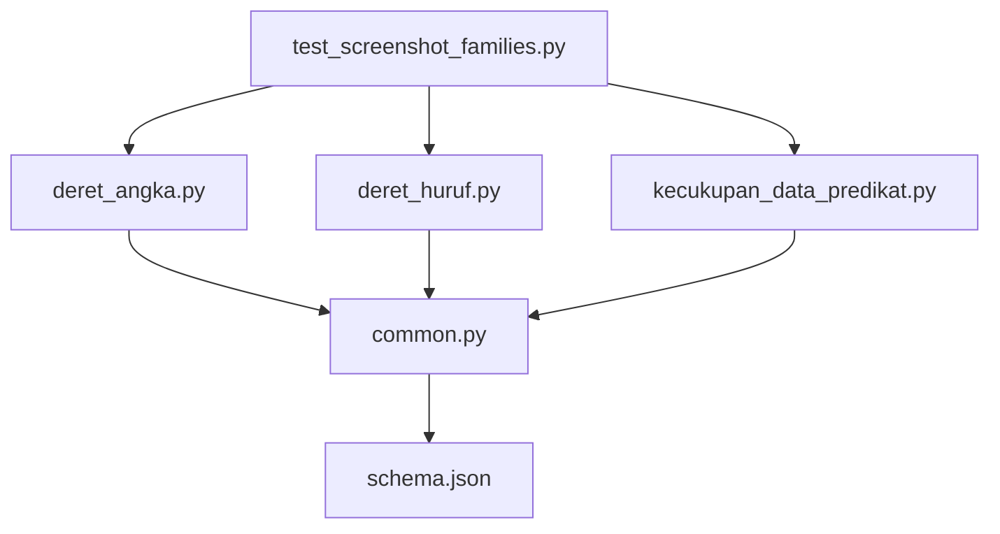
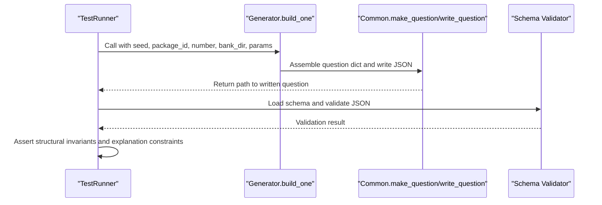
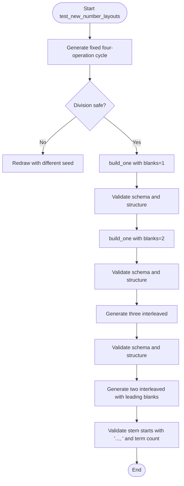
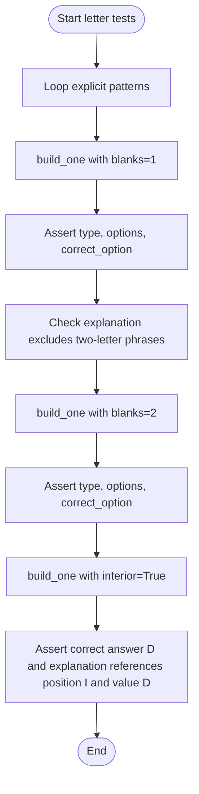
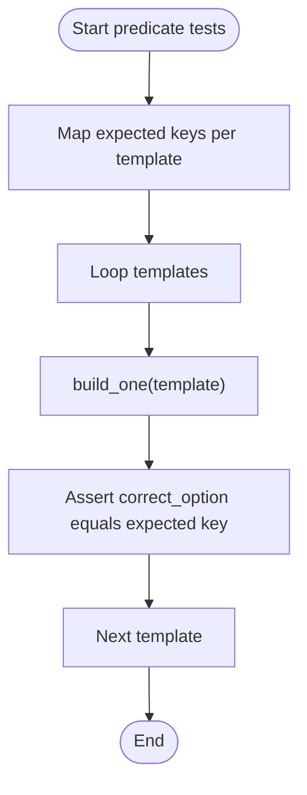
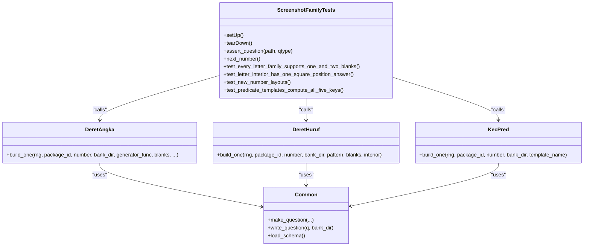

# Screenshot Testing

<cite>
**Referenced Files in This Document**
- [test_screenshot_families.py](file://questions/generator/test_screenshot_families.py)
- [deret_angka.py](file://questions/generator/deret_angka.py)
- [deret_huruf.py](file://questions/generator/deret_huruf.py)
- [kecukupan_data_predikat.py](file://questions/generator/kecukupan_data_predikat.py)
- [common.py](file://questions/generator/common.py)
- [schema.json](file://questions/schema.json)
- [README.md](file://questions/generator/README.md)
- [COVERAGE.md](file://questions/generator/COVERAGE.md)
</cite>

## Table of Contents
1. [Introduction](#introduction)
2. [Project Structure](#project-structure)
3. [Core Components](#core-components)
4. [Architecture Overview](#architecture-overview)
5. [Detailed Component Analysis](#detailed-component-analysis)
6. [Dependency Analysis](#dependency-analysis)
7. [Performance Considerations](#performance-considerations)
8. [Troubleshooting Guide](#troubleshooting-guide)
9. [Conclusion](#conclusion)
10. [Appendices](#appendices)

## Introduction
This document explains the screenshot testing framework used to validate generated question variants for three families: number sequences (deret_angka), letter sequences (deret_huruf), and data sufficiency predicates (kecukupan_data_predikat). It focuses on how test_screenshot_families.py performs regression testing across these families, how visual consistency is verified through structural assertions, how blank positions are handled, and how explanation text validation ensures correctness. It also provides guidelines for adding new test cases, maintaining test data, debugging visual discrepancies, understanding generator-to-test relationships, and ensuring backward compatibility when modifying generation logic.

## Project Structure
The screenshot testing framework lives under questions/generator and integrates with shared utilities and schema validation. The key elements are:
- A test runner that imports generators and validates generated JSON against a strict schema.
- Generators that produce deterministic question objects with computed answers, distractors, and explanations.
- Shared helpers for formatting, numbering, writing files, and assembling question structures.
- A JSON schema that defines the contract for every question file.

**Diagram sources**
- [test_screenshot_families.py:15-18](file://questions/generator/test_screenshot_families.py#L15-L18)
- [deret_angka.py:44-47](file://questions/generator/deret_angka.py#L44-L47)
- [deret_huruf.py:26-29](file://questions/generator/deret_huruf.py#L26-L29)
- [kecukupan_data_predikat.py:30-34](file://questions/generator/kecukupan_data_predikat.py#L30-L34)
- [common.py:13-15](file://questions/generator/common.py#L13-L15)
- [schema.json:1-22](file://questions/schema.json#L1-L22)

**Section sources**
- [test_screenshot_families.py:1-115](file://questions/generator/test_screenshot_families.py#L1-L115)
- [common.py:1-218](file://questions/generator/common.py#L1-L218)
- [schema.json:1-98](file://questions/schema.json#L1-L98)

## Core Components
- ScreenshotFamilyTests: A unittest.TestCase subclass that sets up a temporary bank directory, loads the JSON schema validator, and asserts properties of generated questions.
- Question assertion helper: Validates type, option count, correct option key, and schema conformance.
- Generator integration: Each family’s build_one function is invoked with controlled random seeds and parameters to produce deterministic outputs for regression checks.
- Shared utilities: Numbering, formatting, question assembly, and file writing are centralized in common.py; schema loading and validation are enforced via jsonschema.

Key responsibilities:
- Ensure each generated question conforms to the schema and has exactly five options with a valid correct_option.
- Verify layout-specific behavior such as single vs double blanks and interior anchor patterns.
- Validate explanation content constraints relevant to each variant.
- Confirm predicate templates compute all five answer keys correctly.

**Section sources**
- [test_screenshot_families.py:21-37](file://questions/generator/test_screenshot_families.py#L21-L37)
- [common.py:130-164](file://questions/generator/common.py#L130-L164)
- [schema.json:23-96](file://questions/schema.json#L23-L96)

## Architecture Overview
The testing architecture follows a deterministic pipeline:
- The test harness creates a temporary bank directory and a schema validator.
- For each family, it calls the generator’s build_one with fixed seeds and specific parameters (blanks, interior mode, template).
- Generated JSON files are read back and validated against the schema and structural invariants.
- Explanation texts are checked for expected or forbidden phrases to ensure consistent rendering across variants.
- Predicate templates are exercised to verify that all five answer keys (A–E) can be produced deterministically.

**Diagram sources**
- [test_screenshot_families.py:21-37](file://questions/generator/test_screenshot_families.py#L21-L37)
- [common.py:167-207](file://questions/generator/common.py#L167-L207)
- [common.py:154-164](file://questions/generator/common.py#L154-L164)
- [schema.json:1-22](file://questions/schema.json#L1-L22)

## Detailed Component Analysis

### Number Sequences (deret_angka) Regression Tests
- Purpose: Validate multiple sequence architectures including fixed four-operation cycles, interleaved sequences, and two-term tail layouts.
- Methodology:
  - Generate sequences using specific functions (e.g., gen_fixed_four_operation_cycle, gen_three_interleaved, gen_two_interleaved) with deterministic seeds.
  - Exercise both one-blank and two-blank layouts where applicable.
  - Assert that stems print the expected number of terms and start patterns (e.g., leading ellipsis).
  - Ensure subtraction transitions do not masquerade as integer division to avoid ambiguous readings.

**Diagram sources**
- [test_screenshot_families.py:70-95](file://questions/generator/test_screenshot_families.py#L70-L95)
- [deret_angka.py:707-785](file://questions/generator/deret_angka.py#L707-L785)
- [deret_angka.py:788-800](file://questions/generator/deret_angka.py#L788-L800)

**Section sources**
- [test_screenshot_families.py:70-95](file://questions/generator/test_screenshot_families.py#L70-L95)
- [deret_angka.py:52-196](file://questions/generator/deret_angka.py#L52-L196)
- [deret_angka.py:707-785](file://questions/generator/deret_angka.py#L707-L785)
- [deret_angka.py:788-800](file://questions/generator/deret_angka.py#L788-L800)

### Letter Sequences (deret_huruf) Regression Tests
- Purpose: Validate explicit pattern support for one and two blanks, and verify interior anchor behavior.
- Methodology:
  - Iterate over EXPLICIT_PATTERNS and generate questions with blanks=1 and blanks=2.
  - For single-blank variants, assert that explanation text does not include phrases implying two subsequent letters.
  - For interior mode, assert the correct answer matches the anchored square-position pattern and that explanations reference the correct position and value.

**Diagram sources**
- [test_screenshot_families.py:43-68](file://questions/generator/test_screenshot_families.py#L43-L68)
- [deret_huruf.py:231-244](file://questions/generator/deret_huruf.py#L231-L244)
- [deret_huruf.py:292-315](file://questions/generator/deret_huruf.py#L292-L315)
- [deret_huruf.py:318-347](file://questions/generator/deret_huruf.py#L318-L347)

**Section sources**
- [test_screenshot_families.py:43-68](file://questions/generator/test_screenshot_families.py#L43-L68)
- [deret_huruf.py:39-108](file://questions/generator/deret_huruf.py#L39-L108)
- [deret_huruf.py:247-315](file://questions/generator/deret_huruf.py#L247-L315)
- [deret_huruf.py:318-347](file://questions/generator/deret_huruf.py#L318-L347)

### Data Sufficiency Predicates (kecukupan_data_predikat) Regression Tests
- Purpose: Ensure all five predicate-sufficiency keys (A–E) are produced by templates and that explanations reflect symbolic proofs and counterexamples.
- Methodology:
  - For each template, call build_one and assert the correct_option matches the expected key mapping.
  - Templates define statements and proofs; the generator computes sufficiency by enumerating positive-integer states and uses symbolic equivalence to justify claims.

**Diagram sources**
- [test_screenshot_families.py:96-110](file://questions/generator/test_screenshot_families.py#L96-L110)
- [kecukupan_data_predikat.py:89-142](file://questions/generator/kecukupan_data_predikat.py#L89-L142)
- [kecukupan_data_predikat.py:148-177](file://questions/generator/kecukupan_data_predikat.py#L148-L177)
- [kecukupan_data_predikat.py:184-253](file://questions/generator/kecukupan_data_predikat.py#L184-L253)

**Section sources**
- [test_screenshot_families.py:96-110](file://questions/generator/test_screenshot_families.py#L96-L110)
- [kecukupan_data_predikat.py:1-282](file://questions/generator/kecukupan_data_predikat.py#L1-L282)

### Relationship Between Generators and Test Suites
- Each generator exposes a build_one function that takes a seeded Random instance, package metadata, and variant parameters (blanks, interior, template).
- The test suite exercises these functions directly, bypassing CLI entry points, to ensure deterministic output and focused regression coverage.
- Shared utilities centralize question assembly and file writing, so tests validate end-to-end outputs without depending on filesystem state beyond a temporary directory.

**Diagram sources**
- [test_screenshot_families.py:21-115](file://questions/generator/test_screenshot_families.py#L21-L115)
- [deret_angka.py:44-47](file://questions/generator/deret_angka.py#L44-L47)
- [deret_huruf.py:26-29](file://questions/generator/deret_huruf.py#L26-L29)
- [kecukupan_data_predikat.py:30-34](file://questions/generator/kecukupan_data_predikat.py#L30-L34)
- [common.py:167-207](file://questions/generator/common.py#L167-L207)

**Section sources**
- [test_screenshot_families.py:21-115](file://questions/generator/test_screenshot_families.py#L21-L115)
- [common.py:167-207](file://questions/generator/common.py#L167-L207)

## Dependency Analysis
- test_screenshot_families.py depends on:
  - deret_angka, deret_huruf, kecukupan_data_predikat for generation.
  - common for schema loading and validators.
- Generators depend on:
  - common for make_question, write_question, next_number, and formatting utilities.
- Schema enforces:
  - Required fields, allowed types per subtest, option arrays, and explanation coverage.

Potential coupling:
- Tight coupling between test expectations and generator behavior (e.g., explanation phrasing constraints).
- Shared constants like SUBTEST and QTYPE must remain consistent across generators and tests.

External dependencies:
- jsonschema for Draft202012Validator.
- Standard library modules (random, re, pathlib, json, tempfile, unittest).

**Section sources**
- [test_screenshot_families.py:6-18](file://questions/generator/test_screenshot_families.py#L6-L18)
- [common.py:130-164](file://questions/generator/common.py#L130-L164)
- [schema.json:23-96](file://questions/schema.json#L23-L96)

## Performance Considerations
- Deterministic seeding ensures repeatable runs; avoid heavy randomness in tests to keep execution time low.
- Rival-rule screening in generators may iterate multiple attempts; tests exercise only representative paths to maintain speed.
- Schema validation is lightweight but should be run once per question; batching validations is unnecessary given small question counts in tests.

[No sources needed since this section provides general guidance]

## Troubleshooting Guide
Common issues and resolutions:
- Schema validation errors:
  - Ensure options array has exactly five entries with keys A–E and non-empty text.
  - Verify correct_option is within A–E and explanations cover all keys.
  - Check type values match allowed enums and subtest mappings.
- Explanation mismatches:
  - For single-blank letter sequences, explanations must not imply two subsequent letters; adjust generator logic if phrasing changes.
  - For interior letter sequences, explanations must reference the correct position and value; update if anchor logic changes.
- Blank handling:
  - One-blank vs two-blank layouts require distinct stems and explanations; ensure build_one routes to the correct layout and that tests assert expected behaviors.
- Predicate sufficiency keys:
  - If a template no longer produces the expected key, review constraint definitions and witness enumeration; ensure symbolic proofs exist for sufficiency claims.

Debugging steps:
- Run individual tests with verbose output to isolate failures.
- Inspect generated JSON files in the temporary directory before teardown to inspect exact content.
- Use distinct seeds per test case to reproduce specific outputs.
- Validate against schema locally using common.load_schema and jsonschema.

**Section sources**
- [test_screenshot_families.py:21-37](file://questions/generator/test_screenshot_families.py#L21-L37)
- [deret_huruf.py:247-315](file://questions/generator/deret_huruf.py#L247-L315)
- [kecukupan_data_predikat.py:148-177](file://questions/generator/kecukupan_data_predikat.py#L148-L177)
- [schema.json:23-96](file://questions/schema.json#L23-L96)

## Conclusion
The screenshot testing framework provides robust regression coverage for number sequences, letter sequences, and predicate-based data sufficiency questions. By enforcing schema compliance, validating structural invariants, and checking explanation content, it ensures visual and textual consistency across variants. Maintaining backward compatibility requires careful updates to generator logic and corresponding test assertions, especially when altering blank handling or explanation phrasing.

[No sources needed since this section summarizes without analyzing specific files]

## Appendices

### Guidelines for Adding New Test Cases
- Identify the generator family and variant (blanks, interior, template).
- Add a test method in ScreenshotFamilyTests that:
  - Calls build_one with a fixed seed and appropriate parameters.
  - Uses assert_question to validate schema and structure.
  - Adds specific assertions for layout and explanation behavior.
- Update COVERAGE.md to reflect new architecture coverage if introducing novel variants.

**Section sources**
- [test_screenshot_families.py:21-115](file://questions/generator/test_screenshot_families.py#L21-L115)
- [COVERAGE.md:1-45](file://questions/generator/COVERAGE.md#L1-L45)

### Maintaining Test Data
- Keep seeds stable to ensure reproducibility.
- Avoid modifying existing generator outputs unless necessary; prefer additive changes.
- When updating templates or rival-rule screens, re-run tests to confirm no regressions.

**Section sources**
- [test_screenshot_families.py:70-110](file://questions/generator/test_screenshot_families.py#L70-L110)
- [deret_angka.py:52-196](file://questions/generator/deret_angka.py#L52-L196)
- [deret_huruf.py:39-108](file://questions/generator/deret_huruf.py#L39-L108)

### Ensuring Backward Compatibility
- Preserve existing explanation phrasing constraints for single-blank letter sequences.
- Maintain rival-rule screening behavior to prevent ambiguous stems.
- Ensure predicate templates continue to produce all five keys with valid proofs and witnesses.

**Section sources**
- [test_screenshot_families.py:43-68](file://questions/generator/test_screenshot_families.py#L43-L68)
- [kecukupan_data_predikat.py:89-142](file://questions/generator/kecukupan_data_predikat.py#L89-L142)
- [kecukupan_data_predikat.py:184-253](file://questions/generator/kecukupan_data_predikat.py#L184-L253)