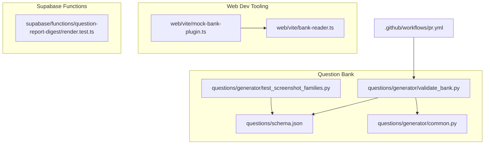
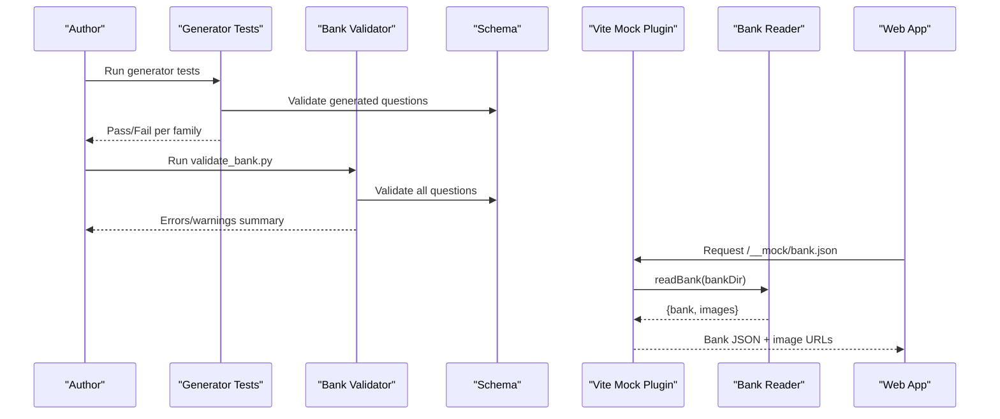
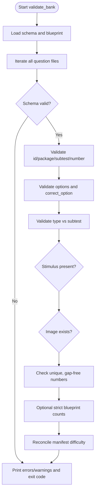
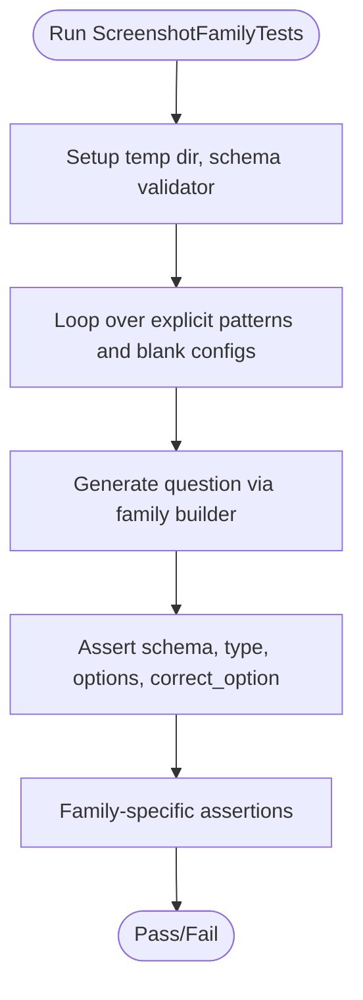
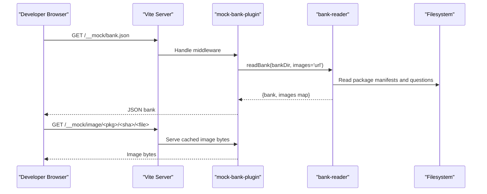
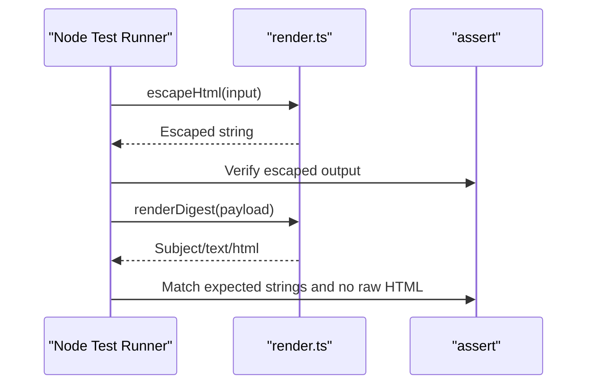
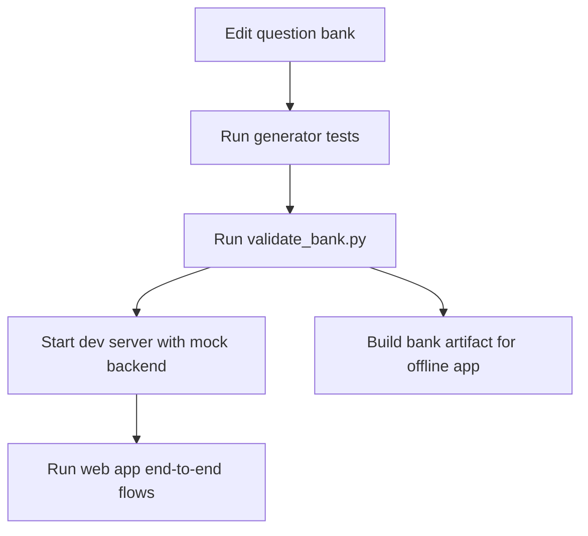
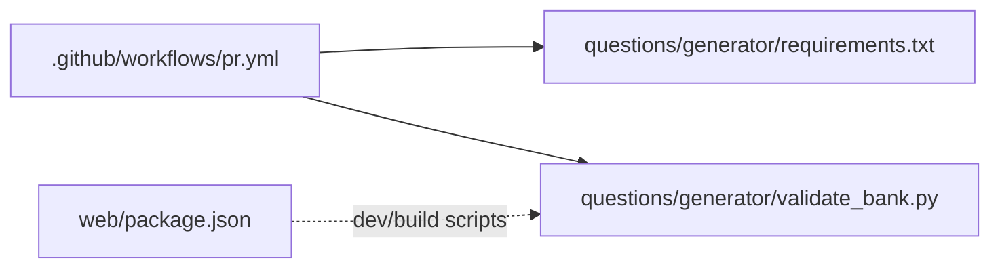

# Testing and Quality Assurance

<cite>
**Referenced Files in This Document**
- [test_screenshot_families.py](file://questions/generator/test_screenshot_families.py)
- [validate_bank.py](file://questions/generator/validate_bank.py)
- [common.py](file://questions/generator/common.py)
- [schema.json](file://questions/schema.json)
- [mock-bank-plugin.ts](file://web/vite/mock-bank-plugin.ts)
- [bank-reader.ts](file://web/vite/bank-reader.ts)
- [render.test.ts](file://supabase/functions/question-report-digest/render.test.ts)
- [pr.yml](file://.github/workflows/pr.yml)
- [requirements.txt](file://questions/generator/requirements.txt)
- [package.json](file://web/package.json)
</cite>

## Table of Contents
1. Introduction
2. Project Structure
3. Core Components
4. Architecture Overview
5. Detailed Component Analysis
6. Dependency Analysis
7. Performance Considerations
8. Troubleshooting Guide
9. Conclusion

## Introduction
This document describes the testing and quality assurance strategy for the TBS LPDP Try Out project. It covers unit tests for question generators, automated validation of the question bank against a JSON schema and blueprint rules, integration testing via a development mock backend, end-to-end flows using the compiled bank artifact, coverage guidance, regression testing approaches, and best practices for writing and maintaining tests across the full stack.

## Project Structure
The testing and QA surface spans three areas:
- Question bank validation and generator tests (Python)
- Web application development-time mock backend (TypeScript/Vite)
- Supabase function unit tests (Node.js)

**Diagram sources**
- [schema.json:1-98](file://questions/schema.json#L1-L98)
- [common.py:1-218](file://questions/generator/common.py#L1-L218)
- [validate_bank.py:1-208](file://questions/generator/validate_bank.py#L1-L208)
- [test_screenshot_families.py:1-115](file://questions/generator/test_screenshot_families.py#L1-L115)
- [mock-bank-plugin.ts:1-52](file://web/vite/mock-bank-plugin.ts#L1-L52)
- [bank-reader.ts:1-298](file://web/vite/bank-reader.ts#L1-L298)
- [render.test.ts:1-43](file://supabase/functions/question-report-digest/render.test.ts#L1-L43)
- [pr.yml:1-28](file://.github/workflows/pr.yml#L1-L28)

**Section sources**
- [schema.json:1-98](file://questions/schema.json#L1-L98)
- [common.py:1-218](file://questions/generator/common.py#L1-L218)
- [validate_bank.py:1-208](file://questions/generator/validate_bank.py#L1-L208)
- [test_screenshot_families.py:1-115](file://questions/generator/test_screenshot_families.py#L1-L115)
- [mock-bank-plugin.ts:1-52](file://web/vite/mock-bank-plugin.ts#L1-L52)
- [bank-reader.ts:1-298](file://web/vite/bank-reader.ts#L1-L298)
- [render.test.ts:1-43](file://supabase/functions/question-report-digest/render.test.ts#L1-L43)
- [pr.yml:1-28](file://.github/workflows/pr.yml#L1-L28)

## Core Components
- Question bank schema and validation: The JSON schema defines the contract for each question file. The validator enforces schema compliance, path-based IDs, option keys, explanations, image references, numbering continuity, and blueprint counts.
- Generator regression tests: Unit tests exercise generated question families to ensure stable behavior across patterns and templates.
- Development mock backend: A Vite plugin serves the git-backed question bank during development without requiring a live Supabase instance.
- Supabase function tests: Node test suite validates rendering logic and HTML escaping for report digests.
- CI pipeline: Pull requests trigger bank validation to gate merges on data integrity.

**Section sources**
- [validate_bank.py:1-208](file://questions/generator/validate_bank.py#L1-L208)
- [test_screenshot_families.py:1-115](file://questions/generator/test_screenshot_families.py#L1-L115)
- [mock-bank-plugin.ts:1-52](file://web/vite/mock-bank-plugin.ts#L1-L52)
- [render.test.ts:1-43](file://supabase/functions/question-report-digest/render.test.ts#L1-L43)
- [pr.yml:1-28](file://.github/workflows/pr.yml#L1-L28)

## Architecture Overview
The QA architecture integrates static validation, generator regression tests, and runtime mocks to cover the full lifecycle from authoring to execution.

**Diagram sources**
- [test_screenshot_families.py:1-115](file://questions/generator/test_screenshot_families.py#L1-L115)
- [validate_bank.py:1-208](file://questions/generator/validate_bank.py#L1-L208)
- [schema.json:1-98](file://questions/schema.json#L1-L98)
- [mock-bank-plugin.ts:1-52](file://web/vite/mock-bank-plugin.ts#L1-L52)
- [bank-reader.ts:1-298](file://web/vite/bank-reader.ts#L1-L298)

## Detailed Component Analysis

### Question Bank Validation
The validator performs comprehensive checks:
- Schema conformance for every question file
- Path-derived ID consistency (package, subtest, number)
- Option keys must be exactly A..E in order; correct_option must be among them
- Explanations must cover all five options
- Image references must exist under the package’s images directory
- Unique, gap-free numbering per subtest; optional strict mode enforces blueprint counts
- Stimulus requirements enforced by type (passage required or allowed)
- Package manifest fields validated and difficulty label reconciled with computed difficulty

**Diagram sources**
- [validate_bank.py:1-208](file://questions/generator/validate_bank.py#L1-L208)
- [common.py:1-218](file://questions/generator/common.py#L1-L218)
- [schema.json:1-98](file://questions/schema.json#L1-L98)

**Section sources**
- [validate_bank.py:1-208](file://questions/generator/validate_bank.py#L1-L208)
- [common.py:1-218](file://questions/generator/common.py#L1-L218)
- [schema.json:1-98](file://questions/schema.json#L1-L98)

### Generator Screenshot Family Regression Tests
These tests ensure generated question families remain consistent:
- Letter sequence generator supports one and two blanks with correct explanation phrasing
- Interior blank pattern yields expected answer and explanation markers
- New number layouts produce valid sequences and printed counts
- Predicate templates compute all five key outcomes correctly

**Diagram sources**
- [test_screenshot_families.py:1-115](file://questions/generator/test_screenshot_families.py#L1-L115)

**Section sources**
- [test_screenshot_families.py:1-115](file://questions/generator/test_screenshot_families.py#L1-L115)

### Development Mock Backend (Mock Bank Plugin)
The Vite plugin provides a dev-only endpoint that serves the entire question bank (including answer keys) from the git repository. It also serves images via a middleware route keyed by content hash, enabling deterministic caching and offline-like behavior during development.

**Diagram sources**
- [mock-bank-plugin.ts:1-52](file://web/vite/mock-bank-plugin.ts#L1-L52)
- [bank-reader.ts:1-298](file://web/vite/bank-reader.ts#L1-L298)

**Section sources**
- [mock-bank-plugin.ts:1-52](file://web/vite/mock-bank-plugin.ts#L1-L52)
- [bank-reader.ts:1-298](file://web/vite/bank-reader.ts#L1-L298)

### Supabase Function Unit Tests
Unit tests verify HTML escaping and digest rendering for report emails, ensuring user-provided content cannot inject raw HTML into rendered outputs.

**Diagram sources**
- [render.test.ts:1-43](file://supabase/functions/question-report-digest/render.test.ts#L1-L43)

**Section sources**
- [render.test.ts:1-43](file://supabase/functions/question-report-digest/render.test.ts#L1-L43)

### End-to-End Integration Flow
While there are no explicit e2e test scripts in this repository, the combination of the bank validator, generator tests, and the mock backend enables an effective integration flow:
- Author changes to question files
- Run generator tests to assert family stability
- Run the bank validator to enforce schema and blueprint constraints
- Start the dev server with the mock backend to run the full exam flow locally without external services
- Optionally build the bank artifact used by the offline app to validate packaging

[No sources needed since this diagram shows conceptual workflow, not actual code structure]

## Dependency Analysis
- Python dependencies for validation and tests are declared in the generator requirements file.
- The PR workflow installs these dependencies and runs the bank validator on pull requests touching question-related paths.
- The web project uses TypeScript and Vite; it does not include a dedicated frontend test runner in this repository.

**Diagram sources**
- [requirements.txt:1-3](file://questions/generator/requirements.txt#L1-L3)
- [pr.yml:1-28](file://.github/workflows/pr.yml#L1-L28)
- [validate_bank.py:1-208](file://questions/generator/validate_bank.py#L1-L208)
- [package.json:1-46](file://web/package.json#L1-L46)

**Section sources**
- [requirements.txt:1-3](file://questions/generator/requirements.txt#L1-L3)
- [pr.yml:1-28](file://.github/workflows/pr.yml#L1-L28)
- [package.json:1-46](file://web/package.json#L1-L46)

## Performance Considerations
- The bank reader caches image bytes in memory during a single request to avoid repeated disk reads when serving multiple image endpoints.
- Git history is used to compute deterministic versions; if unavailable, fallbacks use file metadata.
- The validator processes files sequentially; for very large banks, consider parallelizing iteration at the OS level or splitting packages.

[No sources needed since this section provides general guidance]

## Troubleshooting Guide
Common issues and resolutions:
- Schema validation failures: Ensure each question file conforms to the schema, including required fields, option keys, and explanations.
- Path mismatch errors: Confirm that id, package, subtest, and number match the file path conventions.
- Missing images: Verify referenced images exist under the package’s images directory.
- Numbering gaps or duplicates: Ensure numbering is unique and continuous within each subtest.
- Strict mode failures: In strict mode, each subtest must meet the blueprint count; add or remove questions accordingly.
- Dev mock backend not serving bank: Ensure the Vite dev server is running and the mock plugin is active; confirm the bank directory exists and contains valid packages.
- Supabase function rendering issues: Check HTML escaping and payload structure in digest rendering tests.

**Section sources**
- [validate_bank.py:1-208](file://questions/generator/validate_bank.py#L1-L208)
- [mock-bank-plugin.ts:1-52](file://web/vite/mock-bank-plugin.ts#L1-L52)
- [render.test.ts:1-43](file://supabase/functions/question-report-digest/render.test.ts#L1-L43)

## Conclusion
The TBS LPDP Try Out project employs a layered QA strategy:
- Static validation ensures data integrity and blueprint compliance.
- Generator regression tests protect the correctness of synthetic question families.
- A development mock backend enables full-stack integration testing without external dependencies.
- CI gates merges on bank validation to maintain quality.
Adhering to these practices and tools will help maintain high-quality, reliable assessments across the platform.