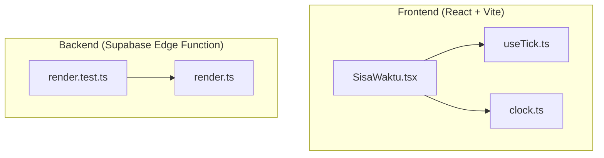
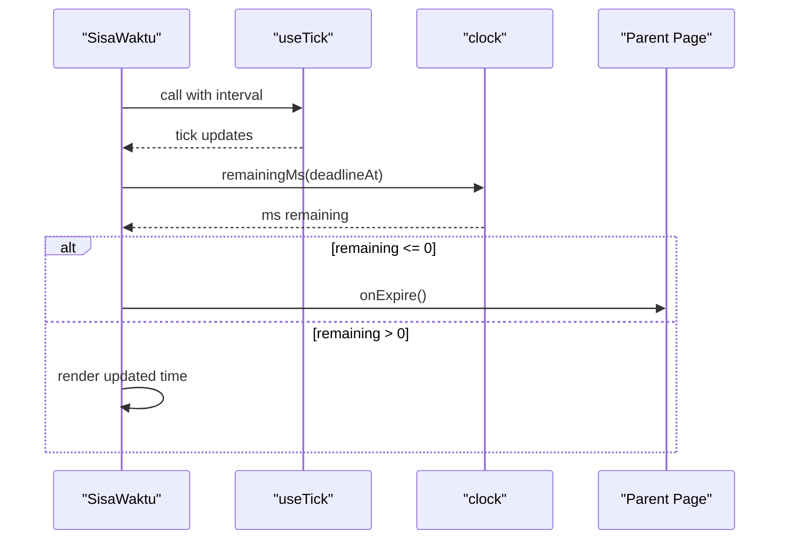
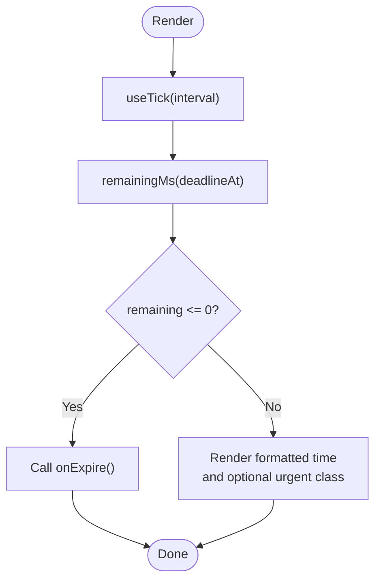
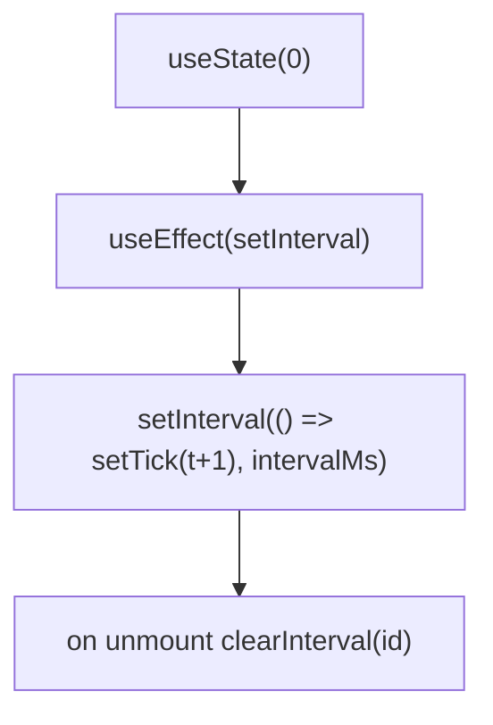
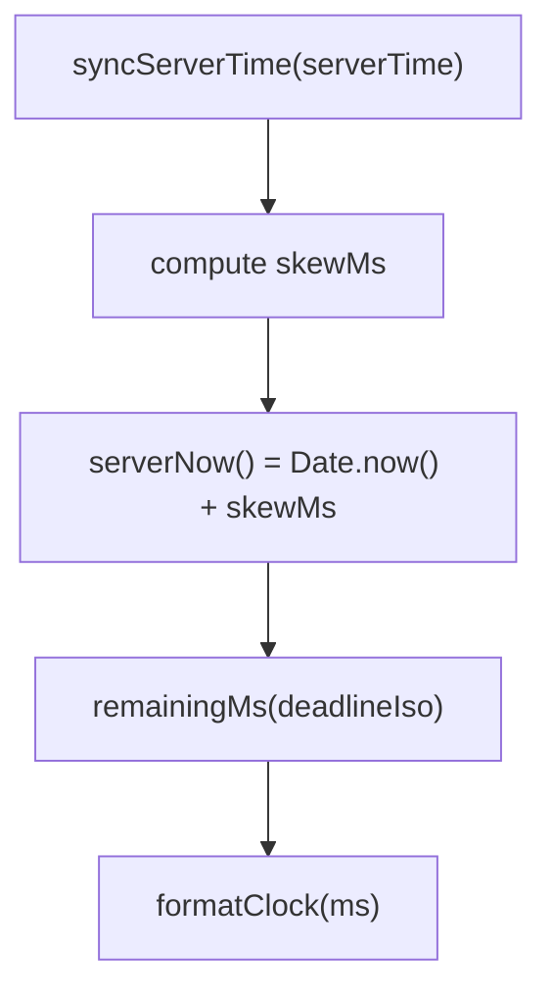
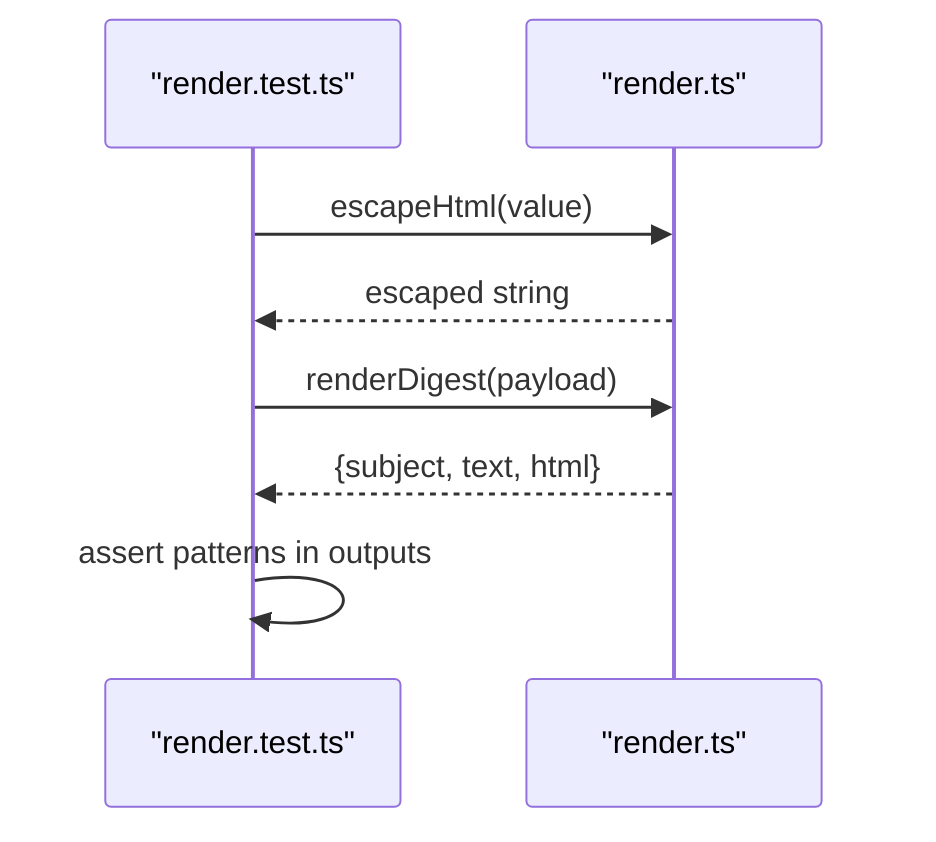
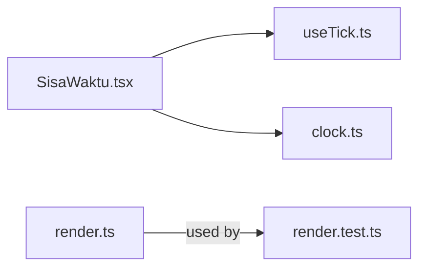

# Unit Testing

<cite>
**Referenced Files in This Document**
- [web/package.json](file://web/package.json)
- [web/vite.config.ts](file://web/vite.config.ts)
- [web/src/hooks/useTick.ts](file://web/src/hooks/useTick.ts)
- [web/src/components/SisaWaktu.tsx](file://web/src/components/SisaWaktu.tsx)
- [web/src/lib/clock.ts](file://web/src/lib/clock.ts)
- [supabase/functions/question-report-digest/render.ts](file://supabase/functions/question-report-digest/render.ts)
- [supabase/functions/question-report-digest/render.test.ts](file://supabase/functions/question-report-digest/render.test.ts)
</cite>

## Table of Contents
1. Introduction
2. Project Structure
3. Core Components
4. Architecture Overview
5. Detailed Component Analysis
6. Dependency Analysis
7. Performance Considerations
8. Troubleshooting Guide
9. Conclusion

## Introduction
This document provides comprehensive unit testing guidance for the TBS LPDP Try Out project, covering both the frontend React application and backend Supabase edge functions. It explains how to set up and configure tests, write effective unit tests for React components and custom hooks, test utility functions, and validate Supabase function behavior. It also includes best practices for mocking, event simulation, state management testing, assertion patterns, coverage maintenance, mock data creation, and debugging techniques.

## Project Structure
The repository contains:
- A React + Vite web app under web/ that renders exam pages, timers, and UI components.
- Utility modules under web/src/lib/ for timekeeping, configuration, and API interactions.
- A custom hook under web/src/hooks/ used by timer-related components.
- Supabase Edge Functions under supabase/functions/, including a report digest renderer with an existing Node test.

**Diagram sources**
- [web/src/components/SisaWaktu.tsx:1-33](file://web/src/components/SisaWaktu.tsx#L1-L33)
- [web/src/hooks/useTick.ts:1-12](file://web/src/hooks/useTick.ts#L1-L12)
- [web/src/lib/clock.ts:1-65](file://web/src/lib/clock.ts#L1-L65)
- [supabase/functions/question-report-digest/render.ts:1-128](file://supabase/functions/question-report-digest/render.ts#L1-L128)
- [supabase/functions/question-report-digest/render.test.ts:1-43](file://supabase/functions/question-report-digest/render.test.ts#L1-L43)

**Section sources**
- [web/package.json:1-46](file://web/package.json#L1-L46)
- [web/vite.config.ts:1-54](file://web/vite.config.ts#L1-L54)

## Core Components
- SisaWaktu component: Renders a countdown timer and triggers expiration callbacks when the deadline passes. It uses a custom tick hook and clock utilities.
- useTick hook: Drives periodic re-renders via setInterval and returns a tick counter.
- clock utilities: Provide server-time-aware calculations for remaining time and formatting.
- render.ts (Supabase): Generates email-style digests from report payloads, including HTML escaping and date formatting.
- render.test.ts (Supabase): Validates escaping behavior and digest rendering for zero and non-zero reports.

**Section sources**
- [web/src/components/SisaWaktu.tsx:1-33](file://web/src/components/SisaWaktu.tsx#L1-L33)
- [web/src/hooks/useTick.ts:1-12](file://web/src/hooks/useTick.ts#L1-L12)
- [web/src/lib/clock.ts:1-65](file://web/src/lib/clock.ts#L1-L65)
- [supabase/functions/question-report-digest/render.ts:1-128](file://supabase/functions/question-report-digest/render.ts#L1-L128)
- [supabase/functions/question-report-digest/render.test.ts:1-43](file://supabase/functions/question-report-digest/render.test.ts#L1-L43)

## Architecture Overview
The frontend timer flow depends on a custom hook and time utilities to compute and display remaining time. The backend digest renderer transforms structured report payloads into safe text and HTML outputs. Tests should isolate these units and verify their behavior deterministically.

**Diagram sources**
- [web/src/components/SisaWaktu.tsx:1-33](file://web/src/components/SisaWaktu.tsx#L1-L33)
- [web/src/hooks/useTick.ts:1-12](file://web/src/hooks/useTick.ts#L1-L12)
- [web/src/lib/clock.ts:1-65](file://web/src/lib/clock.ts#L1-L65)

## Detailed Component Analysis

### Frontend: SisaWaktu Component
Responsibilities:
- Drive frequent re-renders using useTick to keep the timer display accurate.
- Compute remaining time using clock utilities.
- Trigger onExpire once the deadline is reached.

Testing strategy:
- Mount the component in a test environment.
- Mock or control time progression to simulate deadlines passing.
- Assert that the displayed time format matches expectations and that onExpire is called at the correct moment.
- Verify CSS class toggling for urgent state when time is below threshold.

**Diagram sources**
- [web/src/components/SisaWaktu.tsx:1-33](file://web/src/components/SisaWaktu.tsx#L1-L33)
- [web/src/hooks/useTick.ts:1-12](file://web/src/hooks/useTick.ts#L1-L12)
- [web/src/lib/clock.ts:1-65](file://web/src/lib/clock.ts#L1-L65)

Best practices:
- Use a test runner capable of handling React components and timers (e.g., Vitest or Jest).
- Advance simulated time to trigger expiration without waiting for real intervals.
- Stub external dependencies if any are introduced later (e.g., network calls).

**Section sources**
- [web/src/components/SisaWaktu.tsx:1-33](file://web/src/components/SisaWaktu.tsx#L1-L33)
- [web/src/hooks/useTick.ts:1-12](file://web/src/hooks/useTick.ts#L1-L12)
- [web/src/lib/clock.ts:1-65](file://web/src/lib/clock.ts#L1-L65)

### Custom Hook: useTick
Responsibilities:
- Set up an interval to increment a tick state at a given interval.
- Clean up the interval on unmount.

Testing strategy:
- Mount a component that consumes the hook.
- Assert that the returned tick value increments over time.
- Verify cleanup by unmounting and ensuring no further ticks occur.

**Diagram sources**
- [web/src/hooks/useTick.ts:1-12](file://web/src/hooks/useTick.ts#L1-L12)

Best practices:
- Use fake timers to control interval timing deterministically.
- Test both normal operation and cleanup paths.

**Section sources**
- [web/src/hooks/useTick.ts:1-12](file://web/src/hooks/useTick.ts#L1-L12)

### Utilities: clock.ts
Responsibilities:
- Maintain server-time skew and compute remaining milliseconds until a deadline.
- Format durations and dates consistently for UI.

Testing strategy:
- Sync server time before computing remaining time.
- Assert remainingMs returns expected values for various deadlines relative to synced server time.
- Validate formatClock output for different durations.
- Ensure timezone-aware formatting behaves as expected.

**Diagram sources**
- [web/src/lib/clock.ts:1-65](file://web/src/lib/clock.ts#L1-L65)

Best practices:
- Always sync server time in tests to avoid flaky assertions.
- Use deterministic inputs for deadlines and assert exact outputs.

**Section sources**
- [web/src/lib/clock.ts:1-65](file://web/src/lib/clock.ts#L1-L65)

### Backend: Supabase Edge Function (render.ts)
Responsibilities:
- Escape user-provided content to prevent XSS.
- Generate subject, plain text, and HTML digest from report payloads.
- Format dates and summarize reasons.

Existing tests:
- Validate HTML escaping for dangerous characters.
- Confirm zero-report heartbeat messages.
- Ensure revision details render correctly and raw HTML is never interpolated.

Testing strategy:
- Import the module and pass structured payloads.
- Assert subject, text, and html fields match expected patterns.
- Include malicious input in comments to verify sanitization.

**Diagram sources**
- [supabase/functions/question-report-digest/render.ts:1-128](file://supabase/functions/question-report-digest/render.ts#L1-L128)
- [supabase/functions/question-report-digest/render.test.ts:1-43](file://supabase/functions/question-report-digest/render.test.ts#L1-L43)

Best practices:
- Keep payloads minimal but representative of real data shapes.
- Cover edge cases like missing fields, empty arrays, and truncated counts.
- Treat HTML generation as a security boundary; always assert against injection patterns.

**Section sources**
- [supabase/functions/question-report-digest/render.ts:1-128](file://supabase/functions/question-report-digest/render.ts#L1-L128)
- [supabase/functions/question-report-digest/render.test.ts:1-43](file://supabase/functions/question-report-digest/render.test.ts#L1-L43)

## Dependency Analysis
The frontend timer stack composes three layers:
- SisaWaktu depends on useTick for periodic updates and clock for time math.
- clock maintains a global skew to align client computations with server time.
- The backend digest renderer depends only on its payload schema and standard libraries.

**Diagram sources**
- [web/src/components/SisaWaktu.tsx:1-33](file://web/src/components/SisaWaktu.tsx#L1-L33)
- [web/src/hooks/useTick.ts:1-12](file://web/src/hooks/useTick.ts#L1-L12)
- [web/src/lib/clock.ts:1-65](file://web/src/lib/clock.ts#L1-L65)
- [supabase/functions/question-report-digest/render.ts:1-128](file://supabase/functions/question-report-digest/render.ts#L1-L128)
- [supabase/functions/question-report-digest/render.test.ts:1-43](file://supabase/functions/question-report-digest/render.test.ts#L1-L43)

**Section sources**
- [web/src/components/SisaWaktu.tsx:1-33](file://web/src/components/SisaWaktu.tsx#L1-L33)
- [web/src/hooks/useTick.ts:1-12](file://web/src/hooks/useTick.ts#L1-L12)
- [web/src/lib/clock.ts:1-65](file://web/src/lib/clock.ts#L1-L65)
- [supabase/functions/question-report-digest/render.ts:1-128](file://supabase/functions/question-report-digest/render.ts#L1-L128)
- [supabase/functions/question-report-digest/render.test.ts:1-43](file://supabase/functions/question-report-digest/render.test.ts#L1-L43)

## Performance Considerations
- Avoid heavy re-renders in tests by isolating units and using mocks where appropriate.
- For timer tests, prefer fake timers to control execution speed and reduce flakiness.
- In backend tests, construct minimal payloads to keep tests fast and focused.

[No sources needed since this section provides general guidance]

## Troubleshooting Guide
Common issues and resolutions:
- Flaky timer tests: Use fake timers and advance time explicitly rather than relying on real intervals.
- Timezone mismatches: Ensure server time synchronization in tests and assert localized formats carefully.
- XSS concerns in backend: Always include tests that inject dangerous HTML and assert it is escaped in generated outputs.
- Missing test runner setup: Add a dedicated test script and configuration to run frontend and backend tests consistently.

**Section sources**
- [web/src/hooks/useTick.ts:1-12](file://web/src/hooks/useTick.ts#L1-L12)
- [web/src/lib/clock.ts:1-65](file://web/src/lib/clock.ts#L1-L65)
- [supabase/functions/question-report-digest/render.test.ts:1-43](file://supabase/functions/question-report-digest/render.test.ts#L1-L43)

## Conclusion
This project’s frontend relies on a small, testable composition of a component, a custom hook, and time utilities, while the backend provides a well-scoped renderer with clear safety guarantees. By adopting deterministic time controls, robust mocking, and thorough assertion patterns, you can maintain high confidence in both UI behavior and backend output correctness. Establish consistent test scripts and coverage goals to ensure long-term reliability.