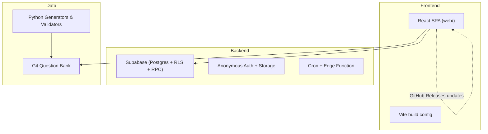
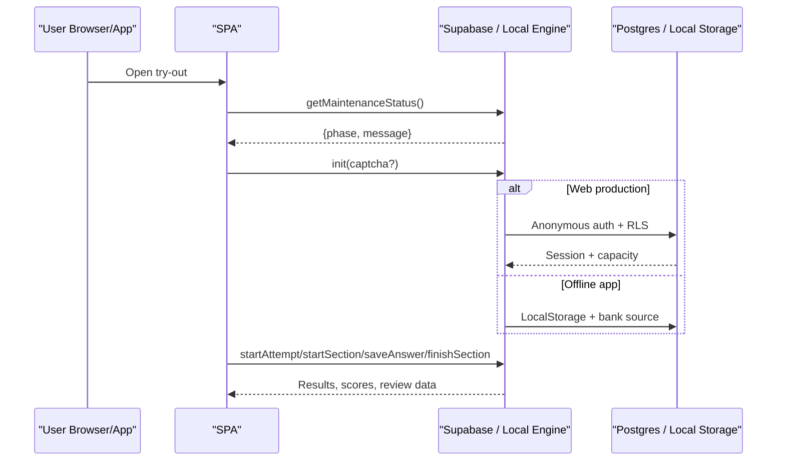
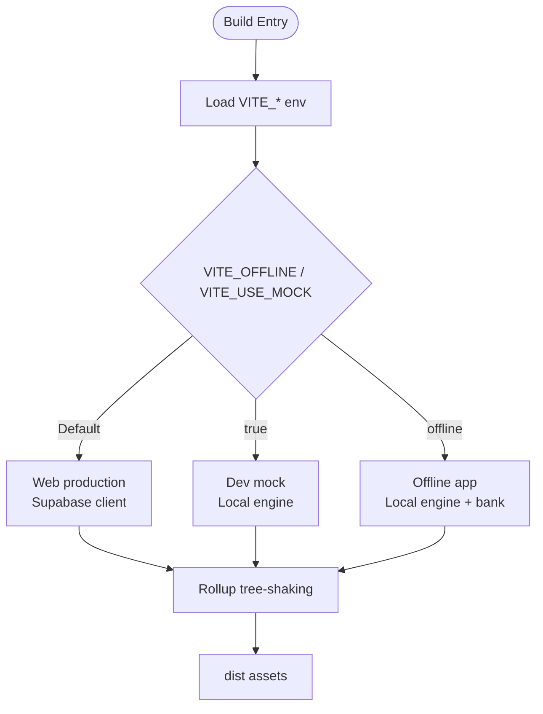

# Troubleshooting and FAQ

<cite>
**Referenced Files in This Document**
- [README.md](file://README.md)
- [package.json](file://web/package.json)
- [vite.config.ts](file://web/vite.config.ts)
- [config.ts](file://web/src/lib/config.ts)
- [supabase.ts](file://web/src/lib/supabase.ts)
- [localApi.ts](file://web/src/lib/localApi.ts)
- [types.ts](file://web/src/lib/types.ts)
- [MaintenanceGate.tsx](file://web/src/components/MaintenanceGate.tsx)
- [HumanVerificationGate.tsx](file://web/src/components/HumanVerificationGate.tsx)
- [deploy-web.yml](file://.github/workflows/deploy-web.yml)
- [schema.sql](file://supabase/schema.sql)
- [TECHNICAL_REQUIREMENTS_V6.md](file://docs/TECHNICAL_REQUIREMENTS_V6.md)
- [CONTRIBUTING.md](file://CONTRIBUTING.md)
</cite>

## Table of Contents
1. Introduction
2. Project Structure
3. Core Components
4. Architecture Overview
5. Detailed Component Analysis
6. Dependency Analysis
7. Performance Considerations
8. Troubleshooting Guide
9. Conclusion
10. Appendices

## Introduction
This document provides comprehensive troubleshooting and frequently asked questions for the TBS LPDP Try Out project. It covers setup problems, runtime errors, performance issues, deployment failures, debugging techniques across development, testing, and production environments, plus browser compatibility, known limitations, workarounds, and migration guidance for deprecated features. The goal is to help both end-users experiencing issues and developers diagnosing problems quickly and safely.

## Project Structure
The repository contains:
- A React + Vite + TypeScript SPA under web/ that runs as a website or offline app via Tauri.
- A Supabase backend with schemas, RPCs, and capacity controls.
- A Git-versioned question bank under questions/bank/ with generators and validators.
- CI workflows for GitHub Pages deployment and application releases.

**Diagram sources**
- [README.md:40-70](file://README.md#L40-L70)
- [TECHNICAL_REQUIREMENTS_V6.md:35-64](file://docs/TECHNICAL_REQUIREMENTS_V6.md#L35-L64)

**Section sources**
- [README.md:87-101](file://README.md#L87-L101)
- [TECHNICAL_REQUIREMENTS_V6.md:35-64](file://docs/TECHNICAL_REQUIREMENTS_V6.md#L35-L64)

## Core Components
- Build-time configuration and environment flags control which backend is included in the bundle.
- The local exam engine (mock/offline) implements the same API surface as the server-side RPCs for development and offline use.
- Supabase schema defines tables, Row Level Security policies, and RPCs used by the web flavor.
- Maintenance and human verification gates protect availability and deter abuse.

Key responsibilities:
- Flavor isolation ensures answer keys and grading logic are never shipped to the production website.
- Capacity guards prevent storage exhaustion on the free tier.
- Offline app supports bank updates and application updates through GitHub Releases.

**Section sources**
- [config.ts:11-43](file://web/src/lib/config.ts#L11-L43)
- [localApi.ts:27-36](file://web/src/lib/localApi.ts#L27-L36)
- [schema.sql:16-142](file://supabase/schema.sql#L16-L142)
- [MaintenanceGate.tsx:31-38](file://web/src/components/MaintenanceGate.tsx#L31-L38)
- [HumanVerificationGate.tsx:73-77](file://web/src/components/HumanVerificationGate.tsx#L73-L77)

## Architecture Overview
The system has three flavors selected at build time:
- Web production: uses Supabase; no local engine or keys in the bundle.
- Dev mock: uses a local engine backed by a Vite middleware bank; excluded from production builds.
- Offline app: uses a local engine with bundled/cached bank; updates via GitHub Releases.

**Diagram sources**
- [vite.config.ts:10-17](file://web/vite.config.ts#L10-L17)
- [schema.sql:341-415](file://supabase/schema.sql#L341-L415)
- [localApi.ts:309-384](file://web/src/lib/localApi.ts#L309-L384)

## Detailed Component Analysis

### Build-time Configuration and Flavor Isolation
- Environment variables define whether the build includes the local engine or Supabase client.
- Vite’s define constants ensure dead code elimination so only one backend is present per flavor.
- Production deployment asserts that neither mock nor offline flags are set and scans the bundle to confirm absence of local engine artifacts.

Common pitfalls:
- Accidentally enabling mock or offline flags in production leads to security violations and missing backend behavior.
- Missing Supabase URL/key prevents authentication and data access on the website.

Mitigations:
- Use repository variables carefully; CI checks enforce correct flags.
- Keep secrets out of frontend bundles; only public keys are allowed.

**Section sources**
- [vite.config.ts:25-41](file://web/vite.config.ts#L25-L41)
- [deploy-web.yml:49-76](file://.github/workflows/deploy-web.yml#L49-L76)
- [deploy-web.yml:89-95](file://.github/workflows/deploy-web.yml#L89-L95)
- [config.ts:11-43](file://web/src/lib/config.ts#L11-L43)

### Local Exam Engine (Mock/Offline)
- Implements the full ExamApi interface locally using localStorage and an injected bank source.
- Enforces deadlines, auto-grading, immutable release pinning, and statistics computation.
- Supports hot-swapping the question bank while preserving past attempts’ pinned releases.

Typical issues:
- Corrupted or missing bank causes load failures; the engine falls back to cached or bundled snapshots when available.
- Exceeding local storage capacity triggers capacity-related errors during attempt creation.

Debugging tips:
- Inspect localStorage keys used by the engine for state and maintenance overrides.
- Validate bank integrity and versioning via manifest and digest checks.

**Section sources**
- [localApi.ts:78-84](file://web/src/lib/localApi.ts#L78-L84)
- [localApi.ts:183-201](file://web/src/lib/localApi.ts#L183-L201)
- [localApi.ts:262-275](file://web/src/lib/localApi.ts#L262-L275)
- [localApi.ts:405-426](file://web/src/lib/localApi.ts#L405-L426)

### Supabase Backend and Security
- Tables store packages, subtests, questions, answers, attempts, and events with strict RLS policies.
- RPCs handle attempt lifecycle, section management, grading, and review retrieval.
- Capacity guard measures database size and row counts to prevent free-tier overflow.

Common issues:
- Authentication failures due to missing or misconfigured anonymous sign-in.
- RLS policy mismatches causing “not found” or permission errors.
- Service capacity reached preventing new attempts while allowing existing ones to finish.

Mitigations:
- Ensure anonymous provider is enabled and service_role key is configured for publishing pipelines.
- Adjust capacity limits via SQL if needed; monitor usage_percent from service status.

**Section sources**
- [schema.sql:16-142](file://supabase/schema.sql#L16-L142)
- [schema.sql:186-239](file://supabase/schema.sql#L186-L239)
- [schema.sql:341-415](file://supabase/schema.sql#L341-L415)
- [schema.sql:417-580](file://supabase/schema.sql#L417-L580)

### Maintenance Gate
- Probes a public endpoint to determine maintenance phase and displays a maintenance page when active.
- Uses polling with timeouts and session-scoped dismissal for warning phases.
- Can be bypassed in development via an explicit flag for testing.

Common issues:
- Network failures or timeouts cause the gate to fail open to avoid blocking users unnecessarily.
- Incorrect schedule configuration can show unexpected maintenance banners.

Debugging tips:
- Check probe timeout and polling interval settings.
- Verify server_time alignment and schedule boundaries.

**Section sources**
- [MaintenanceGate.tsx:13-21](file://web/src/components/MaintenanceGate.tsx#L13-L21)
- [MaintenanceGate.tsx:56-83](file://web/src/components/MaintenanceGate.tsx#L56-L83)
- [MaintenanceGate.tsx:96-103](file://web/src/components/MaintenanceGate.tsx#L96-L103)

### Human Verification Gate (Turnstile)
- Requires a CAPTCHA token for new anonymous identities to deter scraping and abuse.
- Dynamically loads Turnstile script and renders a widget; handles expired tokens and errors gracefully.
- Skips verification in mock mode even if site keys exist locally.

Common issues:
- Third-party blockers or network issues prevent loading the Turnstile script.
- Misconfigured site key results in challenge failures.

Mitigations:
- Provide a retry action to re-render the widget.
- Ensure the site key matches Supabase Auth CAPTCHA settings.

**Section sources**
- [HumanVerificationGate.tsx:8-20](file://web/src/components/HumanVerificationGate.tsx#L8-L20)
- [HumanVerificationGate.tsx:36-69](file://web/src/components/HumanVerificationGate.tsx#L36-L69)
- [HumanVerificationGate.tsx:85-107](file://web/src/components/HumanVerificationGate.tsx#L85-L107)
- [HumanVerificationGate.tsx:117-158](file://web/src/components/HumanVerificationGate.tsx#L117-L158)

### Offline App Updates and Bank Refresh
- On launch, the app checks for newer bank manifests and downloads verified banks when available.
- Desktop apps update via tauri-plugin-updater; Android prompts to install over existing APKs.
- Manifest enforces minimum app version and schema compatibility before downloading new banks.

Common issues:
- Offline mode cannot reach GitHub endpoints; bank refresh fails silently until connectivity returns.
- Schema mismatch blocks bank updates; prompts users to update the app.

Workarounds:
- Use manual refresh actions to retry with visible progress.
- Ensure consistent signing for Android upgrades.

**Section sources**
- [TECHNICAL_REQUIREMENTS_V6.md:77-90](file://docs/TECHNICAL_REQUIREMENTS_V6.md#L77-L90)
- [TECHNICAL_REQUIREMENTS_V6.md:107-145](file://docs/TECHNICAL_REQUIREMENTS_V6.md#L107-L145)
- [TECHNICAL_REQUIREMENTS_V6.md:240-325](file://docs/TECHNICAL_REQUIREMENTS_V6.md#L240-L325)

## Dependency Analysis
Flavor selection and dependency inclusion are enforced at build time to prevent sensitive code or keys from reaching unintended deployments.

**Diagram sources**
- [vite.config.ts:10-17](file://web/vite.config.ts#L10-L17)
- [vite.config.ts:25-41](file://web/vite.config.ts#L25-L41)

**Section sources**
- [vite.config.ts:10-17](file://web/vite.config.ts#L10-L17)
- [vite.config.ts:25-41](file://web/vite.config.ts#L25-L41)
- [deploy-web.yml:49-76](file://.github/workflows/deploy-web.yml#L49-L76)

## Performance Considerations
- Avoid bundling large libraries eagerly; lazy-load Supabase client via dynamic imports to reduce initial payload.
- Use content-addressed bank files and manifest checks to minimize redundant downloads and ensure integrity.
- Monitor service capacity to prevent write failures near free-tier limits; existing attempts remain usable.
- In offline mode, prefer cached or bundled banks to avoid network overhead; verify SHA-256 before applying updates.

[No sources needed since this section provides general guidance]

## Troubleshooting Guide

### Setup Problems
- Node.js version mismatch:
  - Symptom: Build or dev server fails to start.
  - Fix: Install Node.js >= 22.18 and npm; reinstall dependencies in web/.
  - Reference: [package.json:6-8](file://web/package.json#L6-L8), [CONTRIBUTING.md:21-34](file://CONTRIBUTING.md#L21-L34)

- Missing or incorrect Supabase configuration:
  - Symptom: Authentication fails; attempts cannot start; service status unavailable.
  - Fix: Set VITE_SUPABASE_URL and VITE_SUPABASE_PUBLISHABLE_KEY (or legacy anon key); ensure anonymous provider enabled.
  - Reference: [config.ts:22-43](file://web/src/lib/config.ts#L22-L43), [supabase.ts:4-13](file://web/src/lib/supabase.ts#L4-L13)

- Turnstile challenges not appearing:
  - Symptom: New anonymous identity cannot be created; error messages about verification.
  - Fix: Provide valid VITE_TURNSTILE_SITE_KEY; ensure Cloudflare Turnstile is configured in Supabase Auth CAPTCHA settings.
  - Reference: [config.ts:33-40](file://web/src/lib/config.ts#L33-L40), [HumanVerificationGate.tsx:117-158](file://web/src/components/HumanVerificationGate.tsx#L117-L158)

- Offline app bank refresh fails:
  - Symptom: No new packages appear; toast indicates offline or already latest.
  - Fix: Ensure connectivity; use manual refresh; verify manifest and bank SHA-256; check min_app_version compatibility.
  - Reference: [TECHNICAL_REQUIREMENTS_V6.md:77-90](file://docs/TECHNICAL_REQUIREMENTS_V6.md#L77-L90), [TECHNICAL_REQUIREMENTS_V6.md:107-145](file://docs/TECHNICAL_REQUIREMENTS_V6.md#L107-L145)

### Runtime Errors
- Section deadline passed:
  - Symptom: Saving answers throws an error indicating deadline exceeded; section auto-graded.
  - Cause: Time elapsed beyond deadline plus grace period.
  - Fix: Finish section promptly; resume within grace window; understand that grading occurs server-side or locally depending on flavor.
  - Reference: [localApi.ts:262-275](file://web/src/lib/localApi.ts#L262-L275), [schema.sql:311-337](file://supabase/schema.sql#L311-L337)

- Already finished section:
  - Symptom: Attempts to modify answers after finishing are rejected.
  - Cause: Section status is finished; writes are disallowed.
  - Fix: Review completed sections; do not edit finished attempts.
  - Reference: [localApi.ts:262-275](file://web/src/lib/localApi.ts#L262-L275), [schema.sql:311-337](file://supabase/schema.sql#L311-L337)

- Package or question not found:
  - Symptom: Errors indicate package/subtest/question not found.
  - Cause: Invalid IDs or unpublished packages; mismatched release pinning.
  - Fix: Verify package publication status; ensure correct attempt release pinning; re-fetch bank if necessary.
  - Reference: [localApi.ts:121-125](file://web/src/lib/localApi.ts#L121-L125), [schema.sql:341-389](file://supabase/schema.sql#L341-L389)

- Too many attempts or reports:
  - Symptom: Rate limit errors when starting attempts or submitting reports.
  - Cause: Per-user hourly budget exceeded; report rate limiting.
  - Fix: Wait for cooldown; reduce rapid retries; ensure legitimate usage patterns.
  - Reference: [localApi.ts:405-426](file://web/src/lib/localApi.ts#L405-L426), [localApi.ts:532-542](file://web/src/lib/localApi.ts#L532-L542), [schema.sql:374-380](file://supabase/schema.sql#L374-L380)

- Storage capacity reached:
  - Symptom: Cannot start new attempts; service status shows high usage.
  - Cause: Database size or row count exceeded configured limits.
  - Fix: Existing attempts continue; wait for retention jobs or adjust limits via SQL; consider upgrading plan.
  - Reference: [schema.sql:108-129](file://supabase/schema.sql#L108-L129), [schema.sql:392-415](file://supabase/schema.sql#L392-L415)

### Deployment Failures
- CI rejects mock/offline flags for web deployment:
  - Symptom: Build fails asserting flavor constraints.
  - Cause: Repository variables or .env files enable local engine flavor.
  - Fix: Clear VITE_OFFLINE and VITE_USE_MOCK; remove from environment files; ensure CI passes assertions.
  - Reference: [deploy-web.yml:49-76](file://.github/workflows/deploy-web.yml#L49-L76), [deploy-web.yml:89-95](file://.github/workflows/deploy-web.yml#L89-L95)

- Bank artifact not published:
  - Symptom: Offline app cannot find updated bank; manifest missing.
  - Cause: Build pipeline did not run bank generation or validation failed.
  - Fix: Ensure full git history in CI; validate bank with Python scripts; publish to dist/bank.
  - Reference: [deploy-web.yml:97-100](file://.github/workflows/deploy-web.yml#L97-L100), [TECHNICAL_REQUIREMENTS_V6.md:107-145](file://docs/TECHNICAL_REQUIREMENTS_V6.md#L107-L145)

### Debugging Techniques
- Development:
  - Run mock mode to test without Supabase; inspect localStorage keys for state and maintenance overrides.
  - Use maintenance phase override flags to simulate warning/maintenance windows.
  - Reference: [localApi.ts:78-84](file://web/src/lib/localApi.ts#L78-L84), [localApi.ts:310-375](file://web/src/lib/localApi.ts#L310-L375)

- Testing:
  - Validate bank with generator scripts; ensure schema migrations applied; check RLS policies.
  - Simulate capacity limits and rate limits to verify UI behavior.
  - Reference: [schema.sql:16-142](file://supabase/schema.sql#L16-L142), [schema.sql:392-415](file://supabase/schema.sql#L392-L415)

- Production:
  - Monitor service status and usage percent; check maintenance schedule and Turnstile configuration.
  - Verify bundle contents to ensure no local engine or keys leaked.
  - Reference: [schema.sql:392-415](file://supabase/schema.sql#L392-L415), [deploy-web.yml:89-95](file://.github/workflows/deploy-web.yml#L89-L95)

### Performance Optimization Tips
- Lazy-load heavy modules (e.g., Supabase client) to reduce initial bundle size.
- Use content-addressed bank files and manifest caching to avoid repeated downloads.
- Minimize frequent polling intervals for maintenance probes; rely on boundary-based timers.
- In offline mode, prefer cached banks and avoid unnecessary network calls.

[No sources needed since this section provides general guidance]

### Memory Management Considerations
- Avoid storing large objects in localStorage; keep only essential state and references.
- Use structured cloning and careful JSON serialization to prevent memory bloat.
- Monitor bank size; inline images increase file size; consider external hosting if exceeding thresholds.

[No sources needed since this section provides general guidance]

### Browser Compatibility Issues
- WebView differences:
  - macOS WKWebView may not support window.print(); use native print command via shell.
  - Android WebView may lack certain APIs; hide unsupported features conditionally.
  - Reference: [TECHNICAL_REQUIREMENTS_V6.md:298-317](file://docs/TECHNICAL_REQUIREMENTS_V6.md#L298-L317)

- Target engines:
  - Tauri builds target specific engines (Chrome 108, Safari 15) for compatibility.
  - Reference: [vite.config.ts:42-48](file://web/vite.config.ts#L42-L48)

### Known Limitations and Workarounds
- Offline app must contain answer keys and grading logic; this is by design and documented.
- Without platform signing certificates, installers trigger OS warnings; provide user instructions.
- Android updater requires same keystore signature; manage secrets securely.
- Reference: [TECHNICAL_REQUIREMENTS_V6.md:22-34](file://docs/TECHNICAL_REQUIREMENTS_V6.md#L22-L34), [TECHNICAL_REQUIREMENTS_V6.md:147-156](file://docs/TECHNICAL_REQUIREMENTS_V6.md#L147-L156)

### Migration Guides for Deprecated Features
- Legacy anon keys vs publishable keys:
  - Both are accepted; prefer publishable keys for newer projects.
  - Reference: [config.ts:24-31](file://web/src/lib/config.ts#L24-L31)

- Schema evolution:
  - Re-apply v2/v3 migrations after base schema changes; ensure idempotency.
  - Reference: [schema.sql:1-12](file://supabase/schema.sql#L1-L12)

- Bank schema versioning:
  - Apps reject banks requiring newer schema; prompt users to update the app.
  - Reference: [TECHNICAL_REQUIREMENTS_V6.md:84-86](file://docs/TECHNICAL_REQUIREMENTS_V6.md#L84-L86)

## Conclusion
This guide consolidates common issues, debugging strategies, and best practices for the TBS LPDP Try Out project. By understanding flavor isolation, capacity controls, maintenance gates, and offline update mechanisms, you can resolve setup problems, runtime errors, and deployment failures efficiently. For ongoing improvements, follow contribution rules and maintain separation between web and offline flavors to preserve security and reliability.

[No sources needed since this section summarizes without analyzing specific files]

## Appendices

### Error Codes and Meanings
- P0002: Resource not found (package, subtest, question, attempt).
- P0003: Section already finished; writes rejected.
- P0004: Section deadline passed; auto-graded.
- P0005: Rate limit exceeded (too many attempts/reports).
- P0006: Validation error (report reason/comment).
- P0007: Storage capacity reached; new attempts blocked.
- HUMAN_VERIFICATION_REQUIRED: New anonymous identity needs CAPTCHA token.

Reference: [types.ts:123-144](file://web/src/lib/types.ts#L123-L144), [config.ts:45-60](file://web/src/lib/config.ts#L45-L60), [localApi.ts:121-125](file://web/src/lib/localApi.ts#L121-L125), [schema.sql:341-415](file://supabase/schema.sql#L341-L415)